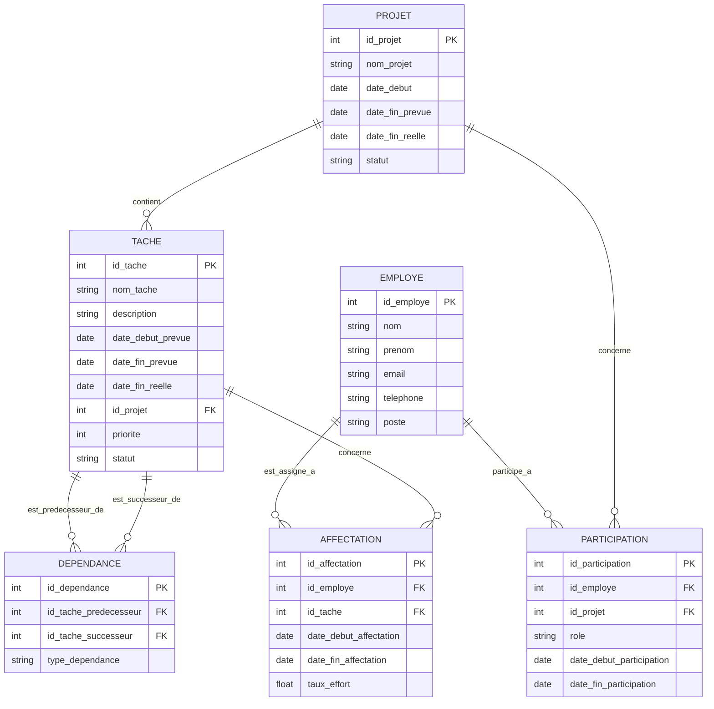

# Sql - Gestion De Projets

Excellent ! Vous êtes motivé(e) ! Voici un autre exercice complet de SQL (SQLite), cette fois-ci axé sur la **gestion d'un système de suivi de projets**. Préparez-vous, il y aura beaucoup de questions !

**1. Modèle Logique des Données (MLD) en ER Diagram**

**2. Création de la Base de Données et des Tables (À faire par vous)**

Créez une nouvelle base de données nommée `gestion_projets.db` et exécutez les instructions SQL pour créer les tables basées sur le diagramme ER ci-dessus. Définissez soigneusement les clés primaires et étrangères.

**3. Insertion de Données (Instructions et Données)**

Insérez les données suivantes dans les tables que vous avez créées.

**Table `PROJET`:**

| id\_projet | nom\_projet             | date\_debut | date\_fin\_prevue | date\_fin\_reelle | statut      |
|------------|-------------------------|-------------|-------------------|-------------------|-------------|
| 1          | Refonte du site web     | 2024-05-01  | 2024-08-31        | 2024-09-15        | Terminé     |
| 2          | Développement application mobile | 2024-07-15  | 2025-01-31        | NULL              | En cours    |
| 3          | Lancement nouveau produit | 2025-01-01  | 2025-06-30        | NULL              | Planifié    |
| 4          | Campagne marketing Q3   | 2025-07-01  | 2025-09-30        | NULL              | Planifié    |

**Table `TACHE`:**

| id\_tache | nom\_tache                      | description                                     | date\_debut\_prevue | date\_fin\_prevue | date\_fin\_reelle | id\_projet | priorite | statut      |
|-----------|---------------------------------|-------------------------------------------------|--------------------|-------------------|-------------------|------------|----------|-------------|
| 1         | Analyse des besoins             | Recueillir et analyser les besoins des utilisateurs | 2024-05-01         | 2024-05-15        | 2024-05-12        | 1          | 1        | Terminé     |
| 2         | Conception de l'interface     | Créer les maquettes et les wireframes             | 2024-05-16         | 2024-06-15        | 2024-06-20        | 1          | 2        | Terminé     |
| 3         | Développement front-end         | Implémenter l'interface utilisateur              | 2024-06-16         | 2024-07-31        | 2024-08-10        | 1          | 2        | Terminé     |
| 4         | Développement back-end          | Créer la logique serveur et la base de données     | 2024-06-16         | 2024-08-15        | 2024-09-01        | 1          | 2        | Terminé     |
| 5         | Tests et validation             | Tester l'application et corriger les bugs        | 2024-08-01         | 2024-08-31        | 2024-09-15        | 1          | 1        | Terminé     |
| 6         | Conception des écrans          | Créer les maquettes pour l'application mobile     | 2024-07-15         | 2024-08-30        | NULL              | 2          | 1        | En cours    |
| 7         | Développement iOS               | Développer la version iOS de l'application        | 2024-09-01         | 2024-12-15        | NULL              | 2          | 2        | À faire     |
| 8         | Développement Android           | Développer la version Android de l'application    | 2024-09-01         | 2024-12-15        | NULL              | 2          | 2        | À faire     |
| 9         | Tests application mobile        | Tester les versions iOS et Android               | 2024-12-16         | 2025-01-31        | NULL              | 2          | 1        | À faire     |
| 10        | Étude de marché                 | Analyser le marché pour le nouveau produit        | 2025-01-01         | 2025-02-28        | 2025-02-25        | 3          | 1        | Terminé     |
| 11        | Développement du produit        | Créer et prototyper le nouveau produit           | 2025-03-01         | 2025-05-31        | NULL              | 3          | 2        | En cours    |
| 12        | Préparation du lancement        | Planifier la logistique et la communication       | 2025-05-01         | 2025-06-30        | NULL              | 3          | 1        | Planifié    |
| 13        | Définition des objectifs        | Fixer les buts de la campagne marketing          | 2025-07-01         | 2025-07-15        | NULL              | 4          | 1        | Planifié    |
| 14        | Création des supports marketing  | Concevoir les visuels et les textes              | 2025-07-16         | 2025-08-15        | NULL              | 4          | 2        | Planifié    |
| 15        | Lancement de la campagne        | Diffuser les supports sur les canaux choisis    | 2025-08-16         | 2025-09-30        | NULL              | 4          | 1        | Planifié    |

**Table `EMPLOYE`:**

| id\_employe | nom     | prenom    | email                       | telephone    | poste                   |
|-------------|---------|-----------|-----------------------------|--------------|-------------------------|
| 1           | Dubois  | Marie     | [adresse e-mail supprimée]   | 06 11 22 33 44 | Chef de projet          |
| 2           | Lefevre | Pierre    | [adresse e-mail supprimée]   | 07 55 66 77 88 | Développeur front-end   |
| 3           | Garcia  | Sophie    | [adresse e-mail supprimée]  | 06 99 88 77 66 | Développeur back-end    |
| 4           | Chen    | Li        | [adresse e-mail supprimée]     | 07 12 34 56 78 | Designer UI/UX          |
| 5           | Rossi   | Antoine   | [adresse e-mail supprimée]  | 06 44 33 22 11 | Testeur QA              |
| 6           | Moreau  | Isabelle  | [adresse e-mail supprimée] | 07 88 99 00 11 | Responsable marketing   |

**Table `PARTICIPATION`:**

| id\_participation | id\_employe | id\_projet | role              | date\_debut\_participation | date\_fin\_participation |
|-------------------|-------------|------------|-------------------|---------------------------|-------------------------|
| 1                 | 1           | 1          | Chef de projet    | 2024-05-01                | 2024-09-15              |
| 2                 | 2           | 1          | Développeur front | 2024-06-16                | 2024-08-10              |
| 3                 | 3           | 1          | Développeur back  | 2024-06-16                | 2024-09-01              |
| 4                 | 4           | 1          | Designer UI/UX    | 2024-05-16                | 2024-06-20              |
| 5                 | 5           | 1          | Testeur QA        | 2024-08-01                | 2024-09-15              |
| 6                 | 1           | 2          | Chef de projet    | 2024-07-15                | NULL                    |
| 7                 | 4           | 2          | Designer UI/UX    | 2024-07-15                | 2024-08-30              |
| 8                 | 2           | 2          | Développeur iOS   | 2024-09-01                | 2024-12-15              |
| 9                 | 3           | 2          | Développeur Android | 2024-09-01                | 2024-12-15              |
| 10                | 5           | 2          | Testeur QA        | 2024-12-16                | 2025-01-31              |
| 11                | 1           | 3          | Chef de projet    | 2025-01-01                | NULL                    |
| 12                | 4           | 3          | Designer UI/UX    | 2025-03-01                | 2025-05-31              |
| 13                | 2           | 3          | Développeur produit| 2025-03-01                | 2025-05-31              |
| 14                | 6           | 4          | Responsable       | 2025-07-01                | NULL                    |
| 15                | 4           | 4          | Créateur contenu  | 2025-07-16                | 2025-08-15              |

**Table `DEPENDANCE`:**

| id\_dependance | id\_tache\_predecesseur | id\_tache\_successeur | type\_dependance |
|----------------|-------------------------|-----------------------|-----------------|
| 1              | 1                       | 2                     | Fin à Début    |
| 2              | 2                       | 3                     | Fin à Début    |
| 3              | 2                       | 4                     | Fin à Début    |
| 4              | 3                       | 5                     | Fin à Début    |
| 5              | 4                       | 5                     | Fin à Début    |
| 6              | 6                       | 7                     | Fin à Début    |
| 7              | 6                       | 8                     | Fin à Début    |
| 8              | 7                       | 9                     | Fin à Début    |
| 9              | 8                       | 9                     | Fin à Début    |
| 10             | 10                      | 11                    | Fin à Début    |
| 11             | 11                      | 12                    | Fin à Début    |
| 12             | 13                      | 14                    | Fin à Début    |
| 13             | 14                      | 15                    | Fin à Début    |

**Table `AFFECTATION`:**

| id\_affectation | id\_employe | id\_tache | date\_debut\_affectation | date\_fin\_affectation | taux\_effort |
|-----------------|-------------|-----------|-------------------------|-----------------------|--------------|
| 1               | 2           | 3         | 2024-06-16              | 2024-07-31            | 0.8          |
| 2               | 3           | 4         | 2024-06-16              | 2024-08-15            | 1.0          |
| 3               | 5           | 5         | 2024-08-01              | 2024-09-15            | 0.5          |
| 4               | 4           | 6         | 2024-07-15              | 2024-08-30            | 0.75         |
| 5               | 2           | 7         | 2024-09-01              | 2024-12-15            | 0.9          |
| 6               | 3           | 8         | 2024-09-01              | 2024-12-15            | 0.9          |
| 7               | 5           | 9         | 2024-12-16              | 2025-01-31            | 0.6          |
| 8               | 2           | 11        | 2025-03-01              | 2025-05-31            | 1.0          |
| 9               | 6           | 15        | 2025-08-16              | 2025-09-30            | 0.5          |
| 10              | 4           | 14        | 2025-07-16              | 2025-08-15            | 0.8          |

**Instructions pour l'insertion (À faire par vous) :**

Utilisez l'instruction `INSERT INTO` pour ajouter toutes ces données dans les tables correspondantes. Soyez patient(e), il y en a beaucoup !

**4. Requêtes SQL (Plus de 100 \!) (À faire par vous)**

Accrochez-vous, voici une longue liste de requêtes SQL pour explorer votre base de données de gestion de projets.

**Requêtes Simples (SELECT, FROM, WHERE):**

1. Affichez tous les projets.
2. Affichez les noms des projets.
3. Affichez les tâches du projet 'Refonte du site web'.
4. Affichez les employés dont le poste est 'Développeur front-end'.
5. Affichez les participations au projet 'Développement application mobile'.
6. Affichez les dépendances où le type est 'Fin à Début'.
7. Affichez les affectations de la tâche 'Développement front-end'.
8. Affichez les projets dont la date de fin prévue est en 2025.
9. Affichez les tâches dont la priorité est 1.
10. Affichez les employés dont le prénom commence par 'M'
11. Affichez les tâches dont le statut est 'Terminé'.
12. Affichez les employés avec leur email.
13. Affichez les projets dont la date de début est antérieure à 2025-01-01.
14. Affichez les tâches dont la date de fin réelle est NULL (en cours ou non terminée).
15. Affichez les participations où le rôle est 'Chef de projet'.
16. Affichez les dépendances où la tâche prédécesseur a l'ID 1.
17. Affichez les affectations avec un taux d'effort supérieur à 0.7.
18. Affichez les projets dont le nom contient le mot 'application'.
19. Affichez les tâches triées par date de début prévue.
20. Affichez les employés triés par nom.

**Requêtes avec JOIN (INNER JOIN):**

21. Affichez les noms des projets et les noms de leurs tâches.
22. Affichez les noms des employés et les projets auxquels ils participent.
23. Affichez les noms des tâches et les employés qui y sont affectés.
24. Affichez les noms des tâches et leurs tâches prédécesseurs.
25. Affichez les noms des projets et le nombre de tâches qu'ils contiennent.
26. Affichez les noms des employés et le nombre de projets auxquels ils participent.
27. Affichez les noms des tâches et le nombre d'employés qui y sont affectés.
28. Affichez les noms des projets et les chefs de projet associés (via la table `PARTICIPATION`).
29. Affichez les noms des tâches et les noms des employés affectés, avec leur taux d'effort.
30. Affichez les noms des projets et les dates de début et de fin de participation des employés.
31. Affichez les noms des tâches et le type de dépendance avec leur prédécesseur.
32. Affichez les noms des employés et les tâches auxquelles ils sont affectés, avec les dates de début et de fin d'affectation.
33. Affichez les noms des projets et le nombre de participants pour chaque projet.
34. Affichez les noms des employés et le nombre de tâches auxquelles ils sont affectés.
35. Affichez les noms des tâches et le nombre de dépendances entrantes (celles qui en dépendent).
36. Affichez les noms des projets terminés et leur date de fin réelle.
37. Affichez les noms des employés et leur poste pour le projet 'Refonte du site web'.
38. Affichez les noms des tâches avec une priorité de 1 pour le projet 'Développement application mobile'.
39. Affichez les noms des employés affectés aux tâches dont le statut est 'En cours'.
40. Affichez les noms des projets avec au moins une tâche dont la date de fin réelle est NULL.

**Requêtes avec fonctions d'agrégation (COUNT, SUM, AVG, MIN, MAX) et GROUP BY, HAVING:**

41. Comptez le nombre total de projets.
42. Comptez le nombre total de tâches.
43. Comptez le nombre total d'employés.
44. Comptez le nombre de tâches par projet.
45. Comptez le nombre d'employés par poste.
46. Comptez le nombre de participations par projet.
47. Comptez le nombre d'affectations par tâche.
48. Trouvez le projet avec le plus grand nombre de tâches.
49. Trouvez l'employé participant au plus grand nombre de projets.
50. Trouvez la tâche avec le plus grand nombre d'employés affectés.
51. Calculez le taux d'effort moyen par tâche.
52. Trouvez le taux d'effort maximal et minimal dans les affectations.
53. Affichez les projets avec plus de 5 tâches (si c'était le cas avec plus de données).
54. Affichez les postes avec plus de 2 employés.
55. Calculez le nombre moyen de participants par projet.
56. Trouvez la priorité la plus élevée et la plus basse parmi toutes les tâches.
57. Comptez le nombre de projets dont le statut est 'Terminé', 'En cours' et 'Planifié'.
58. Trouvez la date de début la plus ancienne et la date de fin prévue la plus tardive parmi tous les projets.
59. Calculez le taux d'effort total par employé pour un projet spécifique (par exemple, le projet ID 1).
60. Affichez les tâches dont le nombre d'affectations est supérieur à 1.

**Requêtes avec LEFT JOIN, RIGHT JOIN, FULL OUTER JOIN (si supporté):**

61. Affichez tous les projets et leurs tâches (même les projets sans tâches).
62. Affichez toutes les tâches et les projets auxquels elles appartiennent (même les tâches sans projet - peu probable).
63. Affichez tous les employés et leurs participations aux projets (même les employés sans participation).
64. Affichez tous les projets et les employés y participant (même les projets sans participant).
65. Affichez toutes les tâches et leurs prédécesseurs (même les tâches sans prédécesseur).
66. Affichez toutes les tâches et leurs successeurs (même les tâches sans successeur).
67. Affichez tous les employés et les tâches auxquelles ils sont affectés (même les employés sans affectation).
68. Affichez toutes les tâches et les employés affectés (même les tâches sans affectation).
69. Trouvez les employés qui ne sont affectés à aucune tâche.
70. Trouvez les projets qui n'ont aucun employé participant.

**Requêtes avec sous-requêtes:**

71. Affichez les tâches du projet dont le nom est 'Refonte du site web'.
72. Affichez les employés qui participent à au moins un projet dont le statut est 'En cours'.
73. Affichez les tâches qui ont une priorité supérieure à la priorité moyenne de toutes les tâches.
74. Affichez les projets dont la date de fin prévue est la plus tardive.
75. Affichez les employés qui sont affectés à la tâche nommée 'Tests et validation'.
76. Affichez les tâches qui ont au moins une dépendance.
77. Affichez les employés dont le poste est le même que celui de l'employé 'Dubois Marie'.
78. Affichez les projets qui ont une date de fin réelle antérieure à leur date de fin prévue.
79. Affichez les tâches qui n'ont aucune affectation.
80. Affichez les employés qui participent à tous les projets (requête complexe).

**Requêtes de modification de données (UPDATE, DELETE):**

81. Mettez à jour le statut du projet 'Développement application mobile' à 'En pause'.
82. Augmentez la priorité de toutes les tâches du projet 'Lancement nouveau produit' de 1.
83. Modifiez la date de fin réelle de la tâche 'Tests et validation' à '2024-09-20'.
84. Supprimez l'affectation de l'employé 'Rossi Antoine' à la tâche 'Tests et validation'.
85. Supprimez toutes les tâches du projet 'Campagne marketing Q3' dont le statut est 'Planifié'.
86. Ajoutez un nouvel employé : 'Dupont', 'Paul', '[adresse e-mail supprimée]', '06 00 00 00 00', 'Développeur full-stack'.
87. Mettez à jour le rôle de l'employé 'Dubois Marie' dans le projet 'Développement application mobile' à 'Responsable de projet'.
88. Réduisez le taux d'effort de toutes les affectations de 0.1.
89. Supprimez toutes les participations terminées avant '2025-01-01'.
90. Mettez à jour la date de début de tous les projets de 7 jours.

**Requêtes avancées (Vues, Index, etc.):**

91. Créez une vue nommée `Vue_Projets_Termines` affichant le nom et la date de fin réelle des projets terminés.
92. Sélectionnez toutes les données de la vue `Vue_Projets_Termines`.
93. Créez une vue nommée `Vue_Employes_Projets` affichant le nom complet de l'employé et le nom du projet auquel il participe.
94. Sélectionnez toutes les données de la vue `Vue_Employes_Projets`.
95. Créez un index sur la colonne `nom_projet` de la table `PROJET`.
96. Créez un index sur la colonne `id_employe` et `id_projet` de la table `PARTICIPATION`.
97. Expliquez comment vous optimiseriez une requête qui joint les tables `PROJET`, `TACHE` et `AFFECTATION` pour trouver les employés travaillant sur des tâches en cours.
98. Écrivez une requête qui utilise une fonction de fenêtre (si supportée par SQLite) pour classer les tâches par priorité au sein de chaque projet.
99. Écrivez une requête récursive (si supportée par SQLite avec une extension) pour afficher l'arborescence des dépendances d'une tâche donnée.
100. Trouvez les projets dont toutes les tâches sont terminées.
101. Trouvez les employés qui sont affectés à au moins deux tâches différentes dans le même projet.
102. Calculez la durée (en jours) de chaque projet (différence entre date de fin prévue et date de début).
103. Trouvez le projet avec la durée moyenne des tâches la plus longue.
104. Identifiez les tâches critiques (celles qui ont au moins une dépendance successeur).
105. Trouvez les employés qui n'ont participé à aucun projet terminé.
