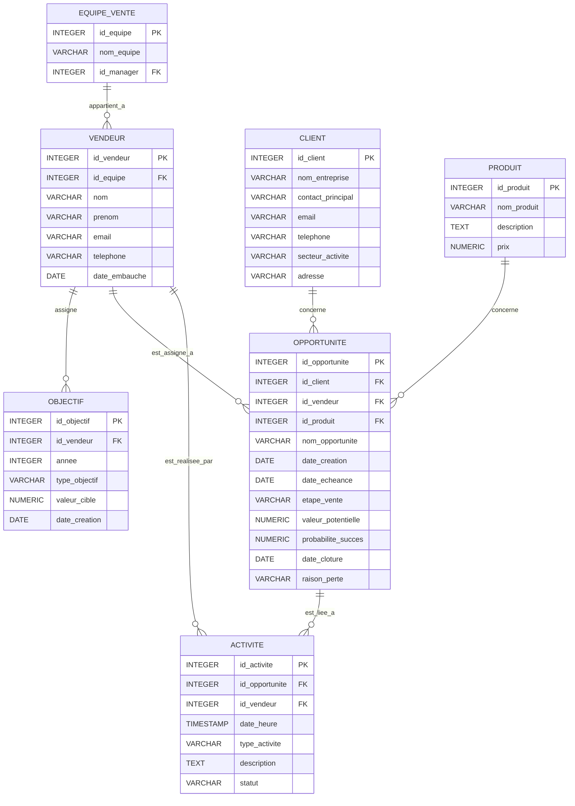

# Gestion D'un Système De Suivi De la Performance D'une Équipe Commerciale

**1. Modèle Logique des Données (MLD) en ER Diagram**

Extrait de code

**2. Création de la Base de Données et des Tables (À faire par vous - en PostgreSQL)**

Créez une nouvelle base de données nommée `performance_commerciale` dans PostgreSQL et exécutez les instructions SQL pour créer les tables basées sur le diagramme ER ci-dessus. Définissez soigneusement les clés primaires, les clés étrangères et toutes les contraintes. Utilisez `SERIAL` pour les colonnes d'auto-incrémentation. N'oubliez pas la contrainte `UNIQUE` sur `OBJECTIF` pour éviter les doublons.

**3. Insertion de Données (Instructions et Données)**

Insérez des données variées dans toutes les tables. Créez plusieurs équipes de vente avec des managers, différents vendeurs affectés à ces équipes, des clients dans divers secteurs, des produits, des objectifs pour différents vendeurs et années, des opportunités de vente à différentes étapes et avec différentes probabilités, et des activités liées à ces opportunités.

**4. Fonctionnalités Avancées (À faire par vous - en PostgreSQL)**

**a) Triggers:**

1. **Trigger pour mettre à jour la date de clôture d'une opportunité gagnée :**
	
	- Créez un trigger qui s'exécute `BEFORE UPDATE` sur la table `OPPORTUNITE`.
	- Si la `etape_vente` est mise à jour à 'Gagnée' et que `date_cloture` est NULL, mettez automatiquement `date_cloture` à la date actuelle (`CURRENT_DATE`).
2. **Trigger pour empêcher la modification d'une opportunité clôturée :**
	
	- Créez un trigger qui s'exécute `BEFORE UPDATE` sur la table `OPPORTUNITE`.
	- Si la `etape_vente` est 'Gagnée' ou 'Perdue', empêchez toute modification ultérieure des autres colonnes de cette opportunité (en lançant une exception).

**b) Fonctions en PL/pgSQL:**

3. **Fonction pour calculer le chiffre d'affaires réalisé par un vendeur sur une période donnée :**
	
	- Prenez en entrée l'`id_vendeur`, une `date_debut` et une `date_fin`, et renvoyez la somme des `valeur_potentielle` des opportunités gagnées par ce vendeur dans cette période (où `date_cloture` est dans la période).
4. **Fonction pour obtenir le nombre d'opportunités à une étape de vente donnée pour une équipe :**
	
	- Prenez en entrée l'`id_equipe` et une `etape_vente`, et renvoyez le nombre d'opportunités appartenant aux vendeurs de cette équipe qui sont à cette étape.
5. **Fonction pour créer automatiquement une activité de suivi pour une opportunité proche de son échéance :**
	
	- Créez une fonction qui vérifie quotidiennement les opportunités dont la `date_echeance` est dans les 7 prochains jours et pour lesquelles aucune activité de type 'Rappel' n'a été planifiée pour les 2 prochains jours. Si c'est le cas, créez automatiquement une nouvelle activité de type 'Rappel' assignée au vendeur de l'opportunité.

**c) Vues:**

6. **Vue affichant les opportunités avec le nom du client et le nom du vendeur :**
	
	- Joignez les tables `OPPORTUNITE`, `CLIENT` et `VENDEUR` pour une vue plus informative.
7. **Vue affichant le pipeline des ventes par équipe (nombre et valeur potentielle des opportunités par étape) :**
	
	- Joignez les tables `OPPORTUNITE` et `VENDEUR`, puis `VENDEUR` et `EQUIPE_VENTE`, et utilisez des fonctions d'agrégation et `GROUP BY` pour afficher les données souhaitées.
8. **Vue affichant les vendeurs avec leur taux de réussite (nombre d'opportunités gagnées / nombre total d'opportunités clôturées) :**
	
	- Utilisez des sous-requêtes ou des CTEs pour calculer ces agrégations et les afficher par vendeur.

**d) Index:**

9. Créez des index sur les clés étrangères et les colonnes fréquemment utilisées dans les clauses `WHERE` (par exemple, `id_vendeur`, `id_client`, `etape_vente`, `date_echeance`, `annee` dans `OBJECTIF`, `id_equipe`).

**e) Transactions:**

10. Écrivez un bloc de code qui effectue la création d'une nouvelle opportunité et la planification d'une première activité (par exemple, un appel de qualification) dans une seule transaction.

**f) Gestion des erreurs et exceptions dans PL/pgSQL:**

11. Modifiez la fonction de calcul du chiffre d'affaires pour gérer le cas où un vendeur n'a aucune opportunité gagnée (par exemple, en renvoyant 0 au lieu d'une erreur de division par zéro).

**g) Sécurité (Permissions):**

12. Créez différents rôles (par exemple, `commercial`, `manager_equipe`, `direction_commerciale`) avec des permissions spécifiques sur les tables et les fonctions. Par exemple, un `commercial` pourrait avoir des droits limités sur les données des autres équipes.

**5. Requêtes SQL Avancées (Beaucoup, beaucoup ! - en PostgreSQL)**

Voici une longue liste de requêtes pour explorer votre système de suivi de la performance commerciale.

**Requêtes Simples et Jointures:**

1. Affichez tous les vendeurs.
2. Affichez les noms des équipes de vente.
3. Affichez les clients dans un secteur d'activité spécifique.
4. Affichez les opportunités assignées à un vendeur donné.
5. Affichez les activités liées à une opportunité spécifique.
6. Affichez les objectifs d'un vendeur pour une année donnée.
7. Affichez les vendeurs appartenant à une équipe spécifique.
8. Affichez les opportunités dont la date d'écheance est dans le mois prochain.
9. Affichez les activités de type 'RDV' planifiées pour aujourd'hui.
10. Affichez les clients avec leur contact principal.
11. Affichez les opportunités avec le nom du client et du produit concerné.
12. Affichez les vendeurs avec le nom de leur équipe.
13. Affichez les activités réalisées par un vendeur spécifique.
14. Affichez les objectifs de vente pour l'année en cours.
15. Affichez les opportunités à l'étape 'Négociation'.
16. Affichez les vendeurs embauchés après une certaine date.
17. Affichez les activités avec leur statut ('Planifiée', 'Réalisée', 'Annulée').
18. Affichez les équipes de vente avec le nom de leur manager.
19. Affichez les opportunités créées au cours du dernier trimestre.
20. Affichez les activités dont la description contient un mot clé spécifique.

**Requêtes avec Agrégation et Group By/Having:**

21. Comptez le nombre total de vendeurs.
22. Comptez le nombre d'équipes de vente.
23. Comptez le nombre d'opportunités par étape de vente.
24. Calculez la valeur potentielle totale des opportunités par équipe.
25. Trouvez le vendeur avec le plus grand nombre d'opportunités assignées.
26. Trouvez l'équipe avec la plus grande valeur potentielle totale dans son pipeline.
27. Calculez le nombre moyen d'activités par opportunité.
28. Affichez les étapes de vente avec plus de 10 opportunités.
29. Affichez les vendeurs qui ont atteint leur objectif de vente pour l'année dernière.
30. Trouvez le client avec le plus grand nombre d'opportunités.
31. Calculez le nombre d'opportunités gagnées par vendeur.
32. Affichez les équipes avec le taux de réussite moyen le plus élevé (en utilisant la vue créée).
33. Trouvez l'année avec le plus grand nombre d'objectifs créés.
34. Calculez la durée moyenne des cycles de vente (différence entre date de création et date de clôture pour les opportunités gagnées).
35. Affichez les vendeurs qui ont plus de 5 opportunités en phase de 'Proposition'.
36. Trouvez le secteur d'activité avec la plus grande valeur potentielle totale d'opportunités.
37. Calculez le nombre moyen d'activités réalisées par vendeur par mois.
38. Affichez les équipes dont la valeur potentielle moyenne par opportunité est supérieure à un certain montant.
39. Trouvez le produit avec le plus grand nombre d'opportunités associées.
40. Calculez le taux de conversion global (nombre d'opportunités gagnées / nombre total d'opportunités clôturées).

**Requêtes Avancées (Sous-requêtes, CTEs, Fonctions Fenêtrées):**

41. Affichez les vendeurs dont le nombre d'opportunités gagnées est supérieur à la moyenne du nombre d'opportunités gagnées par tous les vendeurs.
42. Affichez les clients qui ont au moins une opportunité à l'étape 'Négociation' assignée à un vendeur d'une équipe spécifique.
43. Trouvez les opportunités dont la valeur potentielle est supérieure à la valeur potentielle moyenne des opportunités à la même étape de vente.
44. Affichez les vendeurs qui n'ont aucune opportunité gagnée au cours de l'année en cours.
45. Utilisez une CTE pour trouver les vendeurs avec la valeur potentielle totale la plus élevée dans leur pipeline actuel (opportunités non clôturées).
46. Utilisez une fonction de fenêtre pour classer les opportunités par valeur potentielle au sein de chaque étape de vente.
47. Trouvez les équipes dont tous les vendeurs ont au moins un objectif de vente pour l'année en cours.
48. Affichez les opportunités avec le délai entre leur date de création et leur date d'échéance.
49. Trouvez les vendeurs qui ont créé le plus d'activités au cours du dernier mois.
50. Utilisez une sous-requête corrélée pour trouver les clients qui ont plus d'une opportunité assignée au même vendeur.
51. Affichez les opportunités avec la probabilité de succès la plus élevée pour chaque vendeur.
52. Trouvez les équipes dont le taux de réussite (calculé précédemment) est supérieur à un certain seuil.
53. Affichez les vendeurs qui ont atteint au moins 75% de leur objectif de vente pour l'année en cours.
54. Trouvez les clients qui n'ont aucune opportunité clôturée (ni gagnée ni perdue).
55. Utilisez une CTE récursive (si applicable avec des données hiérarchiques, par exemple, si les équipes avaient des sous-équipes) pour afficher la structure des équipes.
56. Affichez les opportunités avec le nombre total d'activités qui leur sont liées.
57. Trouvez les vendeurs qui ont créé des opportunités pour plus de 3 clients différents.
58. Affichez les équipes avec la date de création de l'opportunité la plus ancienne encore ouverte.
59. Trouvez les vendeurs qui n'ont aucune activité planifiée pour la semaine prochaine.
60. Utilisez une fonction de fenêtre pour calculer la moyenne mobile de la valeur des opportunités gagnées par vendeur sur les 3 derniers mois.

