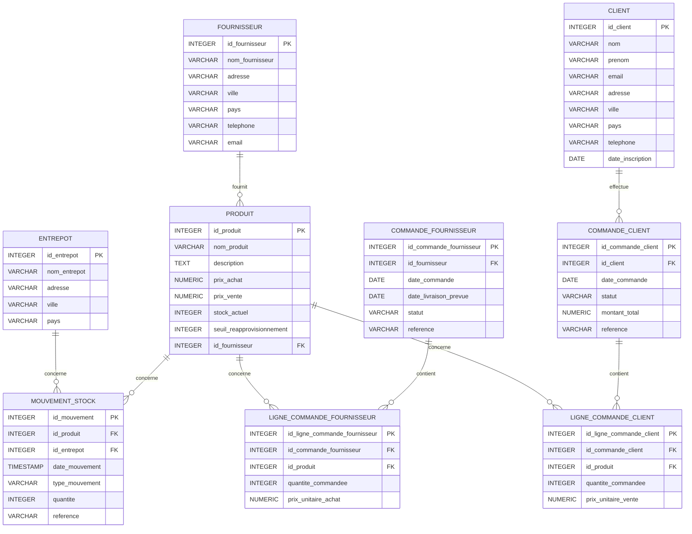

# PgSql

Parfait ! Puisque vous êtes prêt pour un autre défi conséquent, cet exercice portera sur la **gestion d'un système de suivi de la chaîne d'approvisionnement**. Nous allons continuer à explorer les fonctionnalités de PostgreSQL et à générer un grand nombre de requêtes.

**1. Modèle Logique des Données (MLD) en ER Diagram**

Extrait de code

**2. Création de la Base de Données et des Tables (À faire par vous - en PostgreSQL)**

Créez une nouvelle base de données nommée `gestion_approvisionnement` dans PostgreSQL et exécutez les instructions SQL pour créer les tables basées sur le diagramme ER ci-dessus. Définissez soigneusement les clés primaires, les clés étrangères et toutes les contraintes. Utilisez `SERIAL` pour les colonnes d'auto-incrémentation.

**3. Insertion de Données (Instructions et Données)**

Insérez des données variées dans toutes les tables. N'hésitez pas à créer plusieurs fournisseurs, entrepôts, produits (avec des stocks différents, certains proches du seuil de réapprovisionnement), des commandes fournisseurs (certaines livrées, d'autres en cours), des clients, et des commandes clients (avec différents statuts). Insérez également quelques mouvements de stock (entrées et sorties) pour différents produits et entrepôts.

**4. Fonctionnalités Avancées (À faire par vous - en PostgreSQL)**

**a) Triggers:**

1. **Trigger pour la mise à jour du stock après un mouvement de stock :**
	
	- Créez un trigger qui s'exécute `AFTER INSERT` sur la table `MOUVEMENT_STOCK`.
	- Si `type_mouvement` est 'Entree', incrémentez `stock_actuel` du `PRODUIT` correspondant.
	- Si `type_mouvement` est 'Sortie', décrémentez `stock_actuel` du `PRODUIT` correspondant.
	- Gérez les cas où la sortie pourrait rendre le stock négatif (empêchez l'opération ou enregistrez un avertissement).
2. **Trigger pour mettre à jour le montant total d'une commande client :**
	
	- Créez un trigger qui s'exécute `AFTER INSERT` ou `AFTER DELETE` sur la table `LIGNE_COMMANDE_CLIENT`.
	- Ce trigger doit recalculer et mettre à jour la colonne `montant_total` de la table `COMMANDE_CLIENT` en fonction des prix unitaires et des quantités des lignes de commande.
	- Créez également un trigger `AFTER UPDATE` sur `LIGNE_COMMANDE_CLIENT` pour gérer les modifications de quantité ou de prix unitaire.
3. **Trigger pour vérifier le seuil de réapprovisionnement :**
	
	- Créez un trigger qui s'exécute `AFTER UPDATE` sur la colonne `stock_actuel` de la table `PRODUIT`.
	- Si le `stock_actuel` devient inférieur ou égal au `seuil_reapprovisionnement`, enregistrez un événement (par exemple, dans une table d'alertes ou en utilisant `RAISE NOTICE`) pour signaler qu'un réapprovisionnement est nécessaire pour ce produit.

**b) Fonctions en PL/pgSQL:**

4. **Fonction pour calculer la valeur totale du stock dans un entrepôt donné :**
	
	- Prenez en entrée l'`id_entrepot` et renvoyez la somme de (`PRODUIT.prix_achat` * `MOUVEMENT_STOCK.quantite`) pour tous les mouvements d'entrée de produits dans cet entrepôt moins la somme pour les mouvements de sortie.
5. **Fonction pour créer une nouvelle commande fournisseur automatiquement basée sur le seuil de réapprovisionnement :**
	
	- Créez une fonction qui vérifie périodiquement les produits dont le `stock_actuel` est inférieur ou égal au `seuil_reapprovisionnement` et crée automatiquement une nouvelle `COMMANDE_FOURNISSEUR` avec des `LIGNE_COMMANDE_FOURNISSEUR` pour ces produits (avec une quantité à commander par défaut, par exemple, le double du seuil).
6. **Fonction pour obtenir l'historique des mouvements de stock pour un produit donné sur une période :**
	
	- Prenez en entrée l'`id_produit`, une `date_debut` et une `date_fin`, et renvoyez une table contenant tous les mouvements de stock pour ce produit dans cette période, avec les noms de l'entrepôt.

**c) Vues:**

7. **Vue affichant le stock actuel de chaque produit dans chaque entrepôt :**
	
	- Joignez les tables `PRODUIT` et `MOUVEMENT_STOCK` (en agrégeant les quantités par produit et entrepôt, en distinguant les entrées et les sorties).
8. **Vue affichant les commandes clients avec le nom et prénom du client, et le nombre total d'articles commandés :**
	
	- Joignez les tables `COMMANDE_CLIENT`, `CLIENT` et `LIGNE_COMMANDE_CLIENT` (en agrégeant la quantité par commande).
9. **Vue affichant les produits qui nécessitent un réapprovisionnement (stock actuel <= seuil) avec le nom du fournisseur :**
	
	- Joignez les tables `PRODUIT` et `FOURNISSEUR` et filtrez en fonction du seuil de réapprovisionnement.

**d) Index:**

10. Créez des index sur les clés étrangères et les colonnes fréquemment utilisées dans les clauses `WHERE` (par exemple, `id_produit`, `id_entrepot`, `date_mouvement`, `id_fournisseur`, `id_commande_client`, `id_client`, `nom_produit`, `nom_entrepot`). Pensez aux index composites si nécessaire.

**e) Transactions:**

11. Écrivez un bloc de code qui effectue une vente (création d'une commande client et mise à jour du stock) dans une seule transaction, en assurant l'atomicité des opérations. Gérez les cas où le stock est insuffisant.

**f) Gestion des erreurs et exceptions dans PL/pgSQL:**

12. Améliorez la fonction de création automatique de commandes fournisseurs pour gérer les cas où un fournisseur n'est pas défini pour un produit en attente de réapprovisionnement (par exemple, en enregistrant une alerte).

**g) Sécurité (Permissions):**

13. Créez différents rôles (par exemple, `gestionnaire_stock`, `commercial`, `administrateur`) avec des permissions spécifiques sur les tables et les fonctions. Par exemple, un `commercial` pourrait avoir uniquement des droits de lecture et d'insertion sur les commandes clients et les clients.

**5. Requêtes SQL Avancées (Beaucoup, beaucoup ! - en PostgreSQL)**

Voici une longue liste de requêtes pour explorer votre système de gestion de la chaîne d'approvisionnement.

**Requêtes Simples et Jointures:**

1. Affichez tous les produits.
2. Affichez les noms et prix de vente des produits.
3. Affichez les entrepôts situés dans un pays spécifique.
4. Affichez les fournisseurs avec leur nom et email.
5. Affichez les mouvements de stock pour un produit donné.
6. Affichez les commandes fournisseurs en cours.
7. Affichez les lignes de commande client pour une commande spécifique.
8. Affichez les clients inscrits après une certaine date.
9. Affichez les produits fournis par un fournisseur spécifique.
10. Affichez les mouvements de stock entre deux dates.
11. Affichez les produits dont le stock actuel est inférieur au seuil de réapprovisionnement.
12. Affichez les commandes clients avec le nom du client.
13. Affichez les lignes de commande fournisseur avec le nom du produit.
14. Affichez les mouvements de stock avec le nom du produit et de l'entrepôt.
15. Affichez les commandes fournisseurs avec le nom du fournisseur.
16. Affichez les commandes clients avec le montant total.
17. Affichez les produits avec leur fournisseur et l'entrepôt où ils ont eu des mouvements de stock.
18. Affichez les clients qui ont passé des commandes.
19. Affichez les fournisseurs qui ont reçu des commandes.
20. Affichez les produits qui ont eu des mouvements de sortie.

**Requêtes avec Agrégation et Group By/Having:**

21. Comptez le nombre total de produits.
22. Comptez le nombre d'entrepôts par ville.
23. Comptez le nombre de commandes fournisseurs par fournisseur.
24. Calculez la valeur totale du stock actuel (prix d'achat * stock actuel).
25. Trouvez le produit avec le stock actuel le plus bas.
26. Trouvez l'entrepôt avec le plus grand nombre de mouvements de stock.
27. Calculez le montant moyen des commandes clients.
28. Affichez les fournisseurs qui ont plus de 5 commandes en cours.
29. Affichez les produits dont le prix de vente moyen dans les commandes clients est supérieur à un certain montant.
30. Trouvez le client qui a dépensé le plus d'argent au total.
31. Calculez le nombre de mouvements d'entrée et de sortie par entrepôt.
32. Affichez les produits dont le stock actuel est inférieur à la moyenne du stock actuel de tous les produits.
33. Trouvez la date de la première et de la dernière commande client.
34. Calculez le délai moyen de livraison des commandes fournisseurs (différence entre date de livraison prévue et date de commande).
35. Affichez les produits avec le plus grand nombre de mouvements de sortie.
36. Trouvez les clients qui ont passé plus de 3 commandes.
37. Calculez la valeur totale des commandes fournisseurs par fournisseur.
38. Affichez les entrepôts avec la valeur de stock la plus élevée.
39. Trouvez les produits avec la plus grande différence entre le prix de vente et le prix d'achat.
40. Calculez le nombre moyen de produits par commande client.

**Requêtes Avancées (Sous-requêtes, CTEs, Fonctions Fenêtrées):**

41. Affichez les produits dont le prix d'achat est inférieur au prix d'achat moyen de tous les produits.
42. Affichez les clients qui ont passé des commandes contenant un produit spécifique.
43. Trouvez les produits qui n'ont jamais eu de mouvements de sortie.
44. Affichez les fournisseurs qui fournissent le produit le plus vendu (nécessite une jointure avec les commandes clients).
45. Utilisez une CTE pour trouver les produits avec le plus grand nombre total de mouvements de stock.
46. Utilisez une fonction de fenêtre pour classer les produits par stock actuel au sein de chaque fournisseur.
47. Trouvez les clients qui ont passé des commandes pour tous les produits d'une certaine catégorie (si vous ajoutiez une table de catégories).
48. Affichez les commandes clients avec le rang de leur montant total par rapport aux autres commandes.
49. Trouvez les produits dont le prix de vente est supérieur au prix de vente moyen des produits de leur fournisseur.
50. Utilisez une sous-requête corrélée pour trouver les produits dont le stock actuel est inférieur au seuil de réapprovisionnement moyen des produits de leur fournisseur.
51. Affichez les mouvements de stock avec le solde courant du stock après chaque mouvement (nécessite une fonction de fenêtre ou une requête récursive si la structure le permettait).
52. Trouvez les fournisseurs qui n'ont aucune commande fournisseur livrée.
53. Affichez les clients qui ont passé des commandes pour la première fois en 2025.
54. Trouvez les produits qui ont eu une augmentation de stock de plus de 50 unités lors d'un seul mouvement d'entrée.
55. Affichez les commandes clients avec le nom du client et le coût total des produits commandés (basé sur le prix d'achat).
56. Trouvez les entrepôts où le stock total (en nombre d'articles) est supérieur à une certaine valeur.
57. Affichez les produits qui ont été commandés par des clients mais n'ont jamais été réapprovisionnés (pas de mouvements d'entrée).
58. Trouvez les fournisseurs dont tous les produits ont un seuil de réapprovisionnement inférieur à 20.
59. Affichez les commandes clients avec le délai entre la date de commande et la date actuelle.
60. Trouvez les produits dont le prix de vente est au moins 50% supérieur au prix d'achat.

**Requêtes encore plus avancées (combinaisons complexes, analyses):**

61. Analysez les tendances des commandes clients au fil du temps (par mois, par trimestre).
62. Identifiez les produits les plus vendus et les moins vendus.
63. Analysez la performance des fournisseurs en termes de délai de livraison.
64. Prédisez les besoins de réapprovisionnement futurs en se basant sur l'historique des ventes.
65. Segmentez les clients en fonction de leur historique d'achat.
66. Calculez la rotation des stocks pour chaque produit dans chaque entrepôt.
67. Identifiez les produits qui sont souvent en rupture de stock.
68. Analysez l'impact des promotions sur les ventes.
69. Optimisez l'emplacement des produits dans les entrepôts en fonction de la fréquence des sorties.
70. Détectez les anomalies dans les mouvements de stock (par exemple, des sorties de stock importantes sans commande client correspondante).
71. Comparez les prix d'achat des différents fournisseurs pour un même produit.
72. Analysez la rentabilité par produit.
73. Identifiez les clients à risque de désabonnement (si vous aviez une notion d'abonnement).
74. Optimisez les itinéraires de livraison (si vous aviez une table de livraisons).
75. Prévoyez la demande future en tenant compte des événements saisonniers (si les données le permettaient).
76. Analysez le comportement d'achat croisé (quels produits sont souvent achetés ensemble).
77. Évaluez la performance des campagnes marketing (si vous aviez des données de campagne).
78. Optimisez les niveaux de stock pour minimiser les coûts de stockage tout en évitant les ruptures.
79. Analysez les retours de produits (si vous aviez une table de retours).
80. Identifiez les goulots d'étranglement dans la chaîne d'approvisionnement.
81. Simulez l'impact d'une augmentation des coûts de transport sur la rentabilité.
82. Analysez la sensibilité des ventes aux variations de prix.
83. Évaluez la satisfaction des clients (si vous aviez des données de feedback).
84. Optimisez les stratégies de tarification.
85. Prévoyez les besoins de capacité des entrepôts futurs.
86. Analysez les risques liés aux fournisseurs (par exemple, dépendance excessive à un seul fournisseur).
87. Évaluez l'impact des délais de livraison sur la satisfaction des clients.
88. Optimisez les processus de commande fournisseur.
89. Analysez la performance des différents canaux de vente (si vous en aviez plusieurs).
90. Identifiez les opportunités d'amélioration de l'efficacité de la chaîne d'approvisionnement.
91. Comparez les performances des différents entrepôts.
92. Analysez l'impact des ruptures de stock sur les ventes futures.
93. Optimisez les stratégies de promotion.
94. Prévoyez les besoins de financement du cycle d'approvisionnement.
95. Analysez la structure des coûts de la chaîne d'approvisionnement.
96. Identifiez les leviers d'amélioration de la marge brute.
97. Évaluez la durabilité de la chaîne d'approvisionnement (si vous aviez des données environnementales).
98. Optimisez les stratégies d'approvisionnement.
99. Analysez l'impact des événements externes (par exemple, pandémies, guerres) sur la chaîne d'approvisionnement.
100. Mettez en place un système d'alerte pour les événements critiques (par exemple, stock faible, retard de livraison important).
101. Créez des rapports automatisés pour suivre les indicateurs clés de performance de la chaîne d'approvisionnement.
102. Explorez l'utilisation d'extensions PostgreSQL pour des analyses plus avancées (par exemple, PostGIS pour la géolocalisation des entrepôts et des clients).
103. Mettez en place un système d'audit pour suivre les modifications apportées aux données critiques (par exemple, prix des produits, niveaux de stock).
104. Analysez la performance des différents transporteurs (si vous aviez des données de transport).
105. Simulez des scénarios de perturbation de la chaîne d'approvisionnement pour tester la résilience du système.

