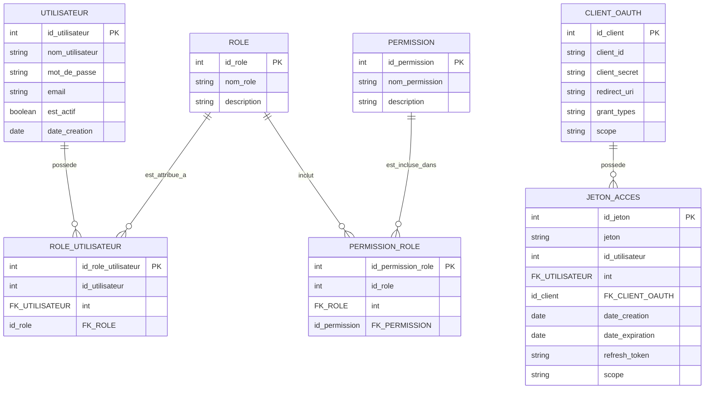

# Pgsql - Systeme D'authentification Et Autorisation

Absolument \! Pour cet exercice, nous allons concevoir un système d'authentification et d'autorisation pour une API en utilisant les concepts de JWT et OAuth 2.0. Étant donné que ces mécanismes sont souvent implémentés au niveau de l'application (backend) plutôt que directement dans la base de données, l'exercice se concentrera sur la *conception de la base de données* pour supporter ces fonctionnalités et sur les requêtes SQL pertinentes pour la gestion des utilisateurs, des rôles et des permissions.

**1. Modèle Logique des Données (MLD) en ER Diagram**

**2. Création de la Base de Données et des Tables (À faire par vous - en PostgreSQL)**

Créez une nouvelle base de données nommée `authentification` dans PostgreSQL et exécutez les instructions SQL pour créer les tables basées sur le diagramme ER ci-dessus. Définissez soigneusement les clés primaires, les clés étrangères et toutes les contraintes (NOT NULL, UNIQUE). Utilisez `SERIAL` pour les colonnes d'auto-incrémentation.

**3. Insertion de Données (Instructions et Données)**

Insérez des données pour configurer votre système d'authentification et d'autorisation.

**Table `UTILISATEUR`:**

| nom\_utilisateur | mot\_de\_passe (hash) | email                       | est\_actif |
|-----------------|-----------------------|-----------------------------|------------|
| alice           | $2a$10$examplehash1    | [adresse e-mail supprimée]   | TRUE       |
| bob             | $2a$10$anotherhash2  | [adresse e-mail supprimée] | TRUE       |
| charlie         | $2a$10$yetanother3   | [adresse e-mail supprimée] | FALSE      |

**Table `ROLE`:**

| nom\_role | description             |
|-----------|-------------------------|
| admin     | Administrateur système  |
| editor    | Éditeur de contenu      |
| viewer    | Lecteur seul            |

**Table `PERMISSION`:**

| nom\_permission | description                     |
|-----------------|---------------------------------|
| create          | Créer des ressources             |
| read            | Lire des ressources               |
| update          | Mettre à jour des ressources     |
| delete          | Supprimer des ressources        |
| publish         | Publier du contenu              |

**Table `ROLE_UTILISATEUR`:**

| id\_utilisateur | id\_role |
|-----------------|----------|
| 1               | 1        | -- Alice est admin
| 2               | 2        | -- Bob est éditeur
| 2               | 3        | -- Bob est aussi lecteur
| 3               | 3        | -- Charlie est lecteur (mais inactif)

**Table `PERMISSION_ROLE`:**

| id\_role | id\_permission |
|----------|-----------------|
| 1        | 1               | -- Admin peut créer
| 1        | 2               | -- Admin peut lire
| 1        | 3               | -- Admin peut mettre à jour
| 1        | 4               | -- Admin peut supprimer
| 1        | 5               | -- Admin peut publier
| 2        | 1               | -- Éditeur peut créer
| 2        | 2               | -- Éditeur peut lire
| 2        | 3               | -- Éditeur peut mettre à jour
| 2        | 5               | -- Éditeur peut publier
| 3        | 2               | -- Lecteur peut lire

**Table `CLIENT_OAUTH`:**

| client\_id           | client\_secret       | redirect\_uri         | grant\_types                      | scope         |
|----------------------|----------------------|-----------------------|-----------------------------------|---------------|
| mobile\_app          | secret\_mobile       | com.example.<mobile://>   | authorization\_code,password,refresh\_token | read,write    |
| web\_app             | secret\_web          | [https://example.com/callback](https://www.google.com/search?q=https://example.com/callback) | authorization\_code             | read          |
| trusted\_cli         | trusted\_secret      |                       | client\_credentials               | api           |

**Table `JETON_ACCES`:**

| jeton                                                | id\_utilisateur | id\_client | date\_creation          | date\_expiration          | refresh\_token                        | scope      |
|------------------------------------------------------|-----------------|------------|-------------------------|-------------------------|---------------------------------------|------------|
| eyJhbGciOiJIUzI1NiIsInR5cCI6IkpXVCJ9.eyJzdWIiOiIxI… | 1               | 1          | 2025-04-09 02:00:00     | 2025-04-09 03:00:00     | rtoken\_alice\_mobile                 | read,write |
| eyJhbGciOiJIUzI1NiIsInR5cCI6IkpXVCJ9.eyJzdWIiOiIyI… | 2               | 2          | 2025-04-09 02:05:00     | 2025-04-09 02:15:00     | rtoken\_bob\_web                      | read       |

**Instructions pour l'insertion (À faire par vous - en PostgreSQL) :**

Utilisez l'instruction `INSERT INTO` pour ajouter ces données dans les tables correspondantes. N'oubliez pas que les mots de passe dans la table `UTILISATEUR` devraient en réalité être des hachages sécurisés (comme ceux générés par bcrypt).

**4. Requêtes SQL Avancées (Beaucoup \! - en PostgreSQL)**

Voici une série de requêtes SQL pour explorer votre système d'authentification et d'autorisation.

**Requêtes de base sur les utilisateurs, rôles et permissions:**

1. Affichez tous les utilisateurs.
2. Affichez les utilisateurs actifs.
3. Affichez tous les rôles.
4. Affichez toutes les permissions.
5. Affichez les rôles attribués à un utilisateur spécifique (par exemple, l'utilisateur 'alice').
6. Affichez les utilisateurs qui ont un rôle spécifique (par exemple, le rôle 'editor').
7. Affichez les permissions associées à un rôle spécifique (par exemple, le rôle 'admin').
8. Affichez les rôles qui incluent une permission spécifique (par exemple, la permission 'publish').
9. Affichez les utilisateurs avec leurs rôles.
10. Affichez les rôles avec leurs permissions.

**Requêtes sur l'autorisation (vérification des permissions):**

11. Vérifiez si un utilisateur spécifique (par exemple, 'bob') a une permission spécifique ('publish'). (Nécessite une jointure sur plusieurs tables).
12. Affichez toutes les permissions d'un utilisateur donné (via ses rôles).
13. Trouvez les utilisateurs qui ont à la fois le rôle 'editor' et 'viewer'.
14. Trouvez les utilisateurs qui ont au moins une permission de 'delete'.
15. Affichez les rôles qui ont toutes les permissions 'read', 'create' et 'update'.

**Requêtes sur les clients OAuth 2.0:**

16. Affichez tous les clients OAuth 2.0 enregistrés.
17. Trouvez un client OAuth 2.0 par son `client_id`.
18. Affichez les `grant_types` supportés par un client spécifique.
19. Affichez les clients qui autorisent le scope 'read,write'.

**Requêtes sur les jetons d'accès (JWT simulé):**

20. Affichez tous les jetons d'accès actifs (non expirés).
21. Trouvez un jeton d'accès par sa valeur.
22. Affichez le jeton d'accès associé à un utilisateur spécifique pour un client OAuth 2.0 donné.
23. Affichez les jetons d'accès qui expireront dans les prochaines 24 heures.
24. Trouvez l'utilisateur associé à un jeton d'accès spécifique.
25. Affichez le client OAuth 2.0 qui a émis un jeton d'accès spécifique.
26. Affichez les jetons d'accès avec un scope spécifique (par exemple, 'read').
27. Trouvez les jetons d'accès qui ont un `refresh_token` non nul.

**Requêtes avancées et combinaisons:**

28. Affichez les utilisateurs (et leur statut actif) qui ont le rôle 'admin' OU le rôle 'editor'.
29. Trouvez les utilisateurs qui ont des rôles qui leur donnent la permission 'delete' mais pas la permission 'create'.
30. Affichez les clients OAuth 2.0 qui permettent l'octroi de type 'password' et ont un `redirect_uri` défini.
31. Trouvez les utilisateurs qui ont un jeton d'accès actif émis par le client 'mobile\_app'.
32. Affichez les utilisateurs qui ont des rôles avec toutes les permissions de base ('create', 'read', 'update', 'delete').
33. Trouvez les clients OAuth 2.0 qui ne spécifient aucun scope.
34. Affichez les utilisateurs qui n'ont aucun rôle attribué.
35. Trouvez les rôles qui n'ont aucune permission associée.
36. Affichez les utilisateurs et le nombre de rôles qu'ils possèdent.
37. Affichez les rôles et le nombre de permissions qu'ils incluent.
38. Trouvez les utilisateurs actifs qui ont au moins une permission 'publish'.
39. Affichez les clients OAuth 2.0 qui supportent à la fois 'authorization\_code' et 'refresh\_token'.
40. Trouvez les jetons d'accès créés au cours de la semaine dernière.

**Scénarios d'autorisation complexes:**

41. Écrivez une requête qui, étant donné un `nom_utilisateur` et un `nom_permission`, renvoie TRUE si l'utilisateur a cette permission, FALSE sinon. (Ceci simule une vérification d'autorisation).
42. Trouvez tous les utilisateurs qui ont au moins une permission qui commence par 'read'.
43. Affichez les rôles dont la description contient le mot 'administrateur'.
44. Trouvez les clients OAuth 2.0 dont le `redirect_uri` correspond à un pattern spécifique (par exemple, se terminant par '/callback').
45. Affichez les jetons d'accès triés par leur date d'expiration (les plus proches en premier).
46. Trouvez les utilisateurs qui ont des rôles qui leur permettent à la fois de 'create' et de 'read' mais pas de 'delete'.
47. Affichez les clients OAuth 2.0 qui n'ont pas de `scope` défini.
48. Trouvez les utilisateurs qui ont plus de deux rôles.
49. Affichez les rôles qui ont plus de quatre permissions.
50. Trouvez les utilisateurs actifs qui ont au moins une permission 'update' et dont l'email contient '@example.com' (si vous aviez plus de données email variées).

Et ainsi de suite \! Cet exercice vous permet de concevoir une base de données robuste pour la gestion de l'authentification et de l'autorisation avec des concepts clés comme les utilisateurs, les rôles, les permissions et le support pour OAuth 2.0 (clients et jetons). N'hésitez pas à imaginer d'autres requêtes pour explorer les relations entre ces entités. Bonne exploration \!
