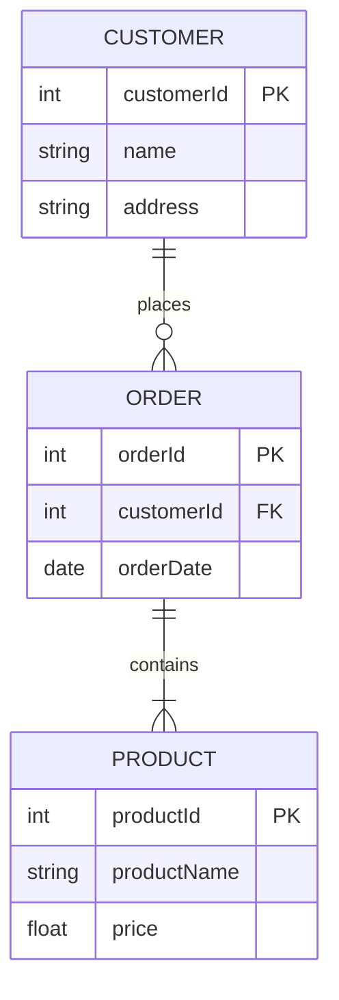
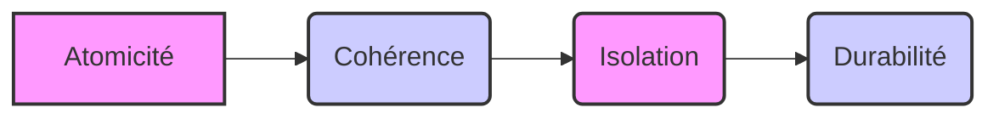

# Guide Compréhensif Des Bases De Données Relationnelles

Voici un guide complet des concepts fondamentaux que vous devez maîtriser concernant les bases de données relationnelles.

## 1. Concepts Fondamentaux

### Modèle Relationnel

- **Définition** : Structure de données basée sur la théorie des ensembles et la logique des prédicats
- **Éléments de base** : Tables (relations), lignes (tuples), colonnes (attributs)
- **Origine** : Développé par Edgar F. Codd en 1970

### Tables (Relations)

- **Structure** : Ensemble de lignes et de colonnes formant un tableau
- **Clé primaire** : Identifiant unique pour chaque ligne
- **Contraintes** : Règles garantissant l'intégrité des données

### Relations Entre Tables

- **Clés étrangères** : Réfèrent à la clé primaire d'une autre table
- **Types de relations** : Un-à-un, un-à-plusieurs, plusieurs-à-plusieurs



- **Jointures** : Permettent de combiner les données de plusieurs tables

## 2. Normalisation

### Formes Normales

- **1NF** : Valeurs atomiques, pas de répétition de groupes. Chaque colonne doit contenir une seule valeur, et il ne doit pas y avoir de groupes de colonnes répétitifs.
- **2NF** : 1NF + pas de dépendances partielles. Tous les attributs non-clés doivent dépendre de la totalité de la clé primaire.
- **3NF** : 2NF + pas de dépendances transitives. Les attributs non-clés ne doivent pas dépendre d'autres attributs non-clés.
- **BCNF** : 3NF + toute dépendance fonctionnelle est une super-clé. Pour chaque dépendance A -> B, A doit être une super-clé.
- **4NF, 5NF** : Formes avancées traitant d'autres types de dépendances.

**Exemple de Normalisation**

Considérons une table `Ventes` avec les colonnes suivantes : `ID_Vente`, `ID_Client`, `Nom_Client`, `Adresse_Client`, `ID_Produit`, `Nom_Produit`, `Prix_Produit`, `Quantité`.

1. **1NF** : La table est déjà en 1NF car chaque colonne contient une seule valeur.
2. **2NF** : Il y a une dépendance partielle car `Nom_Client` et `Adresse_Client` dépendent de `ID_Client` et `Nom_Produit`, `Prix_Produit` dépendent de `ID_Produit`. Pour passer en 2NF, on divise la table en trois tables :

    - `Clients` (`ID_Client`, `Nom_Client`, `Adresse_Client`)
    - `Produits` (`ID_Produit`, `Nom_Produit`, `Prix_Produit`)
    - `Ventes` (`ID_Vente`, `ID_Client`, `ID_Produit`, `Quantité`)

3. **3NF** : Il n'y a pas de dépendances transitives dans les tables `Clients`, `Produits` et `Ventes`, donc elles sont déjà en 3NF.

### Objectifs De la Normalisation

- Réduire la redondance des données.
- Éviter les anomalies d'insertion, de mise à jour et de suppression.
- Assurer l'intégrité des données.

## 3. Langage SQL

- **Définition** : Langage standard pour interagir avec les bases de données relationnelles.
- **Catégories principales** : DDL (Définition), DML (Manipulation), DCL (Contrôle), TCL (Transactions).

## 4. Contraintes D'intégrité

- **Définition** : Règles pour garantir la validité et la cohérence des données.

### Types De Contraintes d'Intégrité

Les contraintes d'intégrité sont des règles appliquées aux colonnes ou aux tables pour garantir l'exactitude et la fiabilité des données dans une base de données relationnelle. Elles aident à maintenir la cohérence des données en empêchant l'insertion, la mise à jour ou la suppression de données non valides.

- **NOT NULL**:
    - **Description**: Cette contrainte garantit qu'une colonne ne peut pas contenir de valeurs NULL. Si vous tentez d'insérer une nouvelle ligne ou de mettre à jour une ligne existante avec une valeur NULL dans une colonne définie comme NOT NULL, l'opération échouera.
    - **Utilité**: Elle est essentielle pour les colonnes qui doivent impérativement contenir une information pour que l'enregistrement soit complet et significatif (par exemple, un nom d'utilisateur, un identifiant de produit).
    - **Exemple SQL**:

        ```sql
        CREATE TABLE Clients (
            ClientID INT NOT NULL,
            Nom VARCHAR(255) NOT NULL
        );
        ```

- **UNIQUE**:
    - **Description**: La contrainte UNIQUE assure que toutes les valeurs dans une colonne (ou un groupe de colonnes) sont distinctes. Bien que similaire à une clé primaire, une table peut avoir plusieurs contraintes UNIQUE, et une colonne avec une contrainte UNIQUE peut contenir des valeurs NULL (généralement une seule, selon le SGBDR).
    - **Utilité**: Elle est utilisée pour identifier de manière unique des enregistrements lorsque la colonne n'est pas la clé primaire, mais que ses valeurs doivent néanmoins être uniques (par exemple, une adresse email, un numéro de sécurité sociale).
    - **Exemple SQL**:

        ```sql
        CREATE TABLE Utilisateurs (
            UtilisateurID INT PRIMARY KEY,
            NomUtilisateur VARCHAR(50) UNIQUE,
            Email VARCHAR(255) UNIQUE
        );
        ```

- **PRIMARY KEY**:
    - **Description**: La clé primaire identifie de manière unique chaque enregistrement (ligne) dans une table. Une table ne peut avoir qu'une seule clé primaire, qui peut être composée d'une ou plusieurs colonnes. La contrainte PRIMARY KEY combine les propriétés de NOT NULL et UNIQUE, garantissant que les valeurs de la clé primaire sont toujours présentes et uniques.
    - **Utilité**: Elle est fondamentale pour l'intégrité de la structure de la base de données, permettant d'établir des relations avec d'autres tables via des clés étrangères et d'assurer l'identification non ambiguë de chaque ligne.
    - **Exemple SQL**:

        ```sql
        CREATE TABLE Produits (
            ProduitID INT PRIMARY KEY,
            NomProduit VARCHAR(255) NOT NULL
        );
        ```

- **FOREIGN KEY**:
    - **Description**: Une clé étrangère est une colonne (ou un ensemble de colonnes) dans une table (la table "enfant") qui établit un lien avec la clé primaire d'une autre table (la table "parente"). Elle garantit l'intégrité référentielle en s'assurant que les valeurs dans la colonne de la clé étrangère correspondent à des valeurs existantes dans la clé primaire de la table parente.
    - **Utilité**: Elle est cruciale pour maintenir la cohérence entre les tables liées, empêchant les "liens brisés" où un enregistrement dans une table référence un enregistrement inexistant dans une autre.
    - **Exemple SQL**:

        ```sql
        CREATE TABLE Commandes (
            CommandeID INT PRIMARY KEY,
            ProduitID INT,
            Quantite INT,
            FOREIGN KEY (ProduitID) REFERENCES Produits(ProduitID)
        );
        ```

- **CHECK**:
    - **Description**: La contrainte CHECK permet de définir une condition qui doit être vraie pour chaque valeur insérée ou mise à jour dans une colonne. Cette condition est une expression booléenne.
    - **Utilité**: Elle est utilisée pour appliquer des règles métier spécifiques qui ne sont pas couvertes par les autres types de contraintes, comme s'assurer qu'un âge est supérieur à 18, qu'un prix est positif, ou qu'une date est dans une certaine plage.
    - **Exemple SQL**:

        ```sql
        CREATE TABLE Employes (
            EmployeID INT PRIMARY KEY,
            Nom VARCHAR(255),
            Salaire DECIMAL(10, 2) CHECK (Salaire > 0)
        );
        ```

- **DEFAULT**:
    - **Description**: La contrainte DEFAULT spécifie une valeur qui sera automatiquement attribuée à une colonne si aucune valeur n'est explicitement fournie lors de l'insertion d'une nouvelle ligne.
    - **Utilité**: Elle est utile pour définir des valeurs par défaut courantes, comme la date actuelle pour une colonne de date de création, un statut par défaut pour une commande, ou une valeur booléenne par défaut.
    - **Exemple SQL**:

        ```sql
        CREATE TABLE Taches (
            TacheID INT PRIMARY KEY,
            Description VARCHAR(255),
            Statut VARCHAR(50) DEFAULT 'En cours'
        );
        ```

### Intégrité Référentielle

L'intégrité référentielle est un concept clé des bases de données relationnelles qui garantit que les relations entre les tables restent cohérentes. Elle est principalement gérée par les clés étrangères. Lorsqu'une clé étrangère est définie, le SGBDR s'assure que chaque valeur dans la colonne de la clé étrangère de la table enfant correspond à une valeur existante dans la clé primaire de la table parente.

Les actions référentielles définissent le comportement du SGBDR lorsque des modifications (suppression ou mise à jour) sont apportées aux données de la table parente qui sont référencées par la table enfant. Ces actions sont spécifiées lors de la définition de la contrainte de clé étrangère :

- **ON DELETE / ON UPDATE**: Ces clauses sont utilisées avec la définition de la clé étrangère pour spécifier l'action à entreprendre lorsque la ligne correspondante dans la table parente est supprimée ou mise à jour.
    - **CASCADE**:
        - **Description**: Si une ligne est supprimée ou mise à jour dans la table parente, les lignes correspondantes dans la table enfant sont automatiquement supprimées ou mises à jour.
        - **Utilité**: Utile lorsque les lignes de la table enfant n'ont pas de sens sans la ligne parente correspondante (par exemple, les lignes d'une commande qui dépendent de l'en-tête de la commande).
        - **Exemple SQL**:

            ```sql
            CREATE TABLE Commandes (
                CommandeID INT PRIMARY KEY,
                ClientID INT,
                FOREIGN KEY (ClientID) REFERENCES Clients(ClientID) ON DELETE CASCADE
            );
            ```

    - **SET NULL**:
        - **Description**: Si une ligne est supprimée ou mise à jour dans la table parente, la valeur de la clé étrangère dans les lignes correspondantes de la table enfant est définie à NULL. Cela n'est possible que si la colonne de la clé étrangère dans la table enfant n'a pas la contrainte NOT NULL.
        - **Utilité**: Utile lorsque les lignes de la table enfant peuvent exister indépendamment de la ligne parente, mais que le lien doit être rompu (par exemple, un employé dont le département est supprimé).
        - **Exemple SQL**:

            ```sql
            CREATE TABLE Employes (
                EmployeID INT PRIMARY KEY,
                DepartementID INT NULL,
                FOREIGN KEY (DepartementID) REFERENCES Departements(DepartementID) ON DELETE SET NULL
            );
            ```

    - **RESTRICT**:
        - **Description**: Empêche la suppression ou la mise à jour d'une ligne dans la table parente s'il existe des lignes correspondantes dans la table enfant. L'opération échoue avec une erreur.
        - **Utilité**: C'est souvent le comportement par défaut et le plus sûr, car il empêche la perte accidentelle de données dans la table enfant.
        - **Exemple SQL**:

            ```sql
            CREATE TABLE Produits (
                ProduitID INT PRIMARY KEY
            );

            CREATE TABLE LignesCommande (
                LigneCommandeID INT PRIMARY KEY,
                ProduitID INT,
                FOREIGN KEY (ProduitID) REFERENCES Produits(ProduitID) ON DELETE RESTRICT
            );
            ```

    - **NO ACTION**:
        - **Description**: Similaire à RESTRICT, mais la vérification de l'existence de lignes correspondantes dans la table enfant est effectuée à la fin de la transaction plutôt qu'immédiatement. Si des lignes correspondantes existent, l'opération est annulée.
        - **Utilité**: Le comportement est pratiquement identique à RESTRICT dans la plupart des cas, mais la différence réside dans le moment de la vérification.
        - **Exemple SQL**:

            ```sql
            CREATE TABLE Commandes (
                CommandeID INT PRIMARY KEY,
                ClientID INT,
                FOREIGN KEY (ClientID) REFERENCES Clients(ClientID) ON DELETE NO ACTION
            );
            ```

    - **SET DEFAULT**:
        - **Description**: Si une ligne est supprimée ou mise à jour dans la table parente, la valeur de la clé étrangère dans les lignes correspondantes de la table enfant est définie à sa valeur par défaut. Cela nécessite qu'une valeur par défaut soit définie pour la colonne de la clé étrangère.
        - **Utilité**: Moins courante que les autres actions, elle est utilisée lorsque le lien doit être rompu et qu'une valeur par défaut significative peut être attribuée.
        - **Exemple SQL**:

            ```sql
            CREATE TABLE Employes (
                EmployeID INT PRIMARY KEY,
                DepartementID INT DEFAULT 1, -- Supposons que 1 est le département par défaut
                FOREIGN KEY (DepartementID) REFERENCES Departements(DepartementID) ON DELETE SET DEFAULT
            );
            ```

### Types De Contraintes d'Intégrité

- **NOT NULL**:
    - Empêche l'insertion de valeurs NULL dans une colonne.
    - Assure que chaque ligne a une valeur pour cette colonne.
- **UNIQUE**:
    - Garantit que toutes les valeurs dans une colonne sont uniques.
    - Peut autoriser une seule valeur NULL, selon le SGBDR.
- **PRIMARY KEY**:
    - Identifie de manière unique chaque ligne dans une table.
    - Implique automatiquement une contrainte NOT NULL et UNIQUE.
    - Une table ne peut avoir qu'une seule clé primaire.
- **FOREIGN KEY**:
    - Établit une relation entre deux tables.
    - Assure que les valeurs dans une colonne correspondent à des valeurs existantes dans une autre table (ou dans la même table).
    - Maintient l'intégrité référentielle.
- **CHECK**:
    - Définit une condition que chaque valeur dans une colonne doit satisfaire.
    - Permet d'appliquer des règles métier spécifiques.
- **DEFAULT**:
    - Spécifie une valeur par défaut pour une colonne si aucune valeur n'est fournie lors de l'insertion.

### Intégrité Référentielle

- Gérée par les clés étrangères.
- Définit les actions à entreprendre lors de la suppression ou de la mise à jour d'une ligne dans la table parente (celle référencée par la clé étrangère).
    - **CASCADE**: Supprime ou met à jour automatiquement les lignes correspondantes dans la table enfant.
    - **SET NULL**: Définit la clé étrangère à NULL dans la table enfant.
    - **RESTRICT**: Empêche la suppression ou la mise à jour dans la table parente si des lignes correspondantes existent dans la table enfant.
    - **NO ACTION**: Similaire à RESTRICT, mais la vérification est effectuée après la tentative de modification.
    - **SET DEFAULT**: Définit la clé étrangère à sa valeur par défaut (moins courante).

### Types De Contraintes d'Intégrité

- **NOT NULL**:
    - Empêche l'insertion de valeurs NULL dans une colonne.
    - Assure que chaque ligne a une valeur pour cette colonne.
- **UNIQUE**:
    - Garantit que toutes les valeurs dans une colonne sont uniques.
    - Peut autoriser une seule valeur NULL, selon le SGBDR.
- **PRIMARY KEY**:
    - Identifie de manière unique chaque ligne dans une table.
    - Implique automatiquement une contrainte NOT NULL et UNIQUE.
    - Une table ne peut avoir qu'une seule clé primaire.
- **FOREIGN KEY**:
    - Établit une relation entre deux tables.
    - Assure que les valeurs dans une colonne correspondent à des valeurs existantes dans une autre table (ou dans la même table).
    - Maintient l'intégrité référentielle.
- **CHECK**:
    - Définit une condition que chaque valeur dans une colonne doit satisfaire.
    - Permet d'appliquer des règles métier spécifiques.
- **DEFAULT**:
    - Spécifie une valeur par défaut pour une colonne si aucune valeur n'est fournie lors de l'insertion.

### Intégrité Référentielle

- Gérée par les clés étrangères.
- Définit les actions à entreprendre lors de la suppression ou de la mise à jour d'une ligne dans la table parente (celle référencée par la clé étrangère).
    - **CASCADE**: Supprime ou met à jour automatiquement les lignes correspondantes dans la table enfant.
    - **SET NULL**: Définit la clé étrangère à NULL dans la table enfant.
    - **RESTRICT**: Empêche la suppression ou la mise à jour dans la table parente si des lignes correspondantes existent dans la table enfant.
    - **NO ACTION**: Similaire à RESTRICT, mais la vérification est effectuée après la tentative de modification.
    - **SET DEFAULT**: Définit la clé étrangère à sa valeur par défaut (moins courante).

### Types De Contraintes d'Intégrité

- **NOT NULL**:
    - Empêche l'insertion de valeurs NULL dans une colonne.
    - Assure que chaque ligne a une valeur pour cette colonne.
- **UNIQUE**:
    - Garantit que toutes les valeurs dans une colonne sont uniques.
    - Peut autoriser une seule valeur NULL, selon le SGBDR.
- **PRIMARY KEY**:
    - Identifie de manière unique chaque ligne dans une table.
    - Implique automatiquement une contrainte NOT NULL et UNIQUE.
    - Une table ne peut avoir qu'une seule clé primaire.
- **FOREIGN KEY**:
    - Établit une relation entre deux tables.
    - Assure que les valeurs dans une colonne correspondent à des valeurs existantes dans une autre table (ou dans la même table).
    - Maintient l'intégrité référentielle.
- **CHECK**:
    - Définit une condition que chaque valeur dans une colonne doit satisfaire.
    - Permet d'appliquer des règles métier spécifiques.
- **DEFAULT**:
    - Spécifie une valeur par défaut pour une colonne si aucune valeur n'est fournie lors de l'insertion.

### Intégrité Référentielle

- Gérée par les clés étrangères.
- Définit les actions à entreprendre lors de la suppression ou de la mise à jour d'une ligne dans la table parente (celle référencée par la clé étrangère).
    - **CASCADE**: Supprime ou met à jour automatiquement les lignes correspondantes dans la table enfant.
    - **SET NULL**: Définit la clé étrangère à NULL dans la table enfant.
    - **RESTRICT**: Empêche la suppression ou la mise à jour dans la table parente si des lignes correspondantes existent dans la table enfant.
    - **NO ACTION**: Similaire à RESTRICT, mais la vérification est effectuée après la tentative de modification.
    - **SET DEFAULT**: Définit la clé étrangère à sa valeur par défaut (moins courante).

### Types De Contraintes d'Intégrité

- **NOT NULL**:
    - Empêche l'insertion de valeurs NULL dans une colonne.
    - Assure que chaque ligne a une valeur pour cette colonne.
- **UNIQUE**:
    - Garantit que toutes les valeurs dans une colonne sont uniques.
    - Peut autoriser une seule valeur NULL, selon le SGBDR.
- **PRIMARY KEY**:
    - Identifie de manière unique chaque ligne dans une table.
    - Implique automatiquement une contrainte NOT NULL et UNIQUE.
    - Une table ne peut avoir qu'une seule clé primaire.
- **FOREIGN KEY**:
    - Établit une relation entre deux tables.
    - Assure que les valeurs dans une colonne correspondent à des valeurs existantes dans une autre table (ou dans la même table).
    - Maintient l'intégrité référentielle.
- **CHECK**:
    - Définit une condition que chaque valeur dans une colonne doit satisfaire.
    - Permet d'appliquer des règles métier spécifiques.
- **DEFAULT**:
    - Spécifie une valeur par défaut pour une colonne si aucune valeur n'est fournie lors de l'insertion.

### Intégrité Référentielle

- Gérée par les clés étrangères.
- Définit les actions à entreprendre lors de la suppression ou de la mise à jour d'une ligne dans la table parente (celle référencée par la clé étrangère).
    - **CASCADE**: Supprime ou met à jour automatiquement les lignes correspondantes dans la table enfant.
    - **SET NULL**: Définit la clé étrangère à NULL dans la table enfant.
    - **RESTRICT**: Empêche la suppression ou la mise à jour dans la table parente si des lignes correspondantes existent dans la table enfant.
    - **NO ACTION**: Similaire à RESTRICT, mais la vérification est effectuée après la tentative de modification.
    - **SET DEFAULT**: Définit la clé étrangère à sa valeur par défaut (moins courante).

## 5. Transactions

### Définition Et Utilité

Une transaction est une séquence d'opérations de base de données (comme INSERT, UPDATE, DELETE) qui sont exécutées comme une seule unité logique de travail. Le but principal des transactions est de maintenir l'intégrité et la cohérence des données, même en cas d'erreurs système ou de pannes.

### Propriétés ACID

Les transactions dans les bases de données relationnelles adhèrent généralement aux propriétés ACID, un acronyme pour :

- **Atomicité** : Une transaction est une unité indivisible. Soit toutes les opérations de la transaction sont complétées avec succès, soit aucune ne l'est. En cas d'échec à n'importe quel moment, la transaction entière est annulée (rollback), ramenant la base de données à son état précédent la transaction.
- **Cohérence** : Une transaction amène la base de données d'un état valide à un autre état valide. Elle garantit que toutes les contraintes d'intégrité (clés primaires, étrangères, checks, etc.) sont respectées avant et après l'exécution de la transaction.
- **Isolation** : L'exécution simultanée de plusieurs transactions ne doit pas interférer les unes avec les autres. Chaque transaction s'exécute comme si elle était la seule à accéder à la base de données, évitant ainsi les problèmes tels que les lectures sales, les lectures non répétables et les lectures fantômes.
- **Durabilité** : Une fois qu'une transaction est validée (commit), ses modifications sont permanentes et survivent aux pannes du système (comme une coupure de courant ou un crash du serveur). Les données validées sont écrites sur un support de stockage permanent.



### Gestion Des Transactions

Les transactions sont gérées à l'aide de commandes SQL spécifiques :

- **START TRANSACTION** (ou BEGIN TRANSACTION) : Marque le début d'une transaction.
- **COMMIT** : Valide la transaction. Toutes les modifications effectuées depuis le début de la transaction sont rendues permanentes.
- **ROLLBACK** : Annule la transaction. Toutes les modifications effectuées depuis le début de la transaction sont annulées, ramenant la base de données à son état précédent.

**Exemple de Transaction**

Considérons un transfert d'argent entre deux comptes bancaires :

```sql
START TRANSACTION;

-- Débiter le compte source
UPDATE Comptes SET Solde = Solde - 100 WHERE CompteID = 1;

-- Créditer le compte destinataire
UPDATE Comptes SET Solde = Solde + 100 WHERE CompteID = 2;

-- Si les deux opérations réussissent, valider la transaction
COMMIT;

-- Si une opération échoue, annuler la transaction
-- ROLLBACK;
```

Dans cet exemple, si la mise à jour du compte destinataire échoue après que le compte source a été débité, le `ROLLBACK` annulera le débit, garantissant que la base de données reste dans un état cohérent.

### Niveaux D'isolation

Les niveaux d'isolation définissent le degré auquel une transaction est isolée des modifications apportées par d'autres transactions concurrentes. Les niveaux d'isolation standard SQL, du moins isolé au plus isolé, sont :

- **READ UNCOMMITTED** : Une transaction peut lire les données non validées par d'autres transactions ("dirty reads"). C'est le niveau le moins isolé et le plus rapide, mais il peut entraîner des incohérences.
- **READ COMMITTED** : Une transaction ne peut lire que les données validées par d'autres transactions. Cela empêche les "dirty reads" mais peut toujours souffrir de "non-repeatable reads" (une même lecture dans une transaction renvoie des résultats différents) et de "phantom reads" (de nouvelles lignes apparaissent dans un ensemble de résultats).
- **REPEATABLE READ** : Une transaction garantit que si elle lit une ligne plusieurs fois, elle obtiendra toujours la même version de la ligne. Cela empêche les "dirty reads" et les "non-repeatable reads", mais les "phantom reads" sont toujours possibles.
- **SERIALIZABLE** : C'est le niveau d'isolation le plus élevé. Il garantit que l'exécution concurrente des transactions produit le même résultat qu'une exécution séquentielle. Cela empêche tous les problèmes de concurrence (dirty reads, non-repeatable reads, phantom reads), mais peut réduire les performances en raison du verrouillage accru.

Le choix du niveau d'isolation dépend du compromis entre la cohérence des données et les performances.

## 6. Index

### Définition Et Fonctionnement

Un index est une structure de données (souvent un arbre B) qui améliore la vitesse de récupération des données à partir d'une table. Il fonctionne de manière similaire à l'index d'un livre : au lieu de parcourir toutes les pages pour trouver une information, vous consultez l'index pour trouver rapidement l'emplacement pertinent.

Les index sont créés sur une ou plusieurs colonnes d'une table. Lorsque vous exécutez une requête qui filtre ou trie les données sur ces colonnes, le SGBDR peut utiliser l'index pour localiser rapidement les lignes pertinentes sans avoir à effectuer une analyse complète de la table (full table scan).

### Types Courants

- **B-tree (Arbre B)** : Le type d'index le plus courant. Il est efficace pour une large gamme d'opérations, y compris les recherches d'égalité, les recherches de plage et le tri.
- **Hash** : Utilisé pour les recherches d'égalité exactes. Il est très rapide pour trouver des valeurs spécifiques, mais ne convient pas aux recherches de plage ou au tri.
- **Bitmap** : Utilisé pour les colonnes avec un faible nombre de valeurs distinctes (faible cardinalité), comme le sexe ou le statut marital. Il stocke un bitmap pour chaque valeur distincte, où chaque bit représente une ligne de la table.
- **Spatial** : Utilisé pour indexer des données géospatiales, permettant des recherches basées sur la localisation.

### Avantages Et Inconvénients

**Avantages :**

- **Amélioration des performances des requêtes SELECT** : Accélère considérablement les opérations de lecture, en particulier sur les grandes tables.
- **Accélération du tri et du regroupement** : Les index peuvent aider le SGBDR à effectuer plus rapidement les opérations ORDER BY et GROUP BY.
- **Application des contraintes UNIQUE et PRIMARY KEY** : Les SGBDR utilisent souvent des index pour faire respecter ces contraintes.

**Inconvénients :**

- **Ralentissement des opérations DML** : Chaque fois que des données sont insérées, mises à jour ou supprimées dans une table indexée, le SGBDR doit également mettre à jour l'index. Cela ajoute une surcharge et peut ralentir ces opérations.
- **Espace de stockage supplémentaire** : Les index sont des structures de données qui nécessitent de l'espace disque.
- **Maintenance** : Les index doivent être mis à jour et parfois reconstruits pour maintenir leur efficacité.

**Exemple d'Indexation**

Supposons que vous ayez une table `Utilisateurs` avec des millions de lignes et que vous interrogiez fréquemment la table sur la colonne `Nom`. Sans index, la base de données doit parcourir chaque ligne de la table pour trouver les correspondances, ce qui peut être lent.

Pour accélérer les requêtes, vous pouvez créer un index sur la colonne `Nom` :

```sql
CREATE INDEX idx_nom ON Utilisateurs(Nom);
```

Maintenant, lorsque vous exécutez une requête comme celle-ci :

```sql
SELECT * FROM Utilisateurs WHERE Nom = 'John Doe';
```

La base de données peut utiliser l'index pour trouver rapidement les lignes correspondantes sans avoir à parcourir toute la table.

Cependant, il est important de noter que les index peuvent ralentir les opérations d'écriture (INSERT, UPDATE, DELETE) car la base de données doit également mettre à jour les index chaque fois que les données sont modifiées. Par conséquent, il est important de créer des index uniquement sur les colonnes qui sont fréquemment utilisées dans les requêtes SELECT.

### Quand Utiliser Des Index ?

- Sur les colonnes utilisées fréquemment dans les clauses WHERE, JOIN, ORDER BY et GROUP BY.
- Sur les colonnes avec une cardinalité élevée (beaucoup de valeurs distinctes), sauf pour les index Bitmap.
- Sur les clés primaires et les clés étrangères (souvent indexées automatiquement par le SGBDR).

### Quand Éviter Les Index ?

- Sur les petites tables où une analyse complète est plus rapide qu'une recherche d'index.
- Sur les colonnes qui sont rarement utilisées dans les requêtes.
- Sur les tables qui subissent de très fréquentes opérations d'écriture (INSERT, UPDATE, DELETE).

## 7. Vues

### Définition Et Utilité

Une vue est une table virtuelle basée sur le résultat d'une requête SQL. Elle ne stocke pas les données elle-même, mais agit comme une fenêtre sur les données des tables sous-jacentes. Lorsqu'une vue est interrogée, le SGBDR exécute la requête définie dans la vue et renvoie le résultat.

Les vues sont utiles pour plusieurs raisons :

- **Simplifier les requêtes complexes** : Une vue peut encapsuler une jointure complexe ou une logique de filtrage, permettant aux utilisateurs d'interroger la vue comme s'il s'agissait d'une table simple.
- **Masquer la complexité des données** : Les vues peuvent présenter un sous-ensemble des données d'une ou plusieurs tables, masquant les détails inutiles ou sensibles.
- **Gérer la sécurité** : Les vues peuvent être utilisées pour restreindre l'accès des utilisateurs à certaines colonnes ou lignes d'une table.
- **Fournir une couche d'abstraction** : Les vues peuvent isoler les applications des changements dans la structure des tables sous-jacentes.

### Création Et Utilisation

Une vue est créée à l'aide de la commande `CREATE VIEW` :

```sql
CREATE VIEW VueClientsCommandes AS
SELECT c.Nom, c.Adresse, o.CommandeID, o.DateCommande
FROM Clients c
JOIN Commandes o ON c.ClientID = o.ClientID
WHERE o.DateCommande >= '2023-01-01';
```

Une fois créée, vous pouvez interroger la vue comme une table normale :

```sql
SELECT * FROM VueClientsCommandes WHERE Nom = 'Dupont';
```

### Types

- **Vues Simples** : Basées sur une seule table, sans fonctions d'agrégation, GROUP BY, ou DISTINCT. Elles sont souvent modifiables (vous pouvez insérer, mettre à jour ou supprimer des données via la vue).
- **Vues Complexes** : Basées sur plusieurs tables, incluant des jointures, des fonctions d'agrégation, GROUP BY, ou DISTINCT. Elles ne sont généralement pas modifiables.
- **Vues Matérialisées** : Contrairement aux vues standard, les vues matérialisées stockent physiquement les données résultant de la requête. Cela peut améliorer considérablement les performances des requêtes sur la vue, mais nécessite un espace de stockage supplémentaire et les données doivent être rafraîchies périodiquement pour refléter les modifications dans les tables sous-jacentes.

## 8. Procédures Stockées Et Déclencheurs

### Procédures Stockées

- **Définition** : Une procédure stockée est un ensemble de déclarations SQL et de logique procédurale (comme des boucles, des conditions) qui est stocké dans la base de données et peut être exécuté sur appel. Elles sont précompilées, ce qui peut améliorer les performances.
- **Utilité** :
    - **Encapsulation de la logique métier** : Permet de centraliser la logique complexe côté base de données.
    - **Performance** : Réduit le trafic réseau entre l'application et la base de données et bénéficie de la précompilation.
    - **Sécurité** : Les utilisateurs peuvent se voir accorder des autorisations pour exécuter des procédures stockées sans avoir un accès direct aux tables sous-jacentes.
    - **Maintenabilité** : Les modifications de la logique métier peuvent être apportées dans la procédure stockée sans nécessiter de modifications dans l'application.

**Exemple de Procédure Stockée (Syntaxe générique)**

```sql
CREATE PROCEDURE TransfererArgent (
    IN CompteSourceID INT,
    IN CompteDestinataireID INT,
    IN Montant DECIMAL(10, 2)
)
BEGIN
    START TRANSACTION;

    UPDATE Comptes SET Solde = Solde - Montant WHERE CompteID = CompteSourceID;
    UPDATE Comptes SET Solde = Solde + Montant WHERE CompteID = CompteDestinataireID;

    COMMIT;
END;
```

Pour exécuter la procédure stockée :

```sql
CALL TransfererArgent(1, 2, 100);
```

### Déclencheurs (Triggers)

- **Définition** : Un déclencheur est un bloc de code SQL qui est exécuté automatiquement en réponse à un événement spécifique (INSERT, UPDATE, DELETE) sur une table.
- **Utilité** :
    - **Application de règles métier complexes** : Peut être utilisé pour maintenir la cohérence des données ou appliquer des règles qui ne peuvent pas être gérées par de simples contraintes.
    - **Audit des données** : Enregistrer les modifications apportées aux données dans une table d'historique.
    - **Synchronisation des données** : Mettre à jour automatiquement d'autres tables en réponse à des modifications.
    - **Prévention d'opérations non valides** : Annuler une opération si elle viole une règle spécifique.

**Exemple de Déclencheur (Syntaxe générique)**

```sql
CREATE TRIGGER after_insert_commande
AFTER INSERT ON Commandes
FOR EACH ROW
BEGIN
    -- Mettre à jour le stock de produits après une nouvelle commande
    UPDATE Produits
    SET Stock = Stock - NEW.Quantite
    WHERE ProduitID = NEW.ProduitID;
END;
```

Ce déclencheur s'exécute après chaque insertion dans la table `Commandes` et réduit le stock du produit correspondant.

## 9. Administration Et Optimisation

L'administration et l'optimisation des bases de données sont cruciales pour garantir que le système de base de données fonctionne de manière efficace, sécurisée et fiable.

### Administration

- **Installation et Configuration** : Mise en place du SGBDR, configuration des paramètres système et réseau.
- **Gestion des Utilisateurs et des Privilèges** : Création d'utilisateurs, attribution de rôles et de permissions pour contrôler l'accès aux données et aux objets de la base de données.
- **Sauvegarde et Restauration** : Mise en place de stratégies de sauvegarde régulières et procédures de restauration en cas de sinistre.
- **Surveillance et Maintenance** : Suivi des performances, de l'utilisation des ressources, gestion de l'espace disque, et application des mises à jour et correctifs.
- **Planification de la Capacité** : Évaluation des besoins futurs en termes de stockage et de performance.

### Optimisation

L'optimisation vise à améliorer les performances des requêtes et l'efficacité globale de la base de données.

- **Analyse et Optimisation des Requêtes** :
    - **Plans d'exécution** : Utilisation d'outils pour analyser comment le SGBDR exécute une requête et identifier les goulots d'étranglement.
    - **Réécriture des requêtes** : Modifier les requêtes pour les rendre plus efficaces (p. ex., éviter les SELECT *, utiliser des jointures appropriées).
- **Gestion des Index** : Création, modification et suppression d'index pour accélérer les opérations de lecture. S'assurer que les index sont utilisés efficacement par le SGBDR.
- **Partitionnement** : Diviser de grandes tables en partitions plus petites et plus gérables, ce qui peut améliorer les performances des requêtes et la maintenance.
- **Optimisation du Schéma** : S'assurer que le schéma de la base de données est correctement normalisé et que les types de données appropriés sont utilisés.
- **Configuration du SGBDR** : Ajuster les paramètres de configuration du SGBDR (mémoire, cache, etc.) pour optimiser les performances.

### Sécurité

La sécurité de la base de données est primordiale pour protéger les données sensibles.

- **Authentification et Autorisation** : Vérifier l'identité des utilisateurs et contrôler les actions qu'ils sont autorisés à effectuer.
- **Prévention des Injections SQL** : Utiliser des requêtes paramétrées ou des procédures stockées pour empêcher les attaquants d'injecter du code SQL malveillant.
- **Chiffrement** : Chiffrer les données au repos (sur le disque) et en transit (sur le réseau) pour protéger contre l'accès non autorisé.
- **Audit** : Enregistrer les activités de la base de données pour détecter les comportements suspects et assurer la conformité.
- **Gestion des Vulnérabilités** : Appliquer régulièrement les correctifs de sécurité et suivre les bonnes pratiques.

## 10. Conception De Bases De Données

La conception d'une base de données est un processus structuré qui vise à créer un schéma de base de données efficace, cohérent et adapté aux besoins de l'application.

### Méthodologies De Conception

- **Conception Conceptuelle** :
    - **Objectif** : Créer un modèle de données de haut niveau qui représente les informations importantes et leurs relations dans le domaine du problème, indépendamment du SGBDR spécifique.
    - **Outils** : Diagrammes Entité-Association (ERD) sont couramment utilisés pour visualiser les entités (objets du monde réel), leurs attributs (propriétés) et les relations entre elles.
    - **Résultat** : Un modèle conceptuel clair et compréhensible par les utilisateurs et les développeurs.
- **Conception Logique** :
    - **Objectif** : Transformer le modèle conceptuel en un schéma de base de données logique qui peut être implémenté dans un SGBDR relationnel.
    - **Processus** : Les entités deviennent des tables, les attributs deviennent des colonnes, et les relations sont représentées par des clés étrangères. La normalisation est appliquée pour réduire la redondance et les anomalies.
    - **Résultat** : Un schéma relationnel (ensemble de tables, colonnes, types de données et contraintes) qui est indépendant du SGBDR physique.
- **Conception Physique** :
    - **Objectif** : Implémenter le schéma logique dans un SGBDR spécifique et prendre des décisions d'implémentation pour optimiser les performances et l'utilisation des ressources.
    - **Processus** : Choix des types de données spécifiques au SGBDR, création d'index, partitionnement des tables, configuration du stockage, et mise en place des mesures de sécurité.
    - **Résultat** : La base de données réelle implémentée dans le SGBDR choisi.

### Étapes De la Conception

1. **Analyse des Exigences** : Recueillir et documenter les besoins en information de l'application et des utilisateurs. Identifier les données à stocker, les relations entre elles, et les règles métier.
2. **Modélisation des Données** : Créer le modèle conceptuel (ERD) puis le transformer en modèle logique (schéma relationnel normalisé).
3. **Choix du SGBDR** : Sélectionner le système de gestion de base de données relationnelle le plus approprié en fonction des exigences de l'application (taille des données, performance, coût, fonctionnalités spécifiques, expertise de l'équipe).
4. **Implémentation du Schéma** : Créer les tables, définir les colonnes avec leurs types de données, spécifier les contraintes d'intégrité (PRIMARY KEY, FOREIGN KEY, UNIQUE, CHECK, NOT NULL) dans le SGBDR choisi.
5. **Optimisation des Performances** : Analyser les modèles d'accès aux données et créer des index appropriés. Envisager le partitionnement pour les grandes tables. Optimiser la configuration du SGBDR.
6. **Sécurité** : Définir les utilisateurs, les rôles et les privilèges. Mettre en place des politiques de sécurité pour protéger les données contre les accès non autorisés et les menaces.

## 11. SGBDR Populaires

Voici une présentation plus détaillée de quelques-uns des systèmes de gestion de bases de données relationnelles (SGBDR) les plus populaires :

- **MySQL/MariaDB** :
    - **Type** : Open source. MariaDB est un fork communautaire de MySQL, offrant une grande compatibilité.
    - **Caractéristiques** : Facile à installer et à utiliser, performant pour de nombreuses applications, large support communautaire. Supporte différents moteurs de stockage (InnoDB, MyISAM, etc.).
    - **Utilisation typique** : Applications web (souvent dans la pile LAMP/LEMP), petites et moyennes entreprises.
    - **Avantages** : Gratuit, rapide, fiable, large adoption.
    - **Inconvénients** : Moins strict sur certaines normes SQL que PostgreSQL, certaines fonctionnalités avancées peuvent manquer par rapport aux SGBDR commerciaux.
- **PostgreSQL** :
    - **Type** : Open source.
    - **Caractéristiques** : Très puissant et riche en fonctionnalités, hautement conforme aux standards SQL, supporte des types de données avancés (JSON, géospatial), extensibilité via des extensions.
    - **Utilisation typique** : Applications d'entreprise, systèmes géospatiaux, entrepôts de données, applications nécessitant une grande conformité SQL et des fonctionnalités avancées.
    - **Avantages** : Robuste, fiable, extensible, excellent pour l'intégrité des données et les charges de travail complexes.
    - **Inconvénients** : Peut être perçu comme plus complexe à administrer que MySQL pour les débutants.
- **Oracle Database** :
    - **Type** : Commercial.
    - **Caractéristiques** : Leader du marché pour les applications d'entreprise critiques, offre une large gamme de fonctionnalités avancées (haute disponibilité, sécurité, performance, gestion du Big Data), support technique professionnel.
    - **Utilisation typique** : Grandes entreprises, applications nécessitant une fiabilité et une évolutivité maximales, systèmes financiers, ERP.
    - **Avantages** : Très puissant, fiable, sécurisé, riche en fonctionnalités, excellent support.
    - **Inconvénients** : Coût élevé des licences et de la maintenance, complexité d'administration.
- **SQL Server** :
    - **Type** : Commercial (Microsoft).
    - **Caractéristiques** : Fortement intégré à l'écosystème Microsoft (Windows Server, .NET), offre des outils puissants pour la Business Intelligence (SSIS, SSAS, SSRS), bonnes performances, différentes éditions pour différents besoins.
    - **Utilisation typique** : Entreprises utilisant principalement des technologies Microsoft, applications .NET, solutions de BI.
    - **Avantages** : Bonne performance, outils BI intégrés, facilité d'intégration avec d'autres produits Microsoft.
    - **Inconvénients** : Coût des licences, moins de flexibilité en dehors de l'écosystème Microsoft.
- **SQLite** :
    - **Type** : Open source.
    - **Caractéristiques** : Bibliothèque logicielle légère et autonome, sans serveur, stocke la base de données dans un seul fichier. Très simple à utiliser et à intégrer.
    - **Utilisation typique** : Applications mobiles, applications de bureau, petits sites web, appareils embarqués, fichiers de configuration.
    - **Avantages** : Très léger, facile à utiliser, ne nécessite pas d'administration, transactionnel.
    - **Inconvénients** : Moins performant pour les grandes bases de données ou les accès concurrents élevés, fonctionnalités limitées par rapport aux SGBDR client-serveur.

Ce guide couvre les concepts essentiels des bases de données relationnelles. Pour approfondir, consultez les guides spécifiques à chaque SGBDR et pratiquez avec des exemples concrets.
