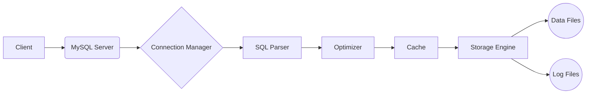

# Mysql

## **Guide Rapide Et Complet Sur MySQL**

---

### **1. Qu'est-ce Que MySQL ?**



- **MySQL** : Système de gestion de base de données relationnelle (SGBD) open-source utilisant le langage SQL.
- **Caractéristiques** :
    - Supporte les transactions ACID (avec le moteur InnoDB).
    - Haute performance, évolutivité, et sécurité.
    - Compatible avec Linux, Windows, macOS, et les clouds (AWS, Azure, etc.).
    - Utilisé par des applications web (ex: WordPress, Drupal).

---

### **2. Installation**

- **Téléchargement** : [MySQL Community Server](https://dev.mysql.com/downloads/mysql/).
- **Installation** :

  ```bash
  # Sur Ubuntu/Debian
  sudo apt update && sudo apt install mysql-server
  sudo mysql_secure_installation
  ```

- **Démarrer/Arrêter le service** :

  ```bash
  sudo systemctl start mysql    # Démarrer
  sudo systemctl stop mysql     # Arrêter
  ```

---

### **3. Commandes De Base (Terminal MySQL)**

| **Commande**          | **Description**                           |
| --------------------- | ----------------------------------------- |
| `mysql -u root -p`    | Connexion au serveur MySQL.               |
| `SHOW DATABASES;`     | Affiche toutes les bases de données.      |
| `USE nom_base;`       | Sélectionne une base de données.          |
| `SHOW TABLES;`        | Liste les tables de la base sélectionnée. |
| `DESCRIBE nom_table;` | Affiche la structure d'une table.         |
| `EXIT;` ou `\q`       | Quitte le terminal MySQL.                 |

---

### **4. Procédures Stockées Et Fonctions**

**Procédure stockée :**

```sql
DELIMITER //
CREATE PROCEDURE GetUser(IN user_id INT)
BEGIN
    SELECT * FROM Utilisateurs WHERE id = user_id;
END //
DELIMITER ;

-- Appel
CALL GetUser(1);
```

---

### **5. Gestion Des Utilisateurs Et Bases De Données**

- **Créer un nouvel utilisateur** :

    ```sql
    CREATE USER 'mon_utilisateur'@'localhost' IDENTIFIED BY 'mot_de_passe_utilisateur';
    -- Pour permettre la connexion depuis n'importe quelle machine (moins sécurisé) :
    -- CREATE USER 'mon_utilisateur'@'%' IDENTIFIED BY 'mot_de_passe_utilisateur';
    ```

- **Accorder des privilèges sur une base de données** :

    ```sql
    -- Accorder tous les privilèges sur une base spécifique
    GRANT ALL PRIVILEGES ON ma_nouvelle_base.* TO 'mon_utilisateur'@'localhost';

    -- Accorder des privilèges spécifiques sur une table
    GRANT SELECT, INSERT, UPDATE ON ma_nouvelle_base.ma_table TO 'mon_utilisateur'@'localhost';

    -- Recharger les privilèges (souvent nécessaire après GRANT/REVOKE)
    FLUSH PRIVILEGES;
    ```

- **Révoquer des privilèges** :

    ```sql
    REVOKE INSERT ON ma_nouvelle_base.ma_table FROM 'mon_utilisateur'@'localhost';
    FLUSH PRIVILEGES;
    ```

- **Supprimer un utilisateur** :

    ```sql
    DROP USER 'mon_utilisateur'@'localhost';
    ```

---

**Fonction :**

```sql
DELIMITER //
CREATE FUNCTION Addition(a INT, b INT)
RETURNS INT
BEGIN
    RETURN a + b;
END //
DELIMITER ;

-- Utilisation
SELECT Addition(5, 3);  -- Résultat: 8
```

---

### **6. Sauvegarde Et Restauration**

**Exporter une base (dump) :**

```bash
mysqldump -u root -p ma_base > backup.sql
```

**Importer une base :**

```bash
mysql -u root -p ma_base < backup.sql
```

---

### **7. Optimisation**

- **EXPLAIN** pour analyser les requêtes :

  ```sql
  EXPLAIN SELECT * FROM Utilisateurs WHERE nom = 'Bob';
  ```

- **Activer le cache de requêtes** (dans `my.cnf`) :

```ini
query_cache_type = 1
query_cache_size = 64M
```

- Éviter les `SELECT *` et privilégier les colonnes nécessaires.

#### Indexation Avancée

Les index sont cruciaux pour optimiser les performances des requêtes. MySQL supporte plusieurs types d'index :

- **B-Tree**: Index par défaut, efficace pour les recherches d'égalité et les intervalles.
- **Hash**: Rapide pour les recherches d'égalité, mais ne supporte pas les intervalles.
- **Fulltext**: Pour la recherche de texte intégral dans les colonnes de type TEXT.
- **Spatial**: Pour les données géographiques.

**Comment choisir le bon index ?**

- Analyser les requêtes avec `EXPLAIN` pour identifier les colonnes utilisées dans les clauses `WHERE`, `JOIN` et `ORDER BY`.
- Créer des index sur ces colonnes.
- Considérer les index composites (sur plusieurs colonnes) pour les requêtes complexes.
- Surveiller la taille des index, car ils peuvent ralentir les opérations d'écriture.

---

### **8. Réplication Et Clustering**

**Réplication** : Permet de copier les données d'un serveur MySQL (maître) vers un ou plusieurs autres serveurs (esclaves). Utile pour la sauvegarde, la répartition de charge et la haute disponibilité.

**Clustering** : Utilise MySQL Cluster pour créer une base de données distribuée avec une haute disponibilité et une évolutivité élevée.

---

### **9. Fonctions Utiles MySQL**

- **Chaînes** :

  ```sql
  CONCAT(nom, ' ', prenom), REPLACE(texte, 'old', 'new'), LENGTH(texte)
  ```

- **Dates** :

  ```sql
  NOW(), DATE_FORMAT(date_inscription, '%d/%m/%Y'), DATEDIFF(date1, date2)
  ```

- **Maths** :

  ```sql
  RAND(), ROUND(prix, 2), FLOOR(prix)
  ```

---

### **10. Erreurs Courantes Et Solutions**

- **Erreur 1045** : Accès refusé → Vérifiez le nom d'utilisateur/mot de passe.
- **Erreur 1064** : Syntaxe SQL incorrecte → Vérifiez les virgules et les guillemets.
- **Erreur 1215** : Échec de clé étrangère → Assurez-vous que les données référencées existent.

---

### **11. Sécurité**

- **Mettre à jour MySQL** : Garder MySQL à jour pour bénéficier des derniers correctifs de sécurité.
- **Utiliser des mots de passe forts** : Pour tous les utilisateurs, y compris root.
- **Limiter les privilèges** : N'accorder que les privilèges nécessaires aux utilisateurs.
- **Désactiver les connexions à distance pour root** : Pour éviter les accès non autorisés.
- **Utiliser SSL** : Pour chiffrer les connexions entre le client et le serveur.
- **Se protéger contre les injections SQL** : En utilisant des requêtes préparées ou des fonctions d'échappement.

---

### **12. Utilisation Avec Différents Langages De Programmation**

MySQL peut être utilisé avec de nombreux langages de programmation. Voici quelques exemples :

#### PHP

```php
<?php
$servername = "localhost";
$username = "username";
$password = "password";
$dbname = "myDB";

// Create connection
$conn = new mysqli($servername, $username, $password, $dbname);

// Check connection
if ($conn->connect_error) {
  die("Connection failed: " . $conn->connect_error);
}

$sql = "SELECT id, firstname, lastname FROM MyGuests";
$result = $conn->query($sql);

if ($result->num_rows > 0) {
  // output data of each row
  while($row = $result->fetch_assoc()) {
    echo "id: " . $row["id"]. " - Name: " . $row["firstname"]. " " . $row["lastname"]. "<br>";
  }
} else {
  echo "0 results";
}
$conn->close();
?>
```

#### Python

```python
import mysql.connector

mydb = mysql.connector.connect(
  host="localhost",
  user="yourusername",
  password="yourpassword",
  database="mydatabase"
)

mycursor = mydb.cursor()

mycursor.execute("SELECT * FROM customers")

myresult = mycursor.fetchall()

for x in myresult:
  print(x)
```

#### Java

```java
import java.sql.*;

public class Main {
  public static void main(String[] args) {

    String url = "jdbc:mysql://localhost:3306/mydatabase";
    String user = "yourusername";
    String password = "yourpassword";

    try {
      Connection connection = DriverManager.getConnection(url, user, password);
      Statement statement = connection.createStatement();
      ResultSet resultSet = statement.executeQuery("SELECT * FROM customers");

      while (resultSet.next()) {
        System.out.println(resultSet.getString("firstname") + " " + resultSet.getString("lastname"));
      }

    } catch (SQLException e) {
      e.printStackTrace();
    }
  }
}
```

---

**📚 Ressources :**
- [Documentation MySQL](https://dev.mysql.com/doc/)
- [MySQL Tutorial (W3Schools)](https://www.w3schools.com/mysql/)
- [MySQL pour les Débutants (YouTube)](https://www.youtube.com/results?search_query=mysql+tutorial)

---

**🚀 Astuce** : Utilisez `phpMyAdmin` ou `MySQL Workbench` pour une gestion graphique de vos bases !
