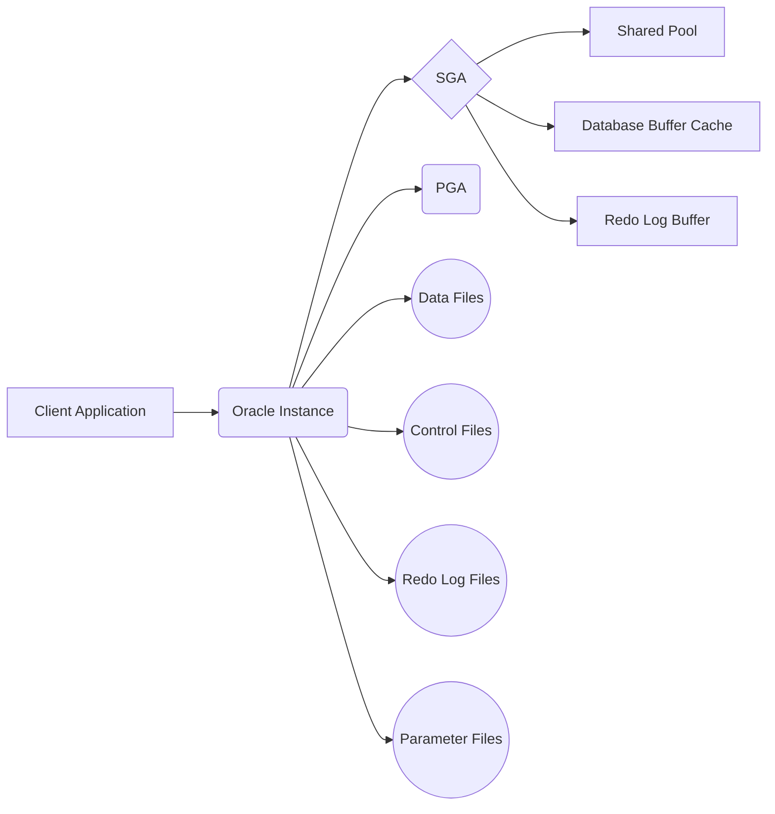

# Oracle

## **Guide Rapide Et Complet Sur Oracle Database**

---

### **1. Qu'est-ce qu'Oracle Database ?**



- **Oracle Database** : SGBD relationnel (RDBMS) enterprise de Oracle, conçu pour les applications critiques et les grandes volumétries.
- **Caractéristiques** :
    - Supporte **PL/SQL** (extension procédurale de SQL).
    - Haute disponibilité (Data Guard, RAC).
    - Sécurité avancée (chiffrement, VPD, TDE).
    - Évolutivité verticale et horizontale.
    - Compatible avec Linux, Windows, et le cloud (Oracle Cloud, AWS, Azure).

---

### **2. Installation**

- **Éditions** :
    - **Enterprise Edition** (payante, fonctionnalités complètes).
    - **Express Edition (XE)** (gratuite, limitée à 11 Go de données).
- **Téléchargement** : [Oracle Database](https://www.oracle.com/database/technologies/).
- **Installation via Docker** (simplifiée) :


  ```bash
  docker pull container-registry.oracle.com/database/express:latest
  docker run -d -p 1521:1521 --name oracle-xe container-registry.oracle.com/database/express:latest
  ```

[official guide](https://github.com/oracle/db-sharding/blob/master/container-based-sharding-deployment/README.md)

---

### **3. Commandes De Base (SQL*Plus)**

| **Commande**               | **Description**                          |
|----------------------------|------------------------------------------|
| `sqlplus / as sysdba`       | Connexion en tant qu'admin (OS auth).    |
| `CONNECT utilisateur/mdp`   | Connexion avec identifiants.             |
| `SELECT * FROM v$version;`  | Affiche la version d'Oracle.             |
| `SHOW USER;`                | Affiche l'utilisateur connecté.          |
| `DESC nom_table;`           | Décrit la structure d'une table.         |
| `@script.sql`               | Exécute un script SQL.                   |
| `EXIT;`                     | Quitte SQL*Plus.                         |

---

### **4. Gestion Des Schémas Et Tables**

**Créer un utilisateur/schema :**

```sql
CREATE USER mon_user IDENTIFIED BY mon_mdp;
GRANT CONNECT, RESOURCE TO mon_user;
```

**Créer une table avec séquence et trigger (auto-incrément) :**

```sql
CREATE TABLE Employés (
    id NUMBER PRIMARY KEY,
    nom VARCHAR2(50),
    salaire NUMBER(10,2)
);

CREATE SEQUENCE seq_employés START WITH 1 INCREMENT BY 1;

CREATE OR REPLACE TRIGGER trig_employés
BEFORE INSERT ON Employés
FOR EACH ROW
BEGIN
    :NEW.id := seq_employés.NEXTVAL;
END;
/
```

**Insérer des données :**

```sql
INSERT INTO Employés (nom, salaire) VALUES ('Alice', 5000);
```

---

### **5. PL/SQL (Procédures, Fonctions, Packages)**

**Procédure stockée :**

```sql
CREATE OR REPLACE PROCEDURE AugmenterSalaire (
    p_id Employés.id%TYPE,
    p_pourcentage NUMBER
) IS
BEGIN
    UPDATE Employés
    SET salaire = salaire * (1 + p_pourcentage/100)
    WHERE id = p_id;
    COMMIT;
END;
/

-- Appel
EXEC AugmenterSalaire(1, 10);
```

**Fonction :**

```sql
CREATE OR REPLACE FUNCTION SalaireAnnuel (
    p_id Employés.id%TYPE
) RETURN NUMBER IS
    v_salaire Employés.salaire%TYPE;
BEGIN
    SELECT salaire * 12 INTO v_salaire
    FROM Employés
    WHERE id = p_id;
    RETURN v_salaire;
END;
/

-- Utilisation
SELECT SalaireAnnuel(1) FROM DUAL;
```

**Package :**

```sql
CREATE OR REPLACE PACKAGE pkg_employés AS
    PROCEDURE AfficherInfos(p_id NUMBER);
    FUNCTION SalaireMoyen RETURN NUMBER;
END pkg_employés;
/

CREATE OR REPLACE PACKAGE BODY pkg_employés AS
    PROCEDURE AfficherInfos(p_id NUMBER) IS
        v_nom Employés.nom%TYPE;
    BEGIN
        SELECT nom INTO v_nom FROM Employés WHERE id = p_id;
        DBMS_OUTPUT.PUT_LINE('Nom : ' || v_nom);
    END;

    FUNCTION SalaireMoyen RETURN NUMBER IS
        v_moyen NUMBER;
    BEGIN
        SELECT AVG(salaire) INTO v_moyen FROM Employés;
        RETURN v_moyen;
    END;
END pkg_employés;
/
```

---

### **6. Sauvegarde Et Restauration (RMAN)**

- **Sauvegarde complète :**

  ```bash
  rman TARGET /
  BACKUP DATABASE;
  ```

- **Restauration :**

  ```bash
  rman TARGET /
  RESTORE DATABASE;
  RECOVER DATABASE;
  ```

---

### **7. Optimisation Des Performances**

- **EXPLAIN PLAN :**

  ```sql
  EXPLAIN PLAN FOR SELECT * FROM Employés WHERE salaire > 3000;
  SELECT * FROM TABLE(DBMS_XPLAN.DISPLAY());
  ```

- **Statistiques d'exécution :**

  ```sql
  SET AUTOTRACE ON;
  SELECT * FROM Employés;
  ```

- **Index invisibles :**

  ```sql
  CREATE INDEX idx_invisible ON Employés(nom) INVISIBLE;
  ```

#### Indexation Avancée

Les index sont essentiels pour optimiser les performances des requêtes dans Oracle. Voici quelques types d'index courants :

-   **B-Tree indexes**: Le type d'index par défaut dans Oracle, adapté à une grande variété de requêtes.
-   **Bitmap indexes**: Utiles pour les colonnes avec une faible cardinalité (peu de valeurs distinctes).
-   **Function-based indexes**: Permettent d'indexer le résultat d'une fonction ou d'une expression.

**Comment choisir le bon index ?**

-   Utiliser `EXPLAIN PLAN` pour analyser les plans d'exécution des requêtes et identifier les goulots d'étranglement.
-   Créer des index sur les colonnes fréquemment utilisées dans les clauses `WHERE`, `JOIN` et `ORDER BY`.
-   Envisager des index composites pour les requêtes qui impliquent plusieurs colonnes.
-   Surveiller l'utilisation des index et les reconstruire si nécessaire.

---

### **8. Oracle Real Application Clusters (RAC)**

Oracle RAC est une option de base de données en cluster qui permet à plusieurs instances d'Oracle Database de s'exécuter simultanément sur plusieurs serveurs, tout en accédant au même stockage de base de données. Cela offre une haute disponibilité, une évolutivité et une gestion améliorée des ressources.

---

### **9. Erreurs Courantes Et Solutions**

- **ORA-00942: table or view does not exist** → Vérifiez le schéma ou les permissions.
- **ORA-00001: unique constraint violated** → Doublon sur une clé primaire ou unique.
- **ORA-12514: TNS:listener does not currently know of service** → Vérifiez le fichier `tnsnames.ora`.

---

### **10. Sécurité**

-   **Mettre à jour Oracle Database**: Appliquer régulièrement les correctifs de sécurité et les mises à jour.
-   **Gestion des utilisateurs et des privilèges**: Accorder uniquement les privilèges nécessaires aux utilisateurs.
-   **Authentification forte**: Utiliser des mots de passe complexes et activer l'authentification multifacteur.
-   **Chiffrement des données**: Chiffrer les données sensibles au repos et en transit.
-   **Audit**: Activer l'audit pour surveiller l'activité de la base de données et détecter les anomalies.
-   **Virtual Private Database (VPD)**: Implémenter des politiques de sécurité au niveau des lignes pour contrôler l'accès aux données.

---

### **11. Différences Clés Avec MySQL**

| **Fonctionnalité**       | **Oracle**                          | **MySQL**                     |
|--------------------------|-------------------------------------|-------------------------------|
| **Langage**              | PL/SQL                              | SQL + Procédures stockées     |
| **Auto-incrément**       | Séquence + Trigger                  | `AUTO_INCREMENT`              |
| **Stockage**             | Segments, Tablespaces               | Bases de données simples      |
| **Licence**              | Payant (sauf Express)               | Open-source (Community)       |
| **Performances**         | Optimisé pour l'enterprise          | Léger et rapide pour le web   |

---

### **12. Utilisation avec Différents Langages de Programmation**

Oracle peut être utilisé avec de nombreux langages de programmation. Voici quelques exemples :

#### PHP

```php
<?php
$conn = oci_connect('username', 'password', 'localhost/XE');
if (!$conn) {
    $e = oci_error();
    trigger_error(htmlentities($e['message'], ENT_QUOTES), E_USER_ERROR);
}
$stid = oci_parse($conn, 'SELECT * FROM employees');
oci_execute($stid);

echo "<table border='1'>\n";
while ($row = oci_fetch_array($stid, OCI_ASSOC+OCI_RETURN_NULLS)) {
    echo "<tr>\n";
    foreach ($row as $item) {
        echo "    <td>" . ($item!==null?htmlentities($item, ENT_QUOTES):"&nbsp;") . "</td>\n";
    }
    echo "</tr>\n";
}
echo "</table>\n";

oci_free_statement($stid);
oci_close($conn);
?>
```

#### Python

```python
import cx_Oracle

try:
    connection = cx_Oracle.connect("username/password@localhost/XE")
    cursor = connection.cursor()
    cursor.execute("SELECT * FROM employees")
    for row in cursor:
        print(row)
except cx_Oracle.DatabaseError as e:
    error, = e.args
    print(sys.stderr, "Oracle code:", error.code)
    print(sys.stderr, "Oracle message:", error.message)
finally:
    if cursor:
        cursor.close()
    if connection:
        connection.close()
```

#### Java

```java
import java.sql.*;

public class OracleJDBC {

  public static void main(String[] args) {

    String host = "localhost";
    String port = "1521";
    String sid = "XE";
    String user = "username";
    String pass = "password";

    String dbURL = "jdbc:oracle:thin:@" + host + ":" + port + ":" + sid;

    try {
      Class.forName("oracle.jdbc.driver.OracleDriver");
      Connection conn = DriverManager.getConnection(dbURL, user, pass);

      Statement stmt = conn.createStatement();
      ResultSet rs = stmt.executeQuery("SELECT * FROM employees");

      while (rs.next()) {
        System.out.println(rs.getString("employee_id") + " " + rs.getString("last_name"));
      }

      conn.close();

    } catch (Exception ex) {
      ex.printStackTrace();
    }

  }

}
```

---

**📚 Ressources :**
- [Documentation Oracle](https://docs.oracle.com/en/database/)
- [Oracle Live SQL](https://livesql.oracle.com/) (TP en ligne).
- [Oracle Base](https://oracle-base.com/) Tutoriels pratiques.

---

**🚀 Astuce** : Utilisez **SQL Developer** (outil graphique gratuit d'Oracle) pour une gestion visuelle des bases !
