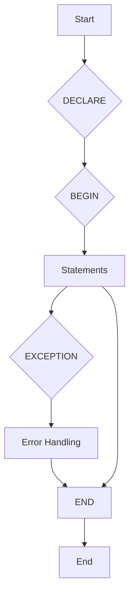

# pl_pgsql

## **Guide Rapide Et Complet Sur PL/pgSQL (PostgreSQL)**

---

### **1. Qu'est-ce Que PL/pgSQL ?**

- **PL/pgSQL** : Langage procédural pour PostgreSQL, inspiré de PL/SQL (Oracle), permettant d'écrire des fonctions, procédures et déclencheurs (triggers) complexes.
- **Caractéristiques** :
  - Exécuté côté serveur pour des performances optimisées.
  - Supporte les boucles, conditions, exceptions, curseurs et transactions.
  - Intègre les types de données PostgreSQL (JSONB, géométrie, etc.).
  - Extensible via des extensions (ex: `plpythonu` pour Python).

---

### **2. Structure De Base D'un Bloc PL/pgSQL**



```sql
DO $$
DECLARE
  -- Déclarations (variables, constantes)
BEGIN
  -- Logique principale
EXCEPTION
  -- Gestion des erreurs
END $$;
```

**Exemple Simple :**

```sql
DO $$
DECLARE
  message TEXT := 'Bonjour le monde !';
BEGIN
  RAISE NOTICE '%', message; -- Affiche un message dans la console
END $$;
```

---

### **3. Variables Et Types De Données**

- **Types scalaires** :

  ```sql
  nombre INTEGER := 42;
  texte TEXT;
  est_vrai BOOLEAN := TRUE;
  date_actuelle DATE := CURRENT_DATE;
  ```

- **Types composites** :
  - **RECORD** : Structure flexible pour stocker une ligne de résultat.

	```sql
    DECLARE
      emp RECORD;
    BEGIN
      SELECT nom, salaire INTO emp FROM employes WHERE id = 1;
      RAISE NOTICE 'Nom: %, Salaire: %', emp.nom, emp.salaire;
    END;
    ```

  - **Tableaux** :

	```sql
    DECLARE
      nombres INTEGER[] := ARRAY[1, 2, 3];
    BEGIN
      RAISE NOTICE 'Deuxième élément : %', nombres[2]; -- 2
    END;
    ```

---

### **4. Structures De Contrôle**

**Condition (`IF-THEN-ELSE`) :**

```sql
IF salaire > 5000 THEN
  RAISE NOTICE 'Salaire élevé';
ELSIF salaire BETWEEN 3000 AND 5000 THEN
  RAISE NOTICE 'Salaire moyen';
ELSE
  RAISE NOTICE 'Salaire bas';
END IF;
```

#### Exemples Détaillés De Structures De Contrôle

**Condition (`IF-THEN-ELSEIF-ELSE`) :**

```sql
DECLARE
  note INT := 75;
  mention TEXT;
BEGIN
  IF note >= 90 THEN
    mention := 'Excellent';
  ELSIF note >= 80 THEN
    mention := 'Très Bien';
  ELSIF note >= 70 THEN
    mention := 'Bien';
  ELSIF note >= 60 THEN
    mention := 'Passable';
  ELSE
    mention := 'Échec';
  END IF;
  RAISE NOTICE 'Note : %, Mention : %', note, mention;
END $$;
```

**Boucles (`LOOP`, `FOR`, `WHILE`) :**

```sql
-- Boucle simple avec EXIT
DECLARE
  compteur INT := 0;
BEGIN
  LOOP
    RAISE NOTICE 'Compteur : %', compteur;
    compteur := compteur + 1;
    EXIT WHEN compteur >= 5;
  END LOOP;
END $$;

-- Boucle FOR sur une plage
BEGIN
  FOR i IN 1..5 LOOP
    RAISE NOTICE 'Itération %', i;
  END LOOP;
END $$;

-- Boucle FOR inversée sur une plage
BEGIN
  FOR i IN REVERSE 5..1 LOOP
    RAISE NOTICE 'Itération inversée %', i;
  END LOOP;
END $$;

-- Boucle FOR sur le résultat d'une requête
BEGIN
  FOR employe_rec IN SELECT nom, salaire FROM employes WHERE salaire > 4000 LOOP
    RAISE NOTICE 'Employé : %, Salaire : %', employe_rec.nom, employe_rec.salaire;
  END LOOP;
END $$;

-- Boucle WHILE
DECLARE
  j INT := 0;
BEGIN
  WHILE j < 5 LOOP
    RAISE NOTICE 'J : %', j;
    j := j + 1;
  END LOOP;
END $$;

-- Boucle FOREACH sur un tableau
DECLARE
  elements TEXT[] := ARRAY['Pomme', 'Banane', 'Cerise'];
  elem TEXT;
BEGIN
  FOREACH elem IN ARRAY elements LOOP
    RAISE NOTICE 'Fruit : %', elem;
  END LOOP;
END $$;
```

---

### **5. Gestion Des Exceptions**

```sql
DO $$
BEGIN
  -- Code susceptible de générer une erreur
  INSERT INTO employes (id, nom) VALUES (1, 'Alice');
EXCEPTION
  WHEN unique_violation THEN
    RAISE NOTICE 'ID déjà existant !';
  WHEN OTHERS THEN
    RAISE NOTICE 'Erreur inattendue : %', SQLERRM;
END $$;
```

---

### **6. Utilisation Avec Tableaux Et JSONB**

PL/pgSQL offre un bon support pour les types de données avancés de PostgreSQL comme les tableaux et JSONB.

#### Utilisation De Tableaux

Vous pouvez déclarer des variables de type tableau et les manipuler dans votre code PL/pgSQL.

```sql
DECLARE
  notes INTEGER[] := ARRAY[85, 92, 78];
  total_notes INTEGER := 0;
  note_individuelle INTEGER;
BEGIN
  FOREACH note_individuelle IN ARRAY notes LOOP
    total_notes := total_notes + note_individuelle;
  END LOOP;
  RAISE NOTICE 'Total des notes : %', total_notes;
END $$;
```

#### Utilisation De JSONB

PL/pgSQL fournit des opérateurs et des fonctions pour travailler avec les données JSONB.

```sql
DECLARE
  profil_utilisateur JSONB := '{"nom": "Alice", "age": 30, "compétences": ["SQL", "PL/pgSQL"]}';
  nom_utilisateur TEXT;
  premiere_competence TEXT;
BEGIN
  nom_utilisateur := profil_utilisateur ->> 'nom';
  premiere_competence := profil_utilisateur -> 'compétences' ->> 0;
  RAISE NOTICE 'Nom : %, Première compétence : %', nom_utilisateur, premiere_competence;
END $$;
```

---

### **7. Fonctions Et Procédures**

**Fonction Retournant un Résultat :**

```sql
CREATE OR REPLACE FUNCTION calculer_tva(prix NUMERIC, taux NUMERIC)
RETURNS NUMERIC AS $$
BEGIN
  RETURN prix * taux;
END;
$$ LANGUAGE plpgsql;

-- Appel
SELECT calculer_tva(100, 0.2); -- 20
```

**Procédure (PostgreSQL 11+) :**

```sql
CREATE OR REPLACE PROCEDURE mettre_a_jour_salaire(id_employe INT, nouveau_salaire NUMERIC)
AS $$
BEGIN
  UPDATE employes SET salaire = nouveau_salaire WHERE id = id_employe;
  COMMIT;
END;
$$ LANGUAGE plpgsql;

-- Appel
CALL mettre_a_jour_salaire(1, 5500);
```

---

### **8. Curseurs (Cursors)**

**Curseur Explicite :**

```sql
CREATE OR REPLACE FUNCTION afficher_employes()
RETURNS VOID AS $$
DECLARE
  cur_employes CURSOR FOR SELECT nom, salaire FROM employes;
  emp_nom TEXT;
  emp_salaire NUMERIC;
BEGIN
  OPEN cur_employes;
  LOOP
    FETCH cur_employes INTO emp_nom, emp_salaire;
    EXIT WHEN NOT FOUND;
    RAISE NOTICE '% : %', emp_nom, emp_salaire;
  END LOOP;
  CLOSE cur_employes;
END;
$$ LANGUAGE plpgsql;

#### Curseurs Implicites

PL/pgSQL utilise des curseurs implicites pour les requêtes `SELECT INTO`, `INSERT`, `UPDATE`, `DELETE`, et `FOR`. Vous pouvez accéder aux informations sur le résultat de ces opérations via des variables spéciales :

-   `FOUND`: Variable booléenne qui est vraie si la dernière commande SQL a affecté au moins une ligne.
-   `NOT FOUND`: Variable booléenne qui est vraie si la dernière commande SQL n'a affecté aucune ligne.
-   `ROWCOUNT`: Variable entière qui contient le nombre de lignes affectées par la dernière commande SQL.

**Exemple avec curseur implicite :**

```sql
BEGIN
  UPDATE employes SET salaire = salaire * 1.05 WHERE departement_id = 1;
  IF FOUND THEN
    RAISE NOTICE 'Salaires mis à jour pour % employés.', ROWCOUNT;
  ELSE
    RAISE NOTICE 'Aucun employé trouvé dans ce département.';
  END IF;
END $$;
```

---

### **9. Déclencheurs (Triggers)**

**Créer un Trigger et sa Fonction :**

```sql
-- Fonction de déclencheur
CREATE OR REPLACE FUNCTION log_modification()
RETURNS TRIGGER AS $$
BEGIN
  INSERT INTO logs (action, table_name, timestamp)
  VALUES (TG_OP, TG_TABLE_NAME, NOW());
  RETURN NEW;
END;
$$ LANGUAGE plpgsql;

-- Attacher le trigger à une table
CREATE TRIGGER trig_log_employes
AFTER INSERT OR UPDATE OR DELETE ON employes
FOR EACH ROW EXECUTE FUNCTION log_modification();
```

---

### **10. Retourner Des Résultats (Fonctions)**

**Retourner un Ensemble de Lignes :**

```sql
CREATE OR REPLACE FUNCTION employes_par_departement(id_dep INT)
RETURNS TABLE (nom TEXT, salario NUMERIC) AS $$
BEGIN
  RETURN QUERY
  SELECT nom, salaire FROM employes WHERE departement_id = id_dep;
END;
$$ LANGUAGE plpgsql;

-- Utilisation
SELECT * FROM employes_par_departement(2);
```

---

### **11. Bonnes Pratiques Et Optimisation**

- **Éviter les requêtes dans les boucles** : Préférer les opérations en masse (`JOIN`, `UPDATE FROM`).
- **Utiliser `PERFORM` pour appeler des fonctions void** :

  ```sql
  PERFORM some_void_function(); -- Au lieu de SELECT
  ```

- **Activer les warnings** :

  ```sql
  SET plpgsql.extra_warnings TO 'all';
  ```

---

### **12. Considérations De Sécurité**

Lors de l'écriture de code PL/pgSQL, il est important de prendre en compte les aspects de sécurité :

- **Droits d'exécution**: Définir les droits d'exécution des fonctions et procédures avec `SECURITY DEFINER` ou `SECURITY INVOKER`. `SECURITY DEFINER` exécute la fonction avec les privilèges de l'utilisateur qui a créé la fonction, tandis que `SECURITY INVOKER` utilise les privilèges de l'utilisateur qui appelle la fonction.
- **Injections SQL**: Utiliser des requêtes paramétrées ou la fonction `quote_literal()` pour éviter les injections SQL lors de la construction de requêtes dynamiques.
- **Audit**: Enregistrer les actions importantes effectuées par le code PL/pgSQL pour des raisons d'audit.

---

### **13. Différences Clés Avec PL/SQL (Oracle)**

| **Fonctionnalité**      | **PL/pgSQL**                      | **PL/SQL**                   |
| ----------------------- | --------------------------------- | ---------------------------- |
| **Langage**             | Open-source, intégré à PostgreSQL | Propriétaire (Oracle)        |
| **Gestion des erreurs** | Blocs `EXCEPTION` similaires      | `PRAGMA EXCEPTION_INIT`      |
| **Transactions**        | Supportées dans les procédures    | Gérées via `COMMIT/ROLLBACK` |
| **Retour de résultats** | `RETURNS TABLE` ou `SETOF`        | `REF CURSOR`                 |
| **Outils**              | pgAdmin, psql                     | SQL Developer, Toad          |

---

### **14. Erreurs Courantes**

- **"ERROR: syntax error at end of input"** → Oubli du `;` ou `END;`.
- **"ERROR: column "X" does not exist"** → Vérifiez les noms de colonnes dans les déclarations.
- **"ERROR: control reached end of function without RETURN"** → Ajoutez `RETURN` dans les fonctions.

---

**📚 Ressources :**

- [Documentation PL/pgSQL](https://www.postgresql.org/docs/current/plpgsql.html)
- [PostgreSQL Tutorial (PL/pgSQL)](https://www.postgresqltutorial.com/plpgsql-programming/)
- [pgAdmin](https://www.pgadmin.org/) (Outil graphique)

---

**🚀 Astuce** : Utilisez `RAISE NOTICE` pour déboguer et `EXPLAIN ANALYZE` pour optimiser les requêtes dans vos fonctions !
