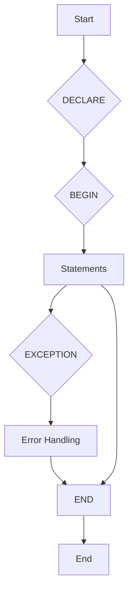

# pl_sql

## **Guide Rapide Et Complet Sur PL/SQL**

---

### **1. Qu'est-ce Que PL/SQL ?**

- **PL/SQL** (Procedural Language extensions to SQL) : Langage procédural d'Oracle pour étendre SQL avec des structures de programmation.
- **Caractéristiques** :
    - Exécuté directement dans la base Oracle.
    - Optimise les performances en regroupant les requêtes SQL.
    - Gère les transactions, les erreurs et la logique métier complexe.
    - Compatible avec les types de données Oracle et les curseurs.

---

### **2. Structure De Base D'un Bloc PL/SQL**



```sql
DECLARE
  -- Section déclarative (variables, constantes, curseurs)
BEGIN
  -- Section exécutable (logique principale)
EXCEPTION
  -- Gestion des erreurs
END;
/
```

**Exemple Simple :**

```sql
DECLARE
  message VARCHAR2(50) := 'Hello, World!';
BEGIN
  DBMS_OUTPUT.PUT_LINE(message);
EXCEPTION
  WHEN OTHERS THEN
    DBMS_OUTPUT.PUT_LINE('Erreur : ' || SQLERRM);
END;
/
```

---

### **3. Variables Et Types De Données**

- **Types scalaires** :

  ```sql
  nombre NUMBER := 10;
  texte VARCHAR2(100);
  date_actuelle DATE := SYSDATE;
  est_vrai BOOLEAN := TRUE;
  ```

- **Types composites** :
    - **Record** :

    ```sql
    TYPE Employe_Record IS RECORD (
      id NUMBER,
      nom VARCHAR2(50)
    );
    emp Employe_Record;
    ```

    - **Tableau** :

    ```sql
    TYPE ListeNoms IS TABLE OF VARCHAR2(50);
    noms ListeNoms := ListeNoms('Alice', 'Bob');
    ```

---

### **4. Structures De Contrôle**

**Condition (`IF-THEN-ELSE`) :**

```sql
IF salaire > 5000 THEN
  DBMS_OUTPUT.PUT_LINE('Salaire élevé');
ELSIF salaire BETWEEN 3000 AND 5000 THEN
  DBMS_OUTPUT.PUT_LINE('Salaire moyen');
ELSE
  DBMS_OUTPUT.PUT_LINE('Salaire bas');
END IF;
```

#### Exemples Détaillés De Structures De Contrôle

**Condition (`IF-THEN-ELSIF-ELSE`) :**

```sql
DECLARE
  note NUMBER := 75;
  mention VARCHAR2(20);
BEGIN
  IF note >= 90 THEN
    mention := 'Excellent';
  ELSIF note >= 80 THEN
    mention := 'Très Bien';
  ELSIF note >= 70 THEN
    mention := 'Bien';
  ELSIF note >= 60 THEN
    mention := 'Passable';
  ELSE
    mention := 'Échec';
  END IF;
  DBMS_OUTPUT.PUT_LINE('Note : ' || note || ', Mention : ' || mention);
END;
/
```

**Boucle (`LOOP`, `FOR`, `WHILE`) :**

```sql
-- Boucle simple avec EXIT WHEN
DECLARE
  compteur NUMBER := 0;
BEGIN
  LOOP
    DBMS_OUTPUT.PUT_LINE('Compteur : ' || compteur);
    compteur := compteur + 1;
    EXIT WHEN compteur >= 5;
  END LOOP;
END;
/

-- Boucle FOR sur une plage
BEGIN
  FOR i IN 1..5 LOOP
    DBMS_OUTPUT.PUT_LINE('Itération : ' || i);
  END LOOP;
END;
/

-- Boucle FOR inversée sur une plage
BEGIN
  FOR i IN REVERSE 5..1 LOOP
    DBMS_OUTPUT.PUT_LINE('Itération inversée : ' || i);
  END LOOP;
END;
/

-- Boucle FOR sur un curseur implicite
BEGIN
  FOR emp_rec IN (SELECT nom, salaire FROM Employes WHERE salaire > 4000) LOOP
    DBMS_OUTPUT.PUT_LINE('Employé : ' || emp_rec.nom || ', Salaire : ' || emp_rec.salaire);
  END LOOP;
END;
/

-- Boucle WHILE
DECLARE
  j NUMBER := 0;
BEGIN
  WHILE j < 5 LOOP
    DBMS_OUTPUT.PUT_LINE('J : ' || j);
    j := j + 1;
  END LOOP;
END;
/
```

---

### **5. Curseurs (Cursors)**

**Curseur Explicite :**

```sql
DECLARE
  CURSOR cur_employes IS SELECT nom, salaire FROM Employes;
  emp_nom VARCHAR2(50);
  emp_salaire NUMBER;
BEGIN
  OPEN cur_employes;
  LOOP
    FETCH cur_employes INTO emp_nom, emp_salaire;
    EXIT WHEN cur_employes%NOTFOUND;
    DBMS_OUTPUT.PUT_LINE(emp_nom || ' : ' || emp_salaire);
  END LOOP;
  CLOSE cur_employes;
END;
/
```

**Curseur Implicite (FOR LOOP) :**

```sql
BEGIN
  FOR emp IN (SELECT nom, salaire FROM Employes) LOOP
    DBMS_OUTPUT.PUT_LINE(emp.nom || ' : ' || emp.salaire);
  END LOOP;
END;
/

#### Curseurs Implicites

PL/SQL utilise des curseurs implicites pour les requêtes `SELECT INTO`, `INSERT`, `UPDATE`, et `DELETE`. Vous pouvez accéder aux informations sur le résultat de ces opérations via des attributs de curseur implicite :

-   `SQL%FOUND`: Attribut booléen qui est VRAI si la dernière commande SQL a affecté au moins une ligne.
-   `SQL%NOTFOUND`: Attribut booléen qui est VRAI si la dernière commande SQL n'a affecté aucune ligne.
-   `SQL%ROWCOUNT`: Attribut numérique qui contient le nombre de lignes affectées par la dernière commande SQL.

**Exemple avec curseur implicite :**

```sql
BEGIN
  UPDATE Employes SET salaire = salaire * 1.05 WHERE departement_id = 10;
  IF SQL%FOUND THEN
    DBMS_OUTPUT.PUT_LINE('Salaires mis à jour pour ' || SQL%ROWCOUNT || ' employés.');
  ELSE
    DBMS_OUTPUT.PUT_LINE('Aucun employé trouvé dans ce département.');
  END IF;
END;
/
```

---

### **6. Utilisation Avec Collections**

PL/SQL supporte les collections, qui sont des types de données composites permettant de stocker plusieurs éléments du même type. Les types de collections les plus courants sont les tables imbriquées (nested tables) et les VARRAYs.

#### Tables Imbriquées (Nested Tables)

Les tables imbriquées sont des collections non liées qui peuvent stocker un nombre illimité d'éléments.

```sql
DECLARE
  TYPE ListeNoms IS TABLE OF VARCHAR2(50);
  noms ListeNoms := ListeNoms('Alice', 'Bob', 'Charlie');
BEGIN
  FOR i IN noms.FIRST..noms.LAST LOOP
    DBMS_OUTPUT.PUT_LINE('Nom : ' || noms(i));
  END LOOP;
END;
/
```

#### VARRAYs

Les VARRAYs (Variable-size Arrays) sont des collections liées qui ont une taille maximale prédéfinie.

```sql
DECLARE
  TYPE NotesEtudiant IS VARRAY(5) OF NUMBER;
  notes NotesEtudiant := NotesEtudiant(85, 92, 78);
BEGIN
  FOR i IN notes.FIRST..notes.LAST LOOP
    DBMS_OUTPUT.PUT_LINE('Note : ' || notes(i));
  END LOOP;
END;
/
```

---

### **7. Gestion Des Exceptions**

- **Exceptions prédéfinies** : `NO_DATA_FOUND`, `TOO_MANY_ROWS`, `ZERO_DIVIDE`.
- **Exceptions personnalisées** :

  ```sql
  DECLARE
    salaire_trop_bas EXCEPTION;
    PRAGMA EXCEPTION_INIT(salaire_trop_bas, -20001);
  BEGIN
    IF salaire < 1000 THEN
      RAISE salaire_trop_bas;
    END IF;
  EXCEPTION
    WHEN salaire_trop_bas THEN
      DBMS_OUTPUT.PUT_LINE('Erreur : Salaire insuffisant.');
    WHEN OTHERS THEN
      ROLLBACK;
  END;
  /
  ```

---

### **9. Procédures Et Fonctions**

**Procédure Stockée :**

```sql
CREATE OR REPLACE PROCEDURE AugmenterSalaire (
  p_id Employes.id%TYPE,
  p_pourcent NUMBER
) IS
BEGIN
  UPDATE Employes
  SET salaire = salaire * (1 + p_pourcent/100)
  WHERE id = p_id;
  COMMIT;
END AugmenterSalaire;
/
```

**Fonction :**

```sql
CREATE OR REPLACE FUNCTION CalculerSalaireAnnuel (
  p_salaire_mensuel NUMBER
) RETURN NUMBER IS
BEGIN
  RETURN p_salaire_mensuel * 12;
END CalculerSalaireAnnuel;
/
```

---

### **10. Packages**

- **Spécification** (déclaration) :

  ```sql
  CREATE OR REPLACE PACKAGE GestionEmployes AS
    PROCEDURE AfficherInfos(p_id NUMBER);
    FUNCTION SalaireMoyen RETURN NUMBER;
  END GestionEmployes;
  /
  ```

    - **Corps** (implémentation) :

    ```sql
    CREATE OR REPLACE PACKAGE BODY GestionEmployes AS
      PROCEDURE AfficherInfos(p_id NUMBER) IS
        emp_nom VARCHAR2(50);
      BEGIN
        SELECT nom INTO emp_nom FROM Employes WHERE id = p_id;
        DBMS_OUTPUT.PUT_LINE('Nom : ' || emp_nom);
      END;

      FUNCTION SalaireMoyen RETURN NUMBER IS
        v_moyen NUMBER;
      BEGIN
        SELECT AVG(salaire) INTO v_moyen FROM Employes;
        RETURN v_moyen;
      END;
    END GestionEmployes;
    /
    ```

---

### **11. Déclencheurs (Triggers)**

**Trigger sur une Table :**

```sql
CREATE OR REPLACE TRIGGER AvantInsertionEmploye
BEFORE INSERT ON Employes
FOR EACH ROW
BEGIN
  :NEW.date_embauche := SYSDATE; -- Définit la date automatiquement
END;
/
```

---

### **12. Optimisation Et Bonnes Pratiques**

- **Bulk Operations** (`FORALL`, `BULK COLLECT`) :

  ```sql
  DECLARE
    TYPE ListeIDs IS TABLE OF NUMBER;
    ids ListeIDs := ListeIDs(1, 2, 3);
  BEGIN
    FORALL i IN ids.FIRST..ids.LAST
      UPDATE Employes SET salaire = salaire * 1.1 WHERE id = ids(i);
  END;
  /
  ```

- **Éviter les boucles SQL** : Préférer les opérations en masse.
- **Utiliser `%ROWTYPE`** pour simplifier la gestion des enregistrements.

---

### **13. Outils Et Débogage**

- **SQL Developer** : Interface graphique pour écrire et déboguer du PL/SQL.
- **DBMS_OUTPUT** : Afficher des messages de débogage.
- **Exceptions avec `RAISE_APPLICATION_ERROR`** :

  ```sql
  IF salaire < 0 THEN
    RAISE_APPLICATION_ERROR(-20001, 'Salaire invalide');
  END IF;
  ```

---

### **14. Exemple Complet**

```sql
-- Création d'une procédure avec gestion d'erreurs
CREATE OR REPLACE PROCEDURE TransfertFonds (
  p_source NUMBER,
  p_destination NUMBER,
  p_montant NUMBER
) IS
  solde_insuffisant EXCEPTION;
BEGIN
  -- Vérifier le solde
  IF (SELECT solde FROM Comptes WHERE id = p_source) < p_montant THEN
    RAISE solde_insuffisant;
  END IF;

  -- Mettre à jour les comptes
  UPDATE Comptes SET solde = solde - p_montant WHERE id = p_source;
  UPDATE Comptes SET solde = solde + p_montant WHERE id = p_destination;

  COMMIT;
EXCEPTION
  WHEN solde_insuffisant THEN
    ROLLBACK;
    DBMS_OUTPUT.PUT_LINE('Erreur : Solde insuffisant.');
  WHEN OTHERS THEN
    ROLLBACK;
    RAISE;
END TransfertFonds;
/
```

---

### **15. Erreurs Courantes**

- **"PLS-00103: Encountered the symbol…"** → Vérifiez la ponctuation ou les mots-clés manquants.
- **"ORA-01403: no data found"** → Utilisez `IF cur%FOUND` ou gérez l'exception `NO_DATA_FOUND`.
- **"ORA-06502: PL/SQL: numeric or value error"** → Vérifiez les types de données et les conversions.

---

**📚 Ressources :**
- [Documentation Oracle PL/SQL](https://docs.oracle.com/en/database/oracle/oracle-database/19/lnpls/)
- [PL/SQL Tutorial (TutorialsPoint)](https://www.tutorialspoint.com/plsql/)
- [Oracle Base – PL/SQL](https://oracle-base.com/articles/misc/articles-misc)

---

**🚀 Astuce** : Utilisez `DBMS_PROFILER` pour analyser les performances de votre code PL/SQL et identifier les goulots d'étranglement !
