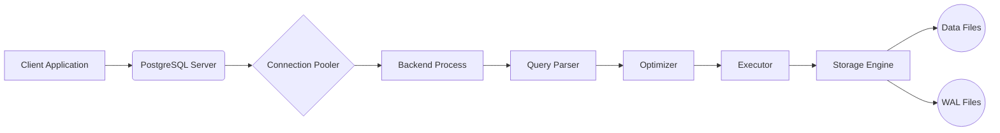

# postgre_sql

## **Guide Rapide Et Complet Sur PostgreSQL**

---

### **1. Qu'est-ce Que PostgreSQL ?**



- **PostgreSQL** : SGBD relationnel et objet (ORDBMS) open-source, conforme aux standards SQL.
- **Caractéristiques** :
  - Supporte les transactions ACID, les vues matérialisées, les déclencheurs (triggers).
  - Types de données avancés : JSON/JSONB, géométrie (PostGIS), UUID, tableaux.
  - Extensible via des extensions (ex: PostGIS, pgcrypto).
  - Performant pour les charges de travail complexes (OLAP, OLTP).

---

### **2. Installation**

- **Linux (Ubuntu/Debian)** :

  ```bash
  sudo apt update && sudo apt install postgresql postgresql-contrib
  sudo systemctl start postgresql
  sudo systemctl enable postgresql # Démarrer au boot
  ```

- **Linux (Arch Linux)** :

  ```bash
  sudo pacman -S postgresql postgresql-libs
  sudo -u postgres initdb -D /var/lib/postgres/data # Initialiser la base
  sudo systemctl start postgresql.service
  sudo systemctl enable postgresql.service # Démarrer au boot
  ```

- **macOS (Homebrew)** :

  ```bash
  brew install postgresql
  brew services start postgresql
  ```

- **Windows** : Téléchargez l'installeur sur [postgresql.org](https://www.postgresql.org/download/).

---

### **3. Commandes De Base (Terminal psql)**

| **Commande**               | **Description**                          |
|----------------------------|------------------------------------------|
| `psql -U utilisateur -d base` | Connexion à une base spécifique.         |
| `sudo -u postgres psql`    | Connexion en tant qu'utilisateur postgres (local). |
| `\l`                        | Liste les bases de données.              |
| `\c nom_base`               | Se connecte à une base.                  |
| `\dt`                       | Liste les tables.                        |
| `\d+ nom_table`             | Décrit la structure d'une table.         |
| `\q`                        | Quitte le terminal psql.                 |

---

### **4. Configuration Initiale (Optionnel)**

Les fichiers de configuration principaux se trouvent généralement dans le répertoire de données (souvent `/var/lib/postgres/data/` sur Linux).

-   **`postgresql.conf`** : Paramètres généraux du serveur.
-   **`pg_hba.conf`** : Règles d'authentification des clients.

---

### **5. Gestion Des Utilisateurs Et Bases De Données**

-   **Créer une nouvelle base de données** :

    ```sql
    CREATE DATABASE ma_nouvelle_base;
    ```

-   **Créer un nouvel utilisateur** :

    ```sql
    CREATE USER mon_utilisateur WITH PASSWORD 'mot_de_passe_utilisateur';
    ```

-   **Accorder des privilèges sur une base de données** :

    ```sql
    GRANT ALL PRIVILEGES ON DATABASE ma_nouvelle_base TO mon_utilisateur;
    ```

---

### **6. Extensions Utiles**

-   **PostGIS** (données géospatiales) :

    ```sql
    CREATE EXTENSION postgis;
    ```

-   **pgcrypto** (chiffrement) :

    ```sql
    CREATE EXTENSION pgcrypto;
    SELECT crypt('motdepasse', gen_salt('bf'));
  ```

---

### **7. Différences Clés Avec MySQL**

**Jointures :**

```sql
-- INNER JOIN
SELECT a.titre, c.nom 
FROM Articles a
INNER JOIN Commentaires c ON a.id = c.article_id;

-- LEFT JOIN
SELECT a.titre, COUNT(c.id) AS nb_commentaires
FROM Articles a
LEFT JOIN Commentaires c ON a.id = c.article_id
GROUP BY a.id;
```

**Agrégation :**

```sql
SELECT auteur_id, AVG(note) AS moyenne
FROM Commentaires
GROUP BY auteur_id
HAVING AVG(note) > 3.5;
```

**Fenêtrage (Window Functions) :**

```sql
SELECT titre, date_creation, 
       RANK() OVER (ORDER BY date_creation DESC) AS rang
FROM Articles;
```

---

### **8. Index**

- **Créer un index B-tree** :

  ```sql
  CREATE INDEX idx_titre ON Articles (titre);
  ```

- **Index GIN pour JSONB** :

  ```sql
  CREATE INDEX idx_json_data ON MaTable USING GIN (json_data);
  ```

- **Index partiel** :

  ```sql
  CREATE INDEX idx_actifs ON Utilisateurs (nom) WHERE est_actif = true;
  ```

#### Types d'Index et Utilisation

PostgreSQL offre une variété de types d'index pour optimiser les requêtes :

-   **B-Tree**: Le type d'index le plus courant, adapté à une large gamme de requêtes (égalité, intervalles, LIKE avec préfixe).
-   **Hash**: Pour les recherches d'égalité uniquement, généralement moins performant que B-Tree.
-   **GIN (Generalized Inverted Index)**: Excellent pour les données indexées composites, comme les tableaux et les types de données de document (JSONB, XML).
-   **GiST (Generalized Search Tree)**: Supporte une variété de structures de données et de méthodes de recherche (géospatiales, pleine recherche de texte).
-   **SP-GiST (Space-Partitioned Generalized Search Tree)**: Similaire à GiST, mais optimisé pour les données non équilibrées.
-   **BRIN (Block Range Index)**: Pour les tables volumineuses où les données sont naturellement ordonnées.

**Comment choisir le bon index ?**

-   Analyser les requêtes lentes avec `EXPLAIN ANALYZE`.
-   Identifier les colonnes utilisées dans les clauses `WHERE`, `JOIN`, `ORDER BY`, et `GROUP BY`.
-   Choisir le type d'index approprié en fonction du type de données et du type de requête.
-   Créer des index composites pour les requêtes qui filtrent sur plusieurs colonnes.
-   Surveiller la taille et l'utilisation des index.

---

### **9. Réplication et Haute Disponibilité**

PostgreSQL offre plusieurs options pour la réplication et la haute disponibilité :

-   **Streaming Replication**: Envoie les journaux de transactions (WAL) en temps réel à un ou plusieurs serveurs esclaves.
-   **Logical Replication**: Permet de répliquer des données sélectivement en fonction des tables ou des changements.
-   **Clustering**: Peut être réalisé avec des outils externes comme Patroni ou repmgr pour la gestion automatique du failover.

---

### **10. Transactions**

```sql
BEGIN;
UPDATE Comptes SET solde = solde - 100 WHERE id = 1;
UPDATE Comptes SET solde = solde + 100 WHERE id = 2;
COMMIT;  -- Valide
-- ROLLBACK;  Annule
```

---

### **11. Fonctions Et Procédures Stockées (PL/pgSQL)**

**Fonction :**

```sql
CREATE OR REPLACE FUNCTION salaire_annuel(salaire_mensuel NUMERIC)
RETURNS NUMERIC AS $$
BEGIN
    RETURN salaire_mensuel * 12;
END;
$$ LANGUAGE plpgsql;

-- Appel
SELECT salaire_annuel(2500);  -- Résultat: 30000
```

**Procédure avec déclencheur (Trigger) :**

```sql
-- Créer une fonction de trigger
CREATE OR REPLACE FUNCTION log_modification()
RETURNS TRIGGER AS $$
BEGIN
    INSERT INTO Logs (action, table_name, date)
    VALUES (TG_OP, TG_TABLE_NAME, NOW());
    RETURN NEW;
END;
$$ LANGUAGE plpgsql;

-- Attacher le trigger à une table
CREATE TRIGGER trig_log_articles
AFTER INSERT OR UPDATE OR DELETE ON Articles
FOR EACH ROW EXECUTE FUNCTION log_modification();
```

---

### **12. Sécurité**

- **Créer un rôle** :

  ```sql
  CREATE ROLE lecteur;
  GRANT SELECT ON Articles TO lecteur;
  ```

- **Gérer les permissions** :

  ```sql
  GRANT INSERT, UPDATE ON Articles TO utilisateur;
  REVOKE DELETE ON Articles FROM utilisateur;
  ```

- **Sécurité au niveau des lignes (RLS)** :

  ```sql
  ALTER TABLE Articles ENABLE ROW LEVEL SECURITY;
  CREATE POLICY acces_articles 
  ON Articles FOR SELECT 
  USING (auteur_id = current_user_id());
  ```

---

### **13. Sauvegarde Et Restauration**

- **Exporter (dump)** :

  ```bash
  pg_dump -U utilisateur -d ma_base > backup.sql
  ```

- **Importer** :

  ```bash
  psql -U utilisateur -d ma_base < backup.sql
  ```

---

### **14. Optimisation**

- **Analyser une requête** :

  ```sql
  EXPLAIN ANALYZE SELECT * FROM Articles WHERE titre = 'Test';
  ```

- **Maintenance** :

  ```sql
  VACUUM ANALYZE Articles;  -- Nettoie et met à jour les statistiques
  ```

- **Configuration (postgresql.conf)** :

```ini
  shared_buffers = 4GB
  work_mem = 64MB
```

---

### **15. Différences Clés Avec MySQL**

| **Fonctionnalité**       | **PostgreSQL**                     | **MySQL**                     |
|--------------------------|------------------------------------|-------------------------------|
| **Types de données**     | JSONB, ARRAY, UUID, géométrie     | JSON, pas de types avancés    |
| **Transactions**         | Complètes (ACID)                   | Supportées (InnoDB)           |
| **Réplication**          | Native (physique/logique)          | Asynchrone ou Galera          |
| **Licence**              | Open-source (PostgreSQL License)   | Dual-license (GPL/commercial) |
| **Performances**         | Optimisé pour requêtes complexes   | Rapide pour lectures simples  |

---

### **16. Erreurs Courantes**

- **"role does not exist"** → Créez l'utilisateur avec `CREATE ROLE`.
- **"relation does not exist"** → Vérifiez le nom de la table ou les permissions.
- **Erreur de syntaxe avec `COPY`** → Utilisez `\copy` en psql pour les droits locaux.

---

**📚 Ressources** :
- [Documentation Officielle](https://www.postgresql.org/docs/)
- [PostgreSQL Tutorial](https://www.postgresqltutorial.com/)
- [pgAdmin](https://www.pgadmin.org/) (Outil graphique)
- [Stack Overflow](https://stackoverflow.com/questions/tagged/postgresql)

---

**🚀 Astuce** : Utilisez `pg_stat_statements` pour analyser les requêtes fréquentes et optimiser les performances !
