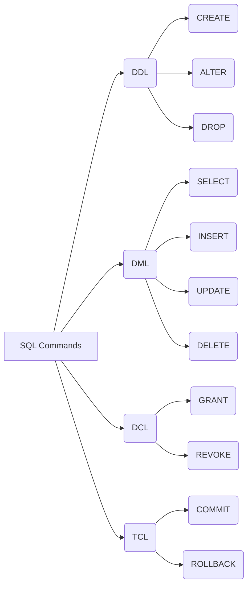
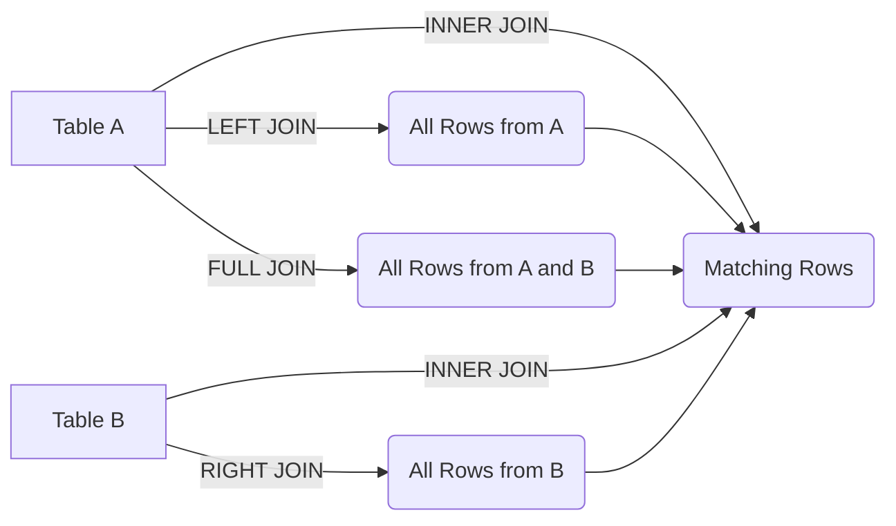

# Guide Complet Sur SQL (Structured Query Language)

## Table Des Matières

## 1. Introduction à SQL

### Qu'est-ce Que SQL ?

SQL (Structured Query Language) est un langage standardisé pour interagir avec les bases de données relationnelles. Créé dans les années 1970, il est devenu le standard pour la gestion et la manipulation des données.

### Catégories De Commandes SQL



- **DDL (Data Definition Language)** : Définit la structure des données (tables) (CREATE, ALTER, DROP)
- **DML (Data Manipulation Language)** : Manipule les données (SELECT, INSERT, UPDATE, DELETE)
- **DCL (Data Control Language)** : Gère les droits d'accès (GRANT, REVOKE)
- **TCL (Transaction Control Language)** : Gère les transactions (COMMIT, ROLLBACK)

## 2. Création Et Gestion Des Bases De Données

### Création D'une Base De Données

```sql
CREATE DATABASE nom_base_de_donnees;
```

### Utilisation D'une Base De Données

```sql
USE nom_base_de_donnees;
```

### Suppression D'une Base De Données

```sql
DROP DATABASE nom_base_de_donnees;
```

### Sauvegarde Et Restauration (syntaxe générique)

```sql
-- Sauvegarde (varie selon le SGBDR)
BACKUP DATABASE nom_base_de_donnees TO DISK = 'chemin/fichier.bak';

-- Restauration
RESTORE DATABASE nom_base_de_donnees FROM DISK = 'chemin/fichier.bak';
```

## 3. Types De Données

### Types Numériques

- **INT/INTEGER** : Nombres entiers (-2,147,483,648 à 2,147,483,647)
- **SMALLINT** : Petits entiers (-32,768 à 32,767)
- **BIGINT** : Grands entiers (-9,223,372,036,854,775,808 à 9,223,372,036,854,775,807)
- **DECIMAL/NUMERIC(p,s)** : Nombres décimaux de précision p et échelle s
- **FLOAT/REAL** : Nombres à virgule flottante
- **DOUBLE PRECISION** : Double précision

### Types Caractères

- **CHAR(n)** : Chaîne de caractères de taille fixe n
- **VARCHAR(n)** : Chaîne de caractères de taille variable (max n)
- **TEXT** : Texte de longueur variable (grande capacité)

### Types Date Et Heure

- **DATE** : Date (AAAA-MM-JJ)
- **TIME** : Heure (HH:MM:SS)
- **DATETIME/TIMESTAMP** : Date et heure
- **INTERVAL** : Intervalle de temps

### Types Booléens

- **BOOLEAN/BOOL** : Valeurs TRUE, FALSE ou NULL

### Types Binaires

- **BLOB** : Binary Large Object
- **BINARY(n)** : Données binaires de taille fixe
- **VARBINARY(n)** : Données binaires de taille variable

### Types Spéciaux

- **JSON** : Données au format JSON (PostgreSQL, MySQL 5.7+)
- **XML** : Données au format XML
- **ARRAY** : Tableaux (PostgreSQL)
- **UUID** : Identifiant universel unique

## 4. Langage De Définition Des Données (DDL)

### Création De Tables

```sql
CREATE TABLE nom_table (
    id INT PRIMARY KEY,
    nom VARCHAR(100) NOT NULL,
    email VARCHAR(100) UNIQUE,
    date_naissance DATE,
    salaire DECIMAL(10,2) DEFAULT 0.00,
    departement_id INT,
    FOREIGN KEY (departement_id) REFERENCES departements(id)
);
```

### Modification De Tables

```sql
-- Ajouter une colonne
ALTER TABLE nom_table ADD COLUMN nouvelle_colonne VARCHAR(50);

-- Modifier une colonne
ALTER TABLE nom_table ALTER COLUMN nom_colonne TYPE VARCHAR(200);
-- ou (selon le SGBDR)
ALTER TABLE nom_table MODIFY COLUMN nom_colonne VARCHAR(200);

-- Supprimer une colonne
ALTER TABLE nom_table DROP COLUMN nom_colonne;

-- Ajouter une contrainte
ALTER TABLE nom_table ADD CONSTRAINT nom_contrainte 
    FOREIGN KEY (colonne) REFERENCES autre_table(colonne);
```

### Suppression De Tables

```sql
DROP TABLE nom_table;
```

### Troncature De Tables (vider sans supprimer)

```sql
TRUNCATE TABLE nom_table;
```

### Index

```sql
-- Création d'index
CREATE INDEX nom_index ON nom_table (colonne1, colonne2);

-- Index unique
CREATE UNIQUE INDEX nom_index ON nom_table (colonne);

-- Suppression d'index
DROP INDEX nom_index;
```

## 5. Langage De Manipulation Des Données (DML)

### Insertion De Données

```sql
-- Insertion d'une ligne complète
INSERT INTO nom_table VALUES (1, 'Jean Dupont', 'jean@email.com', '1980-01-15', 45000.00, 2);

-- Insertion avec colonnes spécifiées
INSERT INTO nom_table (id, nom, email) VALUES (2, 'Marie Martin', 'marie@email.com');

-- Insertion multiple
INSERT INTO nom_table (id, nom) VALUES 
    (3, 'Pierre Durand'),
    (4, 'Sophie Lefebvre');

-- Insertion à partir d'une requête
INSERT INTO table_cible (col1, col2)
SELECT col1, col2 FROM table_source WHERE condition;
```

### Mise à Jour De Données

```sql
-- Mise à jour simple
UPDATE nom_table SET colonne1 = 'nouvelle_valeur' WHERE condition;

-- Mise à jour multiple
UPDATE nom_table SET 
    colonne1 = 'nouvelle_valeur1',
    colonne2 = 'nouvelle_valeur2'
WHERE condition;

-- Mise à jour avec sous-requête
UPDATE nom_table SET colonne1 = (SELECT colonne FROM autre_table WHERE condition)
WHERE condition;
```

### Suppression De Données

```sql
-- Suppression avec condition
DELETE FROM nom_table WHERE condition;

-- Suppression totale
DELETE FROM nom_table;
```

### Requête De Base SELECT

```sql
-- Sélection de toutes les colonnes
SELECT * FROM nom_table;

-- Sélection de colonnes spécifiques
SELECT colonne1, colonne2 FROM nom_table;

-- Sélection avec condition
SELECT colonne1, colonne2 FROM nom_table WHERE condition;

-- Tri des résultats
SELECT colonne1, colonne2 FROM nom_table ORDER BY colonne1 ASC, colonne2 DESC;

-- Limitation des résultats
SELECT colonne1, colonne2 FROM nom_table LIMIT 10 OFFSET 20;
-- ou (SQL Server)
SELECT TOP 10 colonne1, colonne2 FROM nom_table;
```

## 6. Requêtes SELECT Avancées

### Filtrage Avec WHERE

```sql
-- Opérateurs de comparaison
SELECT * FROM employees WHERE salary > 50000;
SELECT * FROM employees WHERE hire_date < '2020-01-01';

-- Opérateurs logiques
SELECT * FROM employees WHERE department_id = 3 AND salary > 40000;
SELECT * FROM employees WHERE department_id = 1 OR department_id = 2;
SELECT * FROM employees WHERE NOT department_id = 3;

-- BETWEEN
SELECT * FROM employees WHERE salary BETWEEN 40000 AND 60000;

-- IN
SELECT * FROM employees WHERE department_id IN (1, 3, 5);

-- LIKE pour la recherche de motifs
SELECT * FROM employees WHERE name LIKE 'J%';        -- Commence par J
SELECT * FROM employees WHERE email LIKE '%@gmail.com'; -- Termine par @gmail.com
SELECT * FROM employees WHERE name LIKE '_o%';       -- Deuxième lettre est 'o'

-- IS NULL / IS NOT NULL
SELECT * FROM employees WHERE manager_id IS NULL;
SELECT * FROM employees WHERE phone IS NOT NULL;
```

### Tri Avec ORDER BY

```sql
-- Tri ascendant (défaut)
SELECT * FROM employees ORDER BY last_name;

-- Tri descendant
SELECT * FROM employees ORDER BY salary DESC;

-- Tri multiple
SELECT * FROM employees ORDER BY department_id, salary DESC;

-- Tri par position de colonne
SELECT id, name, salary FROM employees ORDER BY 3 DESC;

-- Tri avec expression
SELECT id, first_name, last_name FROM employees ORDER BY LENGTH(last_name);
```

### Groupement Avec GROUP BY

```sql
-- Groupement simple
SELECT department_id, COUNT(*) FROM employees GROUP BY department_id;

-- Groupement multiple
SELECT department_id, job_title, AVG(salary) FROM employees 
GROUP BY department_id, job_title;

-- Filtrage de groupes avec HAVING
SELECT department_id, AVG(salary) FROM employees 
GROUP BY department_id
HAVING AVG(salary) > 50000;
```

### Clauses LIMIT/OFFSET

```sql
-- Limiter le nombre de résultats
SELECT * FROM products ORDER BY price DESC LIMIT 10;

-- Pagination
SELECT * FROM products ORDER BY name LIMIT 20 OFFSET 40; -- Page 3 (items 41-60)
```

## 7. Fonctions SQL

### Fonctions D'agrégation

```sql
SELECT 
    COUNT(*) AS nombre_total,
    COUNT(DISTINCT department_id) AS nombre_departements,
    SUM(salary) AS masse_salariale,
    AVG(salary) AS salaire_moyen,
    MIN(salary) AS salaire_minimum,
    MAX(salary) AS salaire_maximum
FROM employees;
```

### Fonctions De Chaîne

```sql
-- Concaténation
SELECT CONCAT(first_name, ' ', last_name) AS full_name FROM employees;
-- ou (Oracle)
SELECT first_name || ' ' || last_name AS full_name FROM employees;

-- Majuscules/minuscules
SELECT UPPER(name) FROM products;
SELECT LOWER(email) FROM users;

-- Extraction
SELECT SUBSTRING(description, 1, 100) FROM products;
-- ou (Oracle)
SELECT SUBSTR(description, 1, 100) FROM products;

-- Remplacement
SELECT REPLACE(phone, '-', '') FROM contacts;

-- Longueur
SELECT LENGTH(description) FROM products;

-- Trim
SELECT TRIM(' texte ') FROM dual;
```

### Fonctions Numériques

```sql
SELECT 
    ROUND(price, 2),      -- Arrondi à 2 décimales
    FLOOR(price),         -- Arrondi à l'entier inférieur
    CEILING(price),       -- Arrondi à l'entier supérieur
    ABS(balance),         -- Valeur absolue
    POWER(base, 2),       -- Puissance
    SQRT(area)            -- Racine carrée
FROM products;
```

### Fonctions De Date Et Heure

```sql
-- Extraction de composants
SELECT 
    EXTRACT(YEAR FROM date_column),
    EXTRACT(MONTH FROM date_column),
    EXTRACT(DAY FROM date_column)
FROM table;

-- Date actuelle
SELECT CURRENT_DATE;
-- ou
SELECT CURRENT_TIMESTAMP;

-- Opérations sur les dates
SELECT 
    date_column + INTERVAL '1 day',
    date_column - INTERVAL '2 hours'
FROM table;

-- Différence entre dates
SELECT DATEDIFF(end_date, start_date) FROM projects;
-- ou (PostgreSQL)
SELECT end_date - start_date FROM projects;

-- Formatage de date
SELECT TO_CHAR(date_column, 'YYYY-MM-DD HH24:MI:SS') FROM table;
-- ou (MySQL)
SELECT DATE_FORMAT(date_column, '%Y-%m-%d %H:%i:%s') FROM table;
```

### Fonctions Conditionnelles

```sql
-- CASE simple
SELECT 
    name,
    CASE 
        WHEN price < 10 THEN 'Bon marché'
        WHEN price < 50 THEN 'Prix moyen'
        ELSE 'Cher'
    END AS categorie_prix
FROM products;

-- CASE avec expressions
SELECT 
    name,
    CASE status
        WHEN 'A' THEN 'Actif'
        WHEN 'I' THEN 'Inactif'
        WHEN 'P' THEN 'En attente'
        ELSE 'Inconnu'
    END AS statut
FROM orders;

-- COALESCE (premier non-NULL)
SELECT COALESCE(phone, email, 'Pas de contact') AS contact FROM customers;

-- NULLIF (NULL si égal)
SELECT NULLIF(value1, value2) FROM table;

-- NVL/IFNULL/ISNULL (valeur par défaut si NULL)
SELECT IFNULL(phone, 'Non renseigné') FROM customers; -- MySQL
SELECT NVL(phone, 'Non renseigné') FROM customers; -- Oracle
SELECT ISNULL(phone, 'Non renseigné') FROM customers; -- SQL Server
```

## 8. Jointures

### Types De Jointures



#### INNER JOIN

```sql
-- Jointure interne
SELECT e.id, e.name, d.name AS department
FROM employees e
INNER JOIN departments d ON e.department_id = d.id;
```

#### LEFT JOIN (LEFT OUTER JOIN)

```sql
-- Jointure externe gauche
SELECT e.id, e.name, d.name AS department
FROM employees e
LEFT JOIN departments d ON e.department_id = d.id;
```

#### RIGHT JOIN (RIGHT OUTER JOIN)

```sql
-- Jointure externe droite
SELECT e.id, e.name, d.name AS department
FROM employees e
RIGHT JOIN departments d ON e.department_id = d.id;
```

#### FULL JOIN (FULL OUTER JOIN)

```sql
-- Jointure externe complète
SELECT e.id, e.name, d.name AS department
FROM employees e
FULL JOIN departments d ON e.department_id = d.id;
```

#### CROSS JOIN

```sql
-- Produit cartésien
SELECT e.name, d.name
FROM employees e
CROSS JOIN departments d;
```

#### SELF JOIN

```sql
-- Auto-jointure (même table)
SELECT e.name AS employee, m.name AS manager
FROM employees e
JOIN employees m ON e.manager_id = m.id;
```

### Jointures Multiples

```sql
SELECT o.id, c.name AS customer, p.name AS product, o.quantity
FROM orders o
JOIN customers c ON o.customer_id = c.id
JOIN products p ON o.product_id = p.id
WHERE o.order_date > '2023-01-01';
```

### Jointures Avec Conditions Complexes

```sql
-- Jointure avec plusieurs conditions
SELECT e.id, e.name, p.name AS project
FROM employees e
JOIN projects p ON e.department_id = p.department_id 
                AND e.hire_date < p.start_date;
```

## 9. Sous-requêtes

### Types De Sous-requêtes

#### Sous-requête Scalaire (retourne Une Seule valeur)

```sql
SELECT name, salary
FROM employees
WHERE salary > (SELECT AVG(salary) FROM employees);
```

#### Sous-requête De Ligne (retourne Une ligne)

```sql
SELECT *
FROM employees
WHERE (department_id, salary) = (SELECT department_id, MAX(salary) 
                                FROM employees 
                                WHERE department_id = 3
                                GROUP BY department_id);
```

#### Sous-requête De Colonne (retourne Une colonne)

```sql
SELECT name
FROM departments
WHERE id IN (SELECT DISTINCT department_id FROM employees WHERE salary > 50000);
```

#### Sous-requête De Table (retourne Plusieurs Colonnes Et lignes)

```sql
SELECT d.name, dept_stats.avg_salary
FROM departments d
JOIN (
    SELECT department_id, AVG(salary) AS avg_salary
    FROM employees
    GROUP BY department_id
) dept_stats ON d.id = dept_stats.department_id;
```

### Opérateurs Pour Sous-requêtes

#### IN / NOT IN

```sql
SELECT name
FROM employees
WHERE department_id IN (SELECT id FROM departments WHERE location = 'Paris');
```

#### EXISTS / NOT EXISTS

```sql
SELECT name
FROM departments d
WHERE EXISTS (
    SELECT 1 
    FROM employees e 
    WHERE e.department_id = d.id AND e.salary > 60000
);
```

#### ANY / SOME

```sql
SELECT name
FROM employees
WHERE salary > ANY (SELECT salary FROM employees WHERE department_id = 3);
```

#### ALL

```sql
SELECT name
FROM employees
WHERE salary > ALL (SELECT salary FROM employees WHERE department_id = 3);
```

### Sous-requêtes Corrélées

```sql
-- Trouver les employés qui ont le salaire le plus élevé dans leur département
SELECT e1.name, e1.salary, e1.department_id
FROM employees e1
WHERE e1.salary = (
    SELECT MAX(e2.salary)
    FROM employees e2
    WHERE e2.department_id = e1.department_id
);
```

## 10. Opérations Ensemblistes

### UNION / UNION ALL

```sql
-- Union sans doublons
SELECT id, name FROM employees
UNION
SELECT id, name FROM contractors;

-- Union avec doublons
SELECT id, name FROM employees
UNION ALL
SELECT id, name FROM contractors;
```

### INTERSECT

```sql
-- Intersection (valeurs communes)
SELECT id FROM employees
INTERSECT
SELECT employee_id FROM project_assignments;
```

### EXCEPT / MINUS

```sql
-- Différence (valeurs présentes uniquement dans le premier ensemble)
SELECT id FROM employees
EXCEPT  -- ou MINUS pour Oracle
SELECT employee_id FROM project_assignments;
```

### Combinaison D'opérations

```sql
(SELECT id, name FROM employees WHERE department_id = 1)
UNION
(SELECT id, name FROM employees WHERE salary > 60000)
EXCEPT
(SELECT id, name FROM employees WHERE hire_date < '2020-01-01');
```

## 11. Indexation

### Types D'index

#### Index Standard (B-tree)

```sql
CREATE INDEX idx_employee_name ON employees(name);
```

#### Index Unique

```sql
CREATE UNIQUE INDEX idx_employee_email ON employees(email);
```

#### Index Composite (plusieurs colonnes)

```sql
CREATE INDEX idx_emp_dept_salary ON employees(department_id, salary);
```

#### Index partiel/filtré

```sql
-- PostgreSQL
CREATE INDEX idx_active_employees ON employees(name) WHERE status = 'active';
-- SQL Server
CREATE INDEX idx_active_employees ON employees(name) WHERE status = 'active';
```

#### Index fonctionnel/calculé

```sql
-- PostgreSQL
CREATE INDEX idx_lower_email ON employees(LOWER(email));
-- SQL Server
CREATE INDEX idx_year_hire ON employees(YEAR(hire_date));
```

### Gestion Des Index

```sql
-- Afficher les index
-- PostgreSQL
SELECT * FROM pg_indexes WHERE tablename = 'employees';
-- MySQL
SHOW INDEX FROM employees;
-- SQL Server
EXEC sp_helpindex 'employees';

-- Supprimer un index
DROP INDEX idx_employee_name;
-- ou (selon SGBDR)
DROP INDEX idx_employee_name ON employees;
```

## 12. Vues

### Création De Vues

```sql
-- Vue simple
CREATE VIEW employee_details AS
SELECT e.id, e.name, e.salary, d.name AS department
FROM employees e
JOIN departments d ON e.department_id = d.id;

-- Vue avec colonnes nommées
CREATE VIEW high_paid_employees (id, name, department, salary) AS
SELECT e.id, e.name, d.name, e.salary
FROM employees e
JOIN departments d ON e.department_id = d.id
WHERE e.salary > 50000;
```

### Vue Matérialisée (PostgreSQL, Oracle)

```sql
-- PostgreSQL
CREATE MATERIALIZED VIEW dept_salary_stats AS
SELECT department_id, AVG(salary) AS avg_salary, MAX(salary) AS max_salary
FROM employees
GROUP BY department_id;

-- Rafraîchissement
REFRESH MATERIALIZED VIEW dept_salary_stats;
```

### Modification Et Suppression De Vues

```sql
-- Modification
CREATE OR REPLACE VIEW employee_details AS
SELECT e.id, e.name, e.salary, e.hire_date, d.name AS department
FROM employees e
JOIN departments d ON e.department_id = d.id;

-- Suppression
DROP VIEW employee_details;
```

### Vues Avec Option CHECK OPTION

```sql
CREATE VIEW local_employees AS
SELECT * FROM employees
WHERE location = 'Paris'
WITH CHECK OPTION;
```

## 13. Transactions Et Contrôle De Concurrence

### Gestion Des Transactions

```sql
-- Début d'une transaction
BEGIN TRANSACTION;
-- ou
START TRANSACTION;
-- ou (Oracle)
BEGIN;

-- Validation
COMMIT;

-- Annulation
ROLLBACK;

-- Points de sauvegarde
SAVEPOINT point1;
-- ...
ROLLBACK TO SAVEPOINT point1;
```

### Niveaux D'isolation

```sql
-- Définir le niveau d'isolation
SET TRANSACTION ISOLATION LEVEL READ UNCOMMITTED;
SET TRANSACTION ISOLATION LEVEL READ COMMITTED;
SET TRANSACTION ISOLATION LEVEL REPEATABLE READ;
SET TRANSACTION ISOLATION LEVEL SERIALIZABLE;
```

### Verrouillage Explicite

```sql
-- MySQL/PostgreSQL
SELECT * FROM accounts WHERE id = 1 FOR UPDATE;

-- SQL Server
SELECT * FROM accounts WITH (UPDLOCK) WHERE id = 1;
```

## 14. Procédures Stockées Et Fonctions

### Procédures Stockées

#### MySQL

```sql
DELIMITER //
CREATE PROCEDURE calculate_bonus(IN employee_id INT, OUT bonus DECIMAL(10,2))
BEGIN
    DECLARE emp_salary DECIMAL(10,2);
    
    SELECT salary INTO emp_salary 
    FROM employees 
    WHERE id = employee_id;
    
    IF emp_salary > 50000 THEN
        SET bonus = emp_salary * 0.1;
    ELSE
        SET bonus = emp_salary * 0.05;
    END IF;
END //
DELIMITER ;

-- Appel
CALL calculate_bonus(123, @bonus);
SELECT @bonus;
```

#### PostgreSQL

```sql
CREATE OR REPLACE PROCEDURE update_employee_salary(
    employee_id_param INT,
    new_salary_param DECIMAL
)
LANGUAGE plpgsql
AS $$
BEGIN
    UPDATE employees
    SET salary = new_salary_param
    WHERE id = employee_id_param;
    
    COMMIT;
END;
$$;

-- Appel
CALL update_employee_salary(123, 55000);
```

#### SQL Server

```sql
CREATE PROCEDURE GetEmployeesByDepartment
    @DepartmentID INT,
    @MinSalary DECIMAL(10,2) = 0
AS
BEGIN
    SELECT id, name, salary
    FROM employees
    WHERE department_id = @DepartmentID
      AND salary >= @MinSalary;
END;

-- Appel
EXEC GetEmployeesByDepartment @DepartmentID = 3, @MinSalary = 40000;
```

### Fonctions

#### MySQL

```sql
DELIMITER //
CREATE FUNCTION calculate_tax(salary DECIMAL(10,2)) 
RETURNS DECIMAL(10,2)
DETERMINISTIC
BEGIN
    DECLARE tax DECIMAL(10,2);
    
    IF salary < 30000 THEN
        SET tax = salary * 0.15;
    ELSEIF salary < 70000 THEN
        SET tax = salary * 0.22;
    ELSE
        SET tax = salary * 0.30;
    END IF;
    
    RETURN tax;
END //
DELIMITER ;

-- Utilisation
SELECT name, salary, calculate_tax(salary) AS tax FROM employees;
```

#### PostgreSQL

```sql
CREATE OR REPLACE FUNCTION get_department_employees(dept_id INT)
RETURNS TABLE (
    employee_id INT,
    employee_name VARCHAR,
    employee_salary DECIMAL
)
AS $$
BEGIN
    RETURN QUERY
    SELECT id, name, salary
    FROM employees
    WHERE department_id = dept_id;
END;
$$ LANGUAGE plpgsql;

-- Utilisation
SELECT * FROM get_department_employees(3);
```

#### SQL Server

```sql
CREATE FUNCTION CalculateAge(@BirthDate DATE)
RETURNS INT
AS
BEGIN
    DECLARE @Age INT;
    SET @Age = DATEDIFF(YEAR, @BirthDate, GETDATE()) -
              CASE
                  WHEN DATEADD(YEAR, DATEDIFF(YEAR, @BirthDate, GETDATE()), @BirthDate) > GETDATE()
                  THEN 1
                  ELSE 0
              END;
    RETURN @Age;
END;

-- Utilisation
SELECT name, birth_date, dbo.CalculateAge(birth_date) AS age FROM employees;
```

## 15. Déclencheurs (Triggers)

### Types De Déclencheurs

#### MySQL

```sql
DELIMITER //
CREATE TRIGGER after_employee_update
AFTER UPDATE ON employees
FOR EACH ROW
BEGIN
    INSERT INTO employee_audit
    (employee_id, action, change_date)
    VALUES
    (NEW.id, 'UPDATE', NOW());
END //
DELIMITER ;
```

#### PostgreSQL

```sql
CREATE OR REPLACE FUNCTION log_salary_changes()
RETURNS TRIGGER AS $$
BEGIN
    IF NEW.salary <> OLD.salary THEN
        INSERT INTO salary_history
        (employee_id, old_salary, new_salary, change_date)
        VALUES
        (NEW.id, OLD.salary, NEW.salary, CURRENT_TIMESTAMP);
    END IF;
    RETURN NEW;
END;
$$ LANGUAGE plpgsql;

CREATE TRIGGER salary_update_trigger
BEFORE UPDATE ON employees
FOR EACH ROW
EXECUTE FUNCTION log_salary_changes();
```

#### SQL Server

```sql
CREATE TRIGGER prevent_weekend_changes
ON employees
INSTEAD OF UPDATE
AS
BEGIN
    IF (DATEPART(DW, GETDATE()) IN (1, 7))
    BEGIN
        RAISERROR('Les modifications ne sont pas autorisées le weekend.', 16, 1);
        ROLLBACK TRANSACTION;
        RETURN;
    END;
    
    UPDATE employees
    SET name = i.name,
        salary = i.salary,
        department_id = i.department_id
    FROM employees e
    INNER JOIN inserted i ON e.id = i.id;
END;
```

### Gestion Des Déclencheurs

```sql
-- Désactiver un déclencheur (SQL Server)
DISABLE TRIGGER salary_update_trigger ON employees;

-- Activer un déclencheur (SQL Server)
ENABLE TRIGGER salary_update_trigger ON employees;

-- Supprimer un déclencheur
DROP TRIGGER salary_update_trigger;
-- ou (selon SGBDR)
DROP TRIGGER salary_update_trigger ON employees;
```

## 16. Contraintes D'intégrité

### Types De Contraintes

#### Contrainte De Clé Primaire

```sql
-- Lors de la création de table
CREATE TABLE employees (
    id INT PRIMARY KEY,
    name VARCHAR(100)
);

-- Ajout ultérieur
ALTER TABLE employees
ADD CONSTRAINT pk_employees PRIMARY KEY (id);
```

#### Contrainte De Clé Étrangère

```sql
-- Lors de la création de table
CREATE TABLE employees (
    id INT PRIMARY KEY,
    department_id INT,
    FOREIGN KEY (department_id) REFERENCES departments(id)
);

-- Ajout ultérieur
ALTER TABLE employees
ADD CONSTRAINT fk_department
FOREIGN KEY (department_id) REFERENCES departments(id);
```

#### Contrainte UNIQUE

```sql
-- Lors de la création de table
CREATE TABLE employees (
    id INT PRIMARY KEY,
    email VARCHAR(100) UNIQUE
);

-- Ajout ultérieur
ALTER TABLE employees
ADD CONSTRAINT uk_email UNIQUE (email);
```

#### Contrainte CHECK

```sql
-- Lors de la création de table
CREATE TABLE products (
    id INT PRIMARY KEY,
    price DECIMAL(10,2) CHECK (price > 0)
);

-- Ajout ultérieur
ALTER TABLE employees
ADD CONSTRAINT chk_salary CHECK (salary >= 0);
```

#### Contrainte NOT NULL

```sql
-- Lors de la création de table
CREATE TABLE employees (
    id INT PRIMARY KEY,
    name VARCHAR(100) NOT NULL
);

-- Ajout ultérieur
ALTER TABLE employees
ALTER COLUMN name SET NOT NULL;
-- ou (SQL Server)
ALTER TABLE employees
ALTER COLUMN name VARCHAR(100) NOT NULL;
```

#### Contrainte DEFAULT

```sql
-- Lors de la création de table
CREATE TABLE orders (
    id INT PRIMARY KEY,
    order_date DATE DEFAULT CURRENT_DATE
);

-- Ajout ultérieur
ALTER TABLE employees
ALTER COLUMN status SET DEFAULT 'active';
-- ou (SQL Server)
ALTER TABLE employees
ADD CONSTRAINT df_status DEFAULT 'active' FOR status;
```

### Options Pour Les Clés Étrangères

```sql
-- Avec action en cascade
CREATE TABLE orders (
    id INT PRIMARY KEY,
    customer_id INT,
    FOREIGN KEY (customer_id) 
        REFERENCES customers(id)
        ON DELETE CASCADE
        ON UPDATE CASCADE
);

-- Avec SET NULL
CREATE TABLE orders (
    id INT PRIMARY KEY,
    customer_id INT,
    FOREIGN KEY (customer_id) 
        REFERENCES customers(id)
        ON DELETE SET NULL
        ON UPDATE CASCADE
);
```

## 17. Optimisation Des Requêtes (suite)

### Analyse Du Plan D'exécution (suite)

```sql
-- PostgreSQL (avec statistiques d'exécution)
EXPLAIN ANALYZE SELECT * FROM employees WHERE department_id = 3;

-- SQL Server
SET SHOWPLAN_ALL ON;
SELECT * FROM employees WHERE department_id = 3;
SET SHOWPLAN_ALL OFF;

-- Oracle
EXPLAIN PLAN FOR SELECT * FROM employees WHERE department_id = 3;
SELECT * FROM TABLE(DBMS_XPLAN.DISPLAY);
```

### Techniques D'optimisation

#### Utilisation Correcte Des Index

```sql
-- Bon usage (utilise l'index)
SELECT * FROM employees WHERE employee_id = 123;

-- Mauvais usage (n'utilisera pas l'index sur employee_id)
SELECT * FROM employees WHERE SUBSTR(employee_id, 1, 2) = '12';
```

#### Éviter Les Fonctions Sur Les Colonnes Indexées

```sql
-- Mauvais (n'utilisera pas l'index)
SELECT * FROM employees WHERE UPPER(email) = 'USER@EXAMPLE.COM';

-- Bon (utilisera l'index si présent)
SELECT * FROM employees WHERE email = 'user@example.com';
-- Alternative (si un index fonctionnel sur LOWER(email) existe)
SELECT * FROM employees WHERE LOWER(email) = 'jean.dupont@example.com';
```

#### Limiter Les Résultats

```sql
-- Utiliser LIMIT/TOP pour récupérer seulement les données nécessaires
SELECT * FROM large_table WHERE condition LIMIT 100;
```

#### Éviter SELECT *

```sql
-- Mauvais (récupère toutes les colonnes)
SELECT * FROM employees JOIN departments ON employees.department_id = departments.id;

-- Bon (récupère uniquement les colonnes nécessaires)
SELECT e.id, e.name, e.salary, d.name AS department 
FROM employees e 
JOIN departments d ON e.department_id = d.id;
```

#### Utiliser Des Jointures Appropriées

```sql
-- Préférer les jointures explicites
SELECT e.name, d.name
FROM employees e
JOIN departments d ON e.department_id = d.id;

-- Plutôt que les jointures implicites
SELECT e.name, d.name
FROM employees e, departments d
WHERE e.department_id = d.id;
```

#### Optimiser Les Sous-requêtes

```sql
-- Parfois une jointure est plus efficace qu'une sous-requête
-- Sous-requête
SELECT * FROM orders
WHERE customer_id IN (SELECT id FROM customers WHERE city = 'Paris');

-- Jointure équivalente potentiellement plus efficace
SELECT o.*
FROM orders o
JOIN customers c ON o.customer_id = c.id
WHERE c.city = 'Paris';
```

#### Utiliser EXISTS Pour Les Tests D'existence

```sql
-- Efficace pour vérifier l'existence
SELECT name
FROM departments d
WHERE EXISTS (SELECT 1 FROM employees e WHERE e.department_id = d.id);
```

#### Partitionnement Des Tables (pour Les Grandes tables)

```sql
-- PostgreSQL
CREATE TABLE measurements (
    city_id         int not null,
    logdate         date not null,
    peaktemp        int,
    unitsales       int
) PARTITION BY RANGE (logdate);

CREATE TABLE measurements_y2020 PARTITION OF measurements
    FOR VALUES FROM ('2020-01-01') TO ('2021-01-01');

CREATE TABLE measurements_y2021 PARTITION OF measurements
    FOR VALUES FROM ('2021-01-01') TO ('2022-01-01');
```

## 18. Sécurité En SQL

### Gestion Des Utilisateurs

#### Création D'utilisateurs

```sql
-- MySQL
CREATE USER 'username'@'localhost' IDENTIFIED BY 'password';

-- PostgreSQL
CREATE USER username WITH PASSWORD 'password';

-- SQL Server
CREATE LOGIN username WITH PASSWORD = 'password';
CREATE USER username FOR LOGIN username;
```

#### Attribution De Privilèges

```sql
-- MySQL/PostgreSQL
GRANT SELECT, INSERT, UPDATE ON table_name TO username;

-- Tous les privilèges
GRANT ALL PRIVILEGES ON database_name.* TO username;

-- SQL Server
GRANT SELECT, INSERT, UPDATE ON schema_name.table_name TO username;
```

#### Révocation De Privilèges

```sql
-- MySQL/PostgreSQL
REVOKE INSERT ON table_name FROM username;

-- SQL Server
REVOKE INSERT ON schema_name.table_name FROM username;
```

### Prévention Des Injections SQL

#### Utilisation De Requêtes Paramétrées

```sql
-- Exemple en PHP
$stmt = $pdo->prepare("SELECT * FROM users WHERE username = ? AND password = ?");
$stmt->execute([$username, $password]);

-- Exemple en Python avec SQLAlchemy
result = session.query(User).filter(User.username == username, User.password == password).all()
```

#### Utilisation Des Procédures Stockées

```sql
-- Création d'une procédure stockée sécurisée
CREATE PROCEDURE authenticate_user(IN p_username VARCHAR(50), IN p_password VARCHAR(100))
BEGIN
    SELECT * FROM users WHERE username = p_username AND password = p_password;
END;

-- Appel
CALL authenticate_user('john_doe', 'secure_password');
```

#### Échappement Des Entrées (moins recommandé)

```sql
-- Exemple en PHP
$username = mysqli_real_escape_string($conn, $_POST['username']);
$password = mysqli_real_escape_string($conn, $_POST['password']);
$query = "SELECT * FROM users WHERE username = '$username' AND password = '$password'";
```

### Chiffrement Des Données

#### Chiffrement Au Niveau Des Colonnes

```sql
-- MySQL
-- Création d'une table avec colonne chiffrée
CREATE TABLE secure_data (
    id INT PRIMARY KEY,
    plaintext VARCHAR(100),
    encrypted_data VARBINARY(150)
);

-- Insertion avec chiffrement
INSERT INTO secure_data (id, plaintext, encrypted_data)
VALUES (1, 'texte sensible', AES_ENCRYPT('texte sensible', 'clé_secrète'));

-- Récupération avec déchiffrement
SELECT id, plaintext, AES_DECRYPT(encrypted_data, 'clé_secrète') AS decrypted
FROM secure_data;
```

#### Chiffrement Au Niveau De la Base De Données

```sql
-- Varie selon le SGBDR, exemple pour SQL Server
-- Création d'un certificat
CREATE MASTER KEY ENCRYPTION BY PASSWORD = 'mot_de_passe_complexe';
CREATE CERTIFICATE MyCertificate WITH SUBJECT = 'Certificate for TDE';

-- Création d'une clé de chiffrement
CREATE DATABASE ENCRYPTION KEY
WITH ALGORITHM = AES_256
ENCRYPTION BY SERVER CERTIFICATE MyCertificate;

-- Activation du chiffrement transparent (TDE)
ALTER DATABASE MyDatabase
SET ENCRYPTION ON;
```

## 19. Différences Entre SGBDR

### Syntaxe Spécifique

#### Auto-incrémentation

```sql
-- MySQL
CREATE TABLE employees (
    id INT AUTO_INCREMENT PRIMARY KEY,
    name VARCHAR(100)
);

-- PostgreSQL
CREATE TABLE employees (
    id SERIAL PRIMARY KEY,
    name VARCHAR(100)
);

-- SQL Server
CREATE TABLE employees (
    id INT IDENTITY(1,1) PRIMARY KEY,
    name VARCHAR(100)
);

-- Oracle
CREATE TABLE employees (
    id NUMBER GENERATED ALWAYS AS IDENTITY PRIMARY KEY,
    name VARCHAR2(100)
);
```

#### Limitation Des Résultats

```sql
-- MySQL/PostgreSQL
SELECT * FROM employees LIMIT 10;

-- SQL Server
SELECT TOP 10 * FROM employees;

-- Oracle
SELECT * FROM employees WHERE ROWNUM <= 10;
-- ou (Oracle 12c+)
SELECT * FROM employees FETCH FIRST 10 ROWS ONLY;
```

#### Concaténation De Chaînes

```sql
-- MySQL/SQL Server
SELECT CONCAT(first_name, ' ', last_name) FROM employees;

-- PostgreSQL/Oracle
SELECT first_name || ' ' || last_name FROM employees;
```

### Types De Données Spécifiques

#### Types JSON

```sql
-- MySQL/PostgreSQL
CREATE TABLE data (
    id INT PRIMARY KEY,
    info JSON
);

-- PostgreSQL - Requête sur JSON
SELECT info->>'name' AS name FROM data;

-- MySQL - Requête sur JSON
SELECT JSON_EXTRACT(info, '$.name') AS name FROM data;
```

#### Types Géographiques

```sql
-- PostgreSQL avec PostGIS
CREATE TABLE locations (
    id INT PRIMARY KEY,
    name VARCHAR(100),
    location GEOMETRY(Point, 4326)
);

-- MySQL
CREATE TABLE locations (
    id INT PRIMARY KEY,
    name VARCHAR(100),
    location POINT
);

-- SQL Server
CREATE TABLE locations (
    id INT PRIMARY KEY,
    name VARCHAR(100),
    location GEOGRAPHY
);
```

### Fonctionnalités Spécifiques

#### Fenêtrage (Window Functions)

```sql
-- Commun à la plupart des SGBDR modernes
SELECT
    department_id,
    name,
    salary,
    RANK() OVER (PARTITION BY department_id ORDER BY salary DESC) AS rank_in_dept,
    AVG(salary) OVER (PARTITION BY department_id) AS avg_dept_salary
FROM employees;
```

## 20. Expression De Table Commune (CTE)

Les Expressions de Table Communes (CTE) sont des ensembles de résultats temporaires nommés que vous pouvez référencer dans une seule instruction SQL (SELECT, INSERT, UPDATE, DELETE). Elles améliorent la lisibilité et la maintenabilité des requêtes complexes.

```sql
-- Exemple de CTE simple
WITH DepartmentAverageSalary AS (
    SELECT 
        department_id,
        AVG(salary) AS avg_salary
    FROM employees
    GROUP BY department_id
)
SELECT 
    e.name,
    e.salary,
    das.avg_salary
FROM employees e
JOIN DepartmentAverageSalary das ON e.department_id = das.department_id
WHERE e.salary > das.avg_salary;
```

### CTE Récursives

Les CTE récursives sont utilisées pour interroger des données hiérarchiques ou en forme d'arbre. Elles se composent d'une partie d'ancrage (la base de la récursion) et d'une partie récursive (qui se réfère à la CTE elle-même).

```sql
-- Exemple de CTE récursive pour une hiérarchie d'organisation
WITH RECURSIVE org_hierarchy AS (
    -- Cas de base: employés sans manager (niveau supérieur)
    SELECT id, name, manager_id, 1 AS level
    FROM employees
    WHERE manager_id IS NULL
    
    UNION ALL
    
    -- Cas récursif: employés avec un manager
    SELECT e.id, e.name, e.manager_id, oh.level + 1
    FROM employees e
    JOIN org_hierarchy oh ON e.manager_id = oh.id
)
SELECT * FROM org_hierarchy ORDER BY level, id;
```

## 21. Requêtes Récursives

```sql
-- PostgreSQL / SQL Server / Oracle
WITH RECURSIVE org_hierarchy AS (
    -- Cas de base: employés sans manager (niveau supérieur)
    SELECT id, name, manager_id, 1 AS level
    FROM employees
    WHERE manager_id IS NULL
    
    UNION ALL
    
    -- Cas récursif: employés avec un manager
    SELECT e.id, e.name, e.manager_id, oh.level + 1
    FROM employees e
    JOIN org_hierarchy oh ON e.manager_id = oh.id
)
SELECT * FROM org_hierarchy ORDER BY level, id;
```

## 22. Bonnes Pratiques

### Conventions De Nommage

- Utilisez des noms cohérents et descriptifs
- Préférez snake_case (my_table) ou PascalCase (MyTable)
- Utilisez le pluriel pour les noms de tables (employees plutôt que employee)
- Préfixez les noms des contraintes (pk_tablename, fk_sourcetable_targettable)
- Préfixez les noms des index (idx_tablename_columnname)

### Structure De la Base De Données

- Normalisez vos données (jusqu'à 3NF en général)
- Utilisez des clés primaires pour toutes les tables
- Définissez les clés étrangères pour maintenir l'intégrité référentielle
- Ajoutez des contraintes appropriées (NOT NULL, UNIQUE, CHECK)
- Utilisez des types de données appropriés et précis

### Écriture De Requêtes

- Écrivez des requêtes lisibles avec indentation et sauts de ligne
- Utilisez des alias de table explicites (employees e, departments d)
- Limitez l'utilisation de SELECT * aux cas nécessaires
- Préférez les jointures explicites (INNER JOIN) aux jointures implicites
- Utilisez les transactions pour les opérations multiples

### Performance

- Indexez les colonnes fréquemment utilisées dans les clauses WHERE, JOIN et ORDER BY
- Évitez d'indexer excessivement (impact sur les opérations d'écriture)
- Analysez régulièrement les plans d'exécution
- Utilisez EXPLAIN pour comprendre comment vos requêtes sont exécutées
- Évitez les sous-requêtes quand des jointures sont plus efficaces

### Sécurité

- N'utilisez jamais de concaténation de chaînes pour les requêtes dynamiques
- Utilisez toujours des requêtes paramétrées ou des procédures stockées
- Appliquez le principe du moindre privilège pour les utilisateurs
- Chiffrez les données sensibles
- Auditez régulièrement les accès à la base de données

### Documentation

- Commentez votre code SQL complexe
- Documentez la structure de la base de données
- Maintenez un dictionnaire de données
- Documentez les relations entre les tables
- Décrivez l'objectif des procédures stockées et des déclencheurs

---

## 23. Anti-Patterns SQL Courants

Éviter ces pièges peut améliorer considérablement la performance et la maintenabilité de vos requêtes.

### Éviter SELECT *

Sélectionner toutes les colonnes (`SELECT *`) est pratique but inefficace, surtout sur de grandes tables. Cela récupère des données inutiles, augmente la charge réseau et empêche l'utilisation d'index couvrant uniquement un sous-ensemble de colonnes.

```sql
-- Anti-pattern
SELECT * FROM large_table WHERE condition;

-- Bonne pratique
SELECT id, nom, email FROM large_table WHERE condition;
```

### Éviter Les Fonctions Sur Les Colonnes Indexées Dans WHERE

Appliquer une fonction à une colonne dans la clause `WHERE` empêche généralement le SGBDR d'utiliser un index sur cette colonne, forçant un scan complet de la table.

```sql
-- Anti-pattern (n'utilise pas l'index sur date_creation)
SELECT * FROM commandes WHERE YEAR(date_creation) = 2023;

-- Bonne pratique (peut utiliser l'index sur date_creation)
SELECT * FROM commandes WHERE date_creation >= '2023-01-01' AND date_creation < '2024-01-01';

-- Anti-pattern (n'utilise pas l'index sur email)
SELECT * FROM utilisateurs WHERE LOWER(email) = 'jean.dupont@example.com';

-- Bonne pratique (si l'index est sur la colonne brute)
SELECT * FROM utilisateurs WHERE email = 'jean.dupont@example.com';
-- Alternative (si un index fonctionnel sur LOWER(email) existe)
SELECT * FROM utilisateurs WHERE LOWER(email) = 'jean.dupont@example.com';
```

### Utiliser NOT IN Avec Des NULLs

`NOT IN` peut donner des résultats inattendus si la sous-requête ou la colonne comparée contient des valeurs `NULL`. Une comparaison avec `NULL` retourne `UNKNOWN`, et `NOT IN` traite `UNKNOWN` comme `FALSE`.

```sql
-- Anti-pattern (peut exclure des lignes de manière incorrecte si manager_id est NULL)
SELECT * FROM employees WHERE manager_id NOT IN (SELECT id FROM managers WHERE status = 'inactive');

-- Bonne pratique (utilise NOT EXISTS ou LEFT JOIN)
SELECT e.*
FROM employees e
WHERE NOT EXISTS (
    SELECT 1
    FROM managers m
    WHERE m.id = e.manager_id AND m.status = 'inactive'
);

-- Alternative avec LEFT JOIN
SELECT e.*
FROM employees e
LEFT JOIN managers m ON e.manager_id = m.id AND m.status = 'inactive'
WHERE m.id IS NULL; -- S'assure qu'il n'y a PAS de manager inactif
```

### Utiliser OR Sur Des Colonnes Non Indexées

Utiliser `OR` dans la clause `WHERE` sur des colonnes qui ne sont pas toutes indexées peut empêcher l'optimiseur d'utiliser les index efficacement.

```sql
-- Anti-pattern (si ni colonne1 ni colonne2 ne sont indexées, ou si un seul l'est)
SELECT * FROM table WHERE colonne1 = 'A' OR colonne2 = 'B';

-- Bonne pratique (parfois, UNION ALL est plus performant)
SELECT * FROM table WHERE colonne1 = 'A'
UNION ALL
SELECT * FROM table WHERE colonne2 = 'B' AND colonne1 <> 'A'; -- Évite les doublons si nécessaire
```

*Note : Les SGBDR modernes sont souvent capables d'optimiser les clauses OR si les colonnes sont indexées.*

### Utiliser Des Curseurs Pour Des Opérations En Masse

Les curseurs traitent les données ligne par ligne, ce qui est très inefficace pour les opérations qui pourraient être effectuées en une seule requête SQL basée sur des ensembles.

```sql
-- Anti-pattern (utilisation d'un curseur pour mettre à jour des salaires)
-- DECLARE cur CURSOR FOR SELECT id, salaire FROM employees WHERE ...
-- OPEN cur; FETCH ... LOOP UPDATE employees SET salaire = ... WHERE id = ... END LOOP; CLOSE cur;

-- Bonne pratique (opération basée sur des ensembles)
UPDATE employees SET salaire = salaire * 1.10 WHERE condition;
```

### Stocker Des Listes Séparées Par Des Virgules Dans Une Colonne

Stocker plusieurs valeurs dans une seule colonne (ex: 'tag1,tag2,tag3') rend les recherches, les mises à jour et les rapports difficiles et inefficaces. Cela viole la première forme normale (1NF).

```sql
-- Anti-pattern
CREATE TABLE produits (
    id INT PRIMARY KEY,
    nom VARCHAR(100),
    tags VARCHAR(255) -- 'electronique,maison,cuisine'
);

-- Bonne pratique (modèle relationnel normalisé)
CREATE TABLE produits (
    id INT PRIMARY KEY,
    nom VARCHAR(100)
);

CREATE TABLE tags (
    id INT PRIMARY KEY,
    nom VARCHAR(50) UNIQUE
);

CREATE TABLE produit_tags (
    produit_id INT,
    tag_id INT,
    PRIMARY KEY (produit_id, tag_id),
    FOREIGN KEY (produit_id) REFERENCES produits(id),
    FOREIGN KEY (tag_id) REFERENCES tags(id)
);
```

### Utiliser Des Requêtes Implicites (Comma Joins)

Les jointures implicites (`FROM table1, table2 WHERE table1.col = table2.col`) sont moins lisibles et plus sujettes aux erreurs (produits cartésiens accidentels) que les jointures explicites (`INNER JOIN`, `LEFT JOIN`, etc.).

```sql
-- Anti-pattern (jointure implicite)
SELECT e.nom, d.nom FROM employees e, departments d WHERE e.department_id = d.id;

-- Bonne pratique (jointure explicite)
SELECT e.nom, d.nom FROM employees e INNER JOIN departments d ON e.department_id = d.id;
```

### Utiliser Des Sous-requêtes Scalaires Dans la Liste SELECT Qui Retournent Plusieurs Lignes

Une sous-requête scalaire est censée retourner une seule valeur. Si elle retourne plusieurs lignes, la requête échouera.

```sql
-- Anti-pattern (échouera si plusieurs managers ont le même nom)
SELECT nom, (SELECT email FROM employees WHERE nom = 'Manager Dupont') AS manager_email FROM ...;

-- Bonne pratique (utiliser une jointure)
SELECT e.nom, m.email AS manager_email
FROM employees e
JOIN employees m ON e.manager_id = m.id
WHERE m.nom = 'Manager Dupont';
```

Ce guide couvre les aspects essentiels de SQL et des bases de données relationnelles. Pour approfondir vos connaissances, je vous recommande de consulter la documentation officielle de votre SGBDR spécifique et de pratiquer régulièrement avec des exemples concrets.
