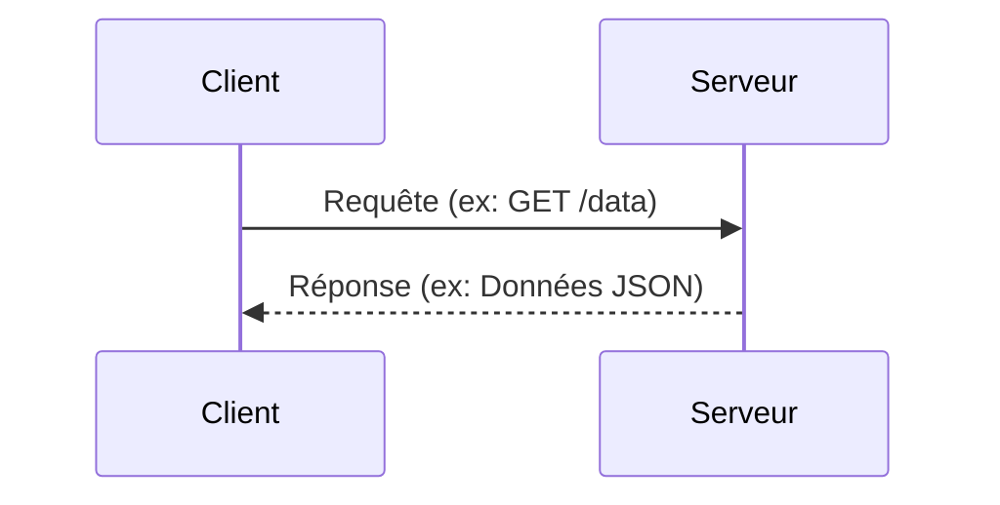

# Architecture Client-Serveur

**Présentation**
L'architecture client-serveur est un modèle fondamental dans le développement d'applications web. Elle divise les tâches entre les "clients", qui demandent des informations ou des services, et les "serveurs", qui fournissent ces informations ou services.

**Principes Clés**
- Le client initie la communication en envoyant une requête au serveur.
- Le serveur écoute les requêtes entrantes, les traite et renvoie une réponse au client.
- Cette séparation des préoccupations permet une gestion plus efficace des ressources et une meilleure évolutivité.

**Composants Principaux**
- **Client:** Une application (comme un navigateur web, une application mobile) qui envoie des requêtes.
- **Serveur:** Un système qui reçoit les requêtes, exécute la logique métier et renvoie des réponses.

**Types de Clients et de Serveurs**

- **Types de Clients:**
    - **Clients Web:** Navigateurs web (Chrome, Firefox, Safari) accédant à des applications via HTTP/HTTPS.
    - **Clients Mobiles:** Applications natives (iOS, Android) ou hybrides.
    - **Clients Desktop:** Applications logicielles installées sur un ordinateur (ex: Microsoft Word, Adobe Photoshop).
    - **Autres Clients:** Appareils IoT, terminaux de paiement, etc.
- **Types de Serveurs:**
    - **Serveurs Web:** Servent des pages web et des ressources statiques (Apache, Nginx, IIS).
    - **Serveurs d'Applications:** Exécutent la logique métier et interagissent avec les bases de données (Node.js, Java Spring Boot, Python Django/Flask).
    - **Serveurs de Bases de Données:** Stockent et gèrent les données (MySQL, PostgreSQL, MongoDB).
    - **Serveurs de Fichiers:** Stockent et partagent des fichiers (FTP, NFS, SMB).
    - **Serveurs de Messagerie:** Gèrent l'envoi et la réception d'e-mails (SMTP, POP3, IMAP).

**Avantages et Inconvénients**

**Avantages:**
- **Centralisation des données:** Les données sont gérées sur le serveur, facilitant la cohérence et la sécurité.
- **Maintenance simplifiée:** Les mises à jour logicielles peuvent être effectuées sur le serveur sans affecter les clients.
- **Sécurité améliorée:** La logique métier et les données sensibles sont protégées sur le serveur.
- **Évolutivité:** Il est plus facile d'ajouter de nouveaux clients ou de mettre à niveau le serveur indépendamment.

**Inconvénients:**
- **Dépendance au serveur:** Si le serveur tombe en panne, les clients ne peuvent plus accéder aux services.
- **Charge du réseau:** Toutes les communications passent par le réseau, ce qui peut entraîner des latences.
- **Complexité du serveur:** Le serveur doit gérer plusieurs requêtes simultanément et assurer la sécurité.

**Guides d'utilisation**
Dans ce modèle, le client n'a pas besoin de connaître les détails internes du fonctionnement du serveur, seulement comment communiquer avec lui via un protocole défini (comme HTTP). Le serveur gère les ressources et les données, répondant aux demandes de plusieurs clients simultanément.

**Exemples de Code (Hono)**
Voici un exemple simple d'un serveur Hono qui répond à une requête GET :

```typescript
import { Hono } from 'hono';

const app = new Hono();

app.get('/', (c) => {
  return c.text('Bonjour depuis le serveur Hono!');
});

export default app;
```

Côté client (conceptuel, utilisant fetch API dans un navigateur):

```javascript
async function fetchData() {
  try {
    const response = await fetch('http://localhost:3000/'); // Remplacez par l'adresse de votre serveur
    const data = await response.text();
    console.log(data); // Affiche "Bonjour depuis le serveur Hono!"
  } catch (error) {
    console.error('Erreur lors de la récupération des données:', error);
  }
}

fetchData();
```

**Diagramme Mermaid**


