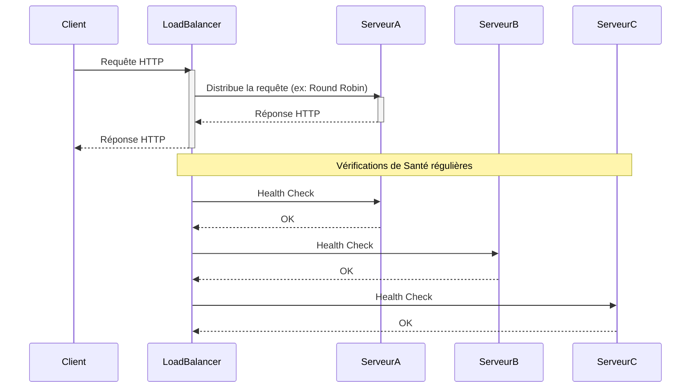

# Équilibreur De Charge (Load Balancer)

**Présentation**
Un équilibreur de charge est un dispositif ou un logiciel qui distribue le trafic réseau entrant sur un groupe de serveurs backend, appelés pool de serveurs. Il garantit qu'aucune machine individuelle n'est surchargée, améliorant ainsi la réactivité et la disponibilité de l'application.

**Principes Clés**
- Distribution du trafic entrant sur plusieurs serveurs.
- Amélioration des performances en évitant la surcharge d'un serveur unique.
- Augmentation de la disponibilité et de la fiabilité en redirigeant le trafic loin des serveurs défaillants.
- Permet une maintenance sans interruption en retirant temporairement des serveurs du pool.

**Types d'Équilibreurs de Charge**
Les équilibreurs de charge peuvent être classés de plusieurs manières :
- **Basés sur le Matériel (Hardware Load Balancers):** Des appareils physiques dédiés (ex: F5 BIG-IP, Citrix ADC). Offrent des performances élevées mais sont coûteux et moins flexibles.
- **Basés sur le Logiciel (Software Load Balancers):** Des applications logicielles exécutées sur des serveurs standards (ex: Nginx, HAProxy, Envoy). Plus flexibles, évolutifs et économiques.
- **Basés sur le Cloud (Cloud Load Balancers):** Services gérés fournis par les fournisseurs de cloud (ex: AWS Elastic Load Balancing (ELB), Google Cloud Load Balancing, Azure Load Balancer). Faciles à configurer et à mettre à l'échelle.

**Niveaux d'Opération :**
- **Couche 4 (Transport Layer - TCP/UDP):** Distribue le trafic en se basant sur les adresses IP et les ports. Moins de surcharge, mais moins de visibilité sur le contenu de la requête.
- **Couche 7 (Application Layer - HTTP/HTTPS):** Distribue le trafic en se basant sur des informations plus riches comme les en-têtes HTTP, les cookies, les chemins d'URL. Permet des règles de routage plus intelligentes et la terminaison SSL.

**Composants Principaux**
- **Trafic Entrant:** Les requêtes des clients.
- **Équilibreur de Charge:** Le point d'entrée unique qui reçoit le trafic.
- **Pool de Serveurs Backend:** Le groupe de serveurs (exécutant des applications comme Hono) qui traitent les requêtes.
- **Algorithmes de Répartition:** Les règles utilisées par l'équilibreur de charge pour décider quel serveur doit recevoir la prochaine requête (par exemple, Round Robin, Moins de Connexions, Hachage IP).
- **Vérifications de Santé (Health Checks):** Mécanismes pour vérifier si les serveurs backend fonctionnent correctement.

**Guides d'utilisation**
Les équilibreurs de charge sont essentiels dans les architectures à haute disponibilité et à mise à l'échelle horizontale. Ils peuvent opérer au niveau de la couche réseau (Layer 4) en se basant sur les adresses IP et les ports, ou au niveau de la couche application (Layer 7) en se basant sur des informations plus détaillées comme les en-têtes HTTP ou les cookies. L'intégration avec une application Hono se fait en plaçant l'équilibreur de charge devant les instances de l'application Hono.

**Avantages Clés de l'Équilibreur de Charge**
- **Amélioration des Performances:** Distribue la charge, évitant la surcharge d'un serveur et réduisant les temps de réponse.
- **Haute Disponibilité:** Redirige automatiquement le trafic vers les serveurs sains en cas de défaillance d'une instance.
- **Scalabilité:** Permet d'ajouter ou de retirer des serveurs backend dynamiquement sans interruption de service.
- **Sécurité Améliorée:** Peut agir comme une première ligne de défense, en filtrant le trafic malveillant et en gérant la terminaison SSL/TLS.
- **Maintenance Simplifiée:** Permet d'effectuer des mises à jour ou des maintenances sur des serveurs individuels sans affecter la disponibilité globale.
- **Flexibilité de Routage:** Permet des règles de routage complexes basées sur le contenu de la requête.

**Exemples de Code (Hono)**
L'application Hono elle-même n'a pas besoin de code spécifique pour fonctionner derrière un équilibreur de charge. Elle écoute simplement les requêtes sur son port configuré. L'équilibreur de charge gère la distribution du trafic vers les différentes instances de l'application Hono.

Voici un exemple simple d'une application Hono qui fonctionnerait derrière un équilibreur de charge :

```typescript
import { Hono } from 'hono';

const app = new Hono();

// Cette application peut être déployée sur plusieurs serveurs.
// Un équilibreur de charge dirigerait le trafic vers ces instances.
app.get('/hello', (c) => {
  // Pourrait éventuellement inclure l'ID de l'instance pour le débogage
  // const instanceId = process.env.INSTANCE_ID || 'inconnu';
  return c.text('Bonjour depuis une instance de l\'application Hono!');
});

export default app;
```

*Note : L'équilibreur de charge est configuré séparément de l'application Hono. La configuration de l'équilibreur de charge spécifierait les adresses IP ou les noms d'hôte des serveurs exécutant l'application Hono.*

**Diagramme Mermaid**


