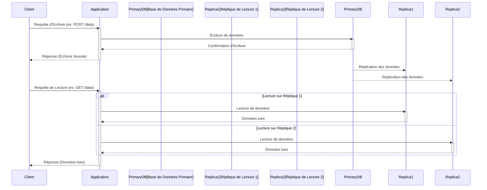

# Réplication De Base De Données (Replication)

**Présentation**
La réplication de base de données consiste à créer et maintenir des copies identiques d'une base de données sur plusieurs serveurs. Cela permet d'améliorer la disponibilité des données, la tolérance aux pannes et les performances en distribuant la charge de lecture.

**Principes Clés**
- Maintien de copies synchronisées des données sur plusieurs serveurs (répliques).
- Améliore la disponibilité : si un serveur tombe en panne, les autres répliques peuvent prendre le relais.
- Améliore les performances de lecture : les requêtes de lecture peuvent être distribuées sur plusieurs répliques.
- Introduit des défis de cohérence : assurer que toutes les répliques ont les données les plus récentes (cohérence éventuelle ou forte).

**Types de Réplication**
Il existe deux modes principaux de réplication :
- **Réplication Synchrone:**
    - **Description:** La réplique primaire attend la confirmation que les données ont été écrites sur au moins une réplique secondaire avant de confirmer l'opération au client.
    - **Avantages:** Garantit une forte cohérence des données (pas de perte de données en cas de panne de la primaire).
    - **Inconvénients:** Introduit une latence supplémentaire pour les opérations d'écriture, car la primaire doit attendre la réplique. Peut affecter les performances.
    - **Cas d'utilisation:** Systèmes où la perte de données est inacceptable (ex: transactions financières).
- **Réplication Asynchrone:**
    - **Description:** La réplique primaire confirme l'opération d'écriture au client immédiatement, sans attendre la confirmation des répliques secondaires. Les données sont copiées vers les secondaires avec un léger délai.
    - **Avantages:** Faible latence pour les écritures, meilleures performances.
    - **Inconvénients:** Risque de perte de données en cas de défaillance de la réplique primaire avant que les modifications ne soient propagées aux secondaires. Cohérence éventuelle.
    - **Cas d'utilisation:** Applications où la performance est critique et une petite perte de données est acceptable (ex: réseaux sociaux, blogs).

**Composants Principaux**
- **Réplique Primaire (Master):** Le serveur principal qui gère toutes les opérations d'écriture (INSERT, UPDATE, DELETE).
- **Répliques Secondaires (Read Replicas / Slaves):** Les copies de la base de données qui gèrent généralement les opérations de lecture (SELECT).
- **Mécanisme de Réplication:** Le processus par lequel les modifications de la réplique primaire sont copiées vers les répliques secondaires (synchrone ou asynchrone).

**Guides d'utilisation**
La réplication est couramment utilisée pour les applications à forte charge de lecture. Les requêtes d'écriture sont dirigées vers la réplique primaire, tandis que les requêtes de lecture sont réparties entre les répliques secondaires. Cela permet de décharger la réplique primaire et d'augmenter le débit global des lectures. La configuration de la réplication dépend du SGBD utilisé (par exemple, MySQL Replication, PostgreSQL Streaming Replication, MongoDB Replica Sets).

**Avantages et Inconvénients de la Réplication**

**Avantages:**
- **Haute Disponibilité:** En cas de panne de la réplique primaire, une réplique secondaire peut prendre le relais (failover), minimisant les temps d'arrêt.
- **Tolérance aux Pannes:** Le système peut continuer à fonctionner même si certains serveurs de base de données échouent.
- **Amélioration des Performances de Lecture:** Les requêtes de lecture peuvent être distribuées sur plusieurs répliques, réduisant la charge sur la primaire et améliorant le débit.
- **Récupération après Désastre (Disaster Recovery):** Les répliques peuvent être situées dans des centres de données différents pour protéger les données contre les catastrophes régionales.
- **Mises à Jour sans Interruption:** Permet d'effectuer des mises à jour logicielles ou des maintenances sur les répliques sans affecter le service principal.

**Inconvénients:**
- **Complexité de la Cohérence:** Assurer la cohérence des données entre toutes les répliques peut être complexe, surtout avec la réplication asynchrone.
- **Coût Accru:** Nécessite plus de serveurs et de ressources de stockage.
- **Latence de Réplication:** Un délai peut exister entre la réplique primaire et les secondaires, surtout en réplication asynchrone.
- **Gestion des Conflits:** En cas d'écritures multiples sur des répliques différentes (dans certains scénarios multi-maîtres), la résolution des conflits peut être difficile.
- **Complexité Opérationnelle:** La mise en place et la maintenance de la réplication nécessitent une expertise.

**Exemples de Code (Hono avec Réplication DB - Conceptuel)**
Dans une architecture utilisant la réplication de base de données, l'application Hono doit être configurée pour diriger les requêtes d'écriture vers la réplique primaire et les requêtes de lecture vers les répliques secondaires. Cela se fait généralement au niveau de la configuration de la connexion à la base de données ou en utilisant une bibliothèque d'accès aux données qui prend en charge la réplication.

Voici un exemple conceptuel montrant comment une application Hono pourrait diriger les requêtes vers différentes connexions DB :

```typescript
import { Hono } from 'hono';
import { json } from 'hono/json';
// Importations conceptuelles des clients DB
// import primaryDb from './primaryDb'; // Connexion à la réplique primaire (écritures)
// import readReplicaDb from './readReplicaDb'; // Connexion aux répliques secondaires (lectures)

const app = new Hono();

// Route pour créer un nouvel article (écriture)
app.post('/articles', async (c) => {
  const newArticle = await c.req.json();
  try {
    // Utiliser la connexion à la réplique primaire pour l'écriture
    // const result = await primaryDb.articles.insert(newArticle);
    const addedArticle = { id: Math.random().toString(36).substring(7), ...newArticle }; // Simulation
    return c.json(addedArticle, 201);
  } catch (error) {
    console.error('Erreur écriture DB:', error);
    return c.json({ message: 'Erreur serveur' }, 500);
  }
});

// Route pour obtenir un article (lecture)
app.get('/articles/:id', async (c) => {
  const articleId = c.req.param('id');
  try {
    // Utiliser la connexion aux répliques secondaires pour la lecture
    // const article = await readReplicaDb.articles.findById(articleId);
    const article = { id: articleId, title: 'Titre Article', content: 'Contenu...' }; // Simulation
    if (article) {
      return c.json(article);
    }
    return c.json({ message: 'Article non trouvé' }, 404);
  } catch (error) {
    console.error('Erreur lecture DB:', error);
    return c.json({ message: 'Erreur serveur' }, 500);
  }
});

export default app;
```

*Note : La gestion de la logique de basculement (failover) en cas de défaillance de la réplique primaire est gérée par le SGBD ou des outils de gestion de cluster, pas directement dans le code Hono.*

**Diagramme Mermaid**


