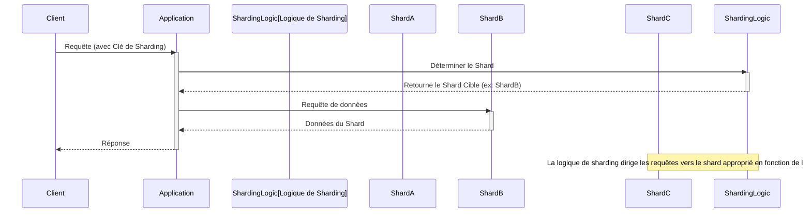

# Sharding De Base De Données (Sharding)

**Présentation**
Le sharding est une technique de partitionnement horizontal des données qui consiste à diviser une grande base de données en morceaux plus petits et plus gérables, appelés shards, et à les distribuer sur plusieurs serveurs de base de données. Cela permet de gérer des volumes de données massifs et d'augmenter les performances en répartissant la charge de lecture et d'écriture.

**Principes Clés**
- Division d'une base de données logique en plusieurs bases de données physiques (shards).
- Chaque shard contient un sous-ensemble des données totales.
- Les requêtes sont dirigées vers le shard approprié en fonction d'une clé de sharding.
- Améliore la scalabilité horizontale pour les opérations de lecture et d'écriture.
- Réduit la quantité de données qu'un seul serveur de base de données doit gérer.

**Stratégies de Sharding**
Le choix de la stratégie de sharding est crucial et dépend des modèles d'accès aux données :
- **Sharding par Plage (Range-Based Sharding):** Les données sont distribuées en fonction d'une plage de valeurs de la clé de sharding (ex: utilisateurs avec des IDs de 1 à 1000 sur shard A, 1001 à 2000 sur shard B).
    - **Avantages:** Facile à implémenter, les requêtes par plage sont efficaces.
    - **Inconvénients:** Peut entraîner des "hot spots" si certaines plages sont plus actives que d'autres.
- **Sharding par Hachage (Hash-Based Sharding):** Les données sont distribuées en appliquant une fonction de hachage à la clé de sharding, ce qui répartit les données de manière plus uniforme.
    - **Avantages:** Meilleure distribution de la charge, réduit les hot spots.
    - **Inconvénients:** Les requêtes par plage sont moins efficaces, l'ajout ou le retrait de shards est plus complexe (nécessite une redistribution des données).
- **Sharding par Répertoire (Directory-Based Sharding):** Un service de "look-up" (répertoire) maintient une carte des clés de sharding vers les shards correspondants.
    - **Avantages:** Très flexible, permet de déplacer des données entre les shards sans modifier la logique de l'application.
    - **Inconvénients:** Le service de répertoire devient un point de défaillance unique et un goulot d'étranglement potentiel.
- **Sharding Géographique/Localisation:** Les données sont shardées en fonction de la localisation géographique des utilisateurs ou des données.

**Composants Principaux**
- **Shards:** Les partitions individuelles de la base de données.
- **Clé de Sharding (Shard Key):** Une ou plusieurs colonnes utilisées pour déterminer comment les données sont distribuées entre les shards. Le choix de la clé de sharding est crucial pour une distribution uniforme des données et des requêtes.
- **Logique de Routage:** Le mécanisme (souvent intégré dans l'application, un proxy de base de données ou une couche de sharding) qui dirige les requêtes vers le shard correct en fonction de la clé de sharding.

**Guides d'utilisation**
Le sharding est généralement mis en œuvre lorsque la taille de la base de données devient trop importante pour être gérée efficacement par un seul serveur, même avec la réplication. Il est essentiel de choisir une clé de sharding appropriée qui permet une distribution équilibrée des données et minimise les requêtes qui nécessitent d'interroger plusieurs shards (requêtes "cross-shard"). Le sharding introduit de la complexité dans la gestion et les requêtes de base de données.

**Avantages et Inconvénients du Sharding**

**Avantages:**
- **Scalabilité Horizontale Massive:** Permet de gérer des volumes de données et des charges de trafic bien au-delà des capacités d'un seul serveur.
- **Performances Améliorées:** Les requêtes sont exécutées sur des sous-ensembles plus petits de données, ce qui réduit les temps de réponse.
- **Haute Disponibilité:** Une panne sur un shard n'affecte pas l'ensemble de la base de données.
- **Réduction des Coûts:** Permet d'utiliser du matériel moins cher en distribuant la charge.

**Inconvénients:**
- **Complexité de l'Implémentation:** La conception et la mise en œuvre du sharding sont complexes.
- **Complexité des Requêtes:** Les requêtes "cross-shard" (qui nécessitent des données de plusieurs shards) sont difficiles et coûteuses.
- **Re-sharding (Re-partitionnement):** La redistribution des données lorsque de nouveaux shards sont ajoutés ou retirés est une opération complexe et potentiellement coûteuse en temps.
- **Point de Défaillance de la Clé de Sharding:** Un mauvais choix de clé de sharding peut entraîner des hot spots ou une distribution inégale des données.
- **Gestion des Transactions Distribuées:** Les transactions qui s'étendent sur plusieurs shards sont très complexes à gérer (nécessitent des protocoles comme le Two-Phase Commit).
- **Coût Opérationnel:** La maintenance et la surveillance d'un système shardé sont plus exigeantes.

**Exemples de Code (Hono avec Sharding DB - Conceptuel)**
Dans une architecture shardée, l'application Hono doit être consciente de la logique de sharding pour diriger les requêtes vers le bon shard. Cela implique généralement d'inclure la clé de sharding dans les requêtes de base de données et d'utiliser une bibliothèque ou un service qui gère le routage vers le shard approprié.

Voici un exemple conceptuel montrant comment une application Hono pourrait interagir avec une base de données shardée en utilisant un ID utilisateur comme clé de sharding :

```typescript
import { Hono } from 'hono';
import { json } from 'hono/json';
// Importation conceptuelle d'un client de base de données shardée
// import shardedDb from './shardedDb'; // Client qui gère le routage vers les shards

const app = new Hono();

// Route pour obtenir les données d'un utilisateur (lecture)
app.get('/users/:userId', async (c) => {
  const userId = c.req.param('userId');
  try {
    // Le client shardedDb utiliserait userId pour déterminer le shard
    // const userData = await shardedDb.users.findById(userId);

    // Simulation de données utilisateur
    const userData = { id: userId, name: `Utilisateur ${userId}`, shard: `shard_${parseInt(userId) % 4}` }; // Simulation avec 4 shards

    if (userData) {
      return c.json(userData);
    }
    return c.json({ message: 'Utilisateur non trouvé' }, 404);
  } catch (error) {
    console.error('Erreur DB shardée:', error);
    return c.json({ message: 'Erreur serveur' }, 500);
  }
});

// Route pour créer un nouvel utilisateur (écriture)
app.post('/users', async (c) => {
  const newUser = await c.req.json();
  // Supposons que newUser.id est la clé de sharding
  if (!newUser.id) {
      return c.json({ message: 'ID utilisateur manquant pour le sharding' }, 400);
  }
  try {
    // Le client shardedDb utiliserait newUser.id pour déterminer le shard
    // const result = await shardedDb.users.insert(newUser);
    const addedUser = { ...newUser, shard: `shard_${parseInt(newUser.id) % 4}` }; // Simulation
    return c.json(addedUser, 201);
  } catch (error) {
    console.error('Erreur écriture DB shardée:', error);
    return c.json({ message: 'Erreur serveur' }, 500);
  }
});


export default app;
```

*Note : L'implémentation réelle du client de base de données shardée (`shardedDb` dans l'exemple) est complexe et dépend du SGBD et de la stratégie de sharding.*

**Diagramme Mermaid**


