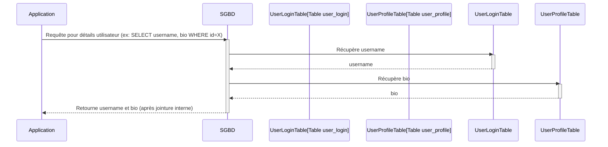

# Partitionnement Vertical (Vertical Partitioning)

**Présentation**
Le partitionnement vertical est une technique de normalisation de base de données qui consiste à diviser une table en plusieurs tables plus petites en fonction des colonnes. Les colonnes qui sont souvent consultées ensemble sont regroupées dans une nouvelle table, tandis que les colonnes moins fréquemment consultées ou très larges sont placées dans d'autres tables.

**Principes Clés**
- Division d'une table en plusieurs tables basées sur des groupes de colonnes.
- Améliore les performances des requêtes de lecture en réduisant la quantité de données à lire depuis le disque.
- Utile lorsque certaines colonnes sont beaucoup plus fréquemment accédées que d'autres.
- Peut nécessiter des jointures (JOIN) pour reconstruire l'enregistrement complet, ce qui peut introduire une surcharge.

**Avantages et Inconvénients du Partitionnement Vertical**

**Avantages:**
- **Performances des Requêtes Améliorées:** Réduit la quantité de données à lire pour les requêtes courantes, car les colonnes fréquemment accédées sont regroupées.
- **Moins de Données par Ligne:** Les lignes sont plus petites, ce qui peut améliorer l'efficacité du cache et des opérations d'E/S.
- **Flexibilité du Schéma:** Permet de gérer des colonnes avec des modèles d'accès très différents.
- **Sécurité Améliorée:** Les colonnes sensibles peuvent être isolées dans des tables séparées avec des contrôles d'accès plus stricts.

**Inconvénients:**
- **Complexité des Jointures:** La reconstruction des enregistrements complets nécessite des opérations de jointure, ce qui peut introduire une surcharge si elles sont trop fréquentes.
- **Complexité de la Gestion:** Gérer plusieurs tables pour ce qui était auparavant une seule peut être plus complexe.
- **Pas de Scalabilité Horizontale:** Ne résout pas les problèmes de scalabilité liés au volume total de données ou au nombre de requêtes sur l'ensemble de la base de données.
- **Dépendance aux Clés:** Nécessite une clé commune pour relier les tables partitionnées.

**Composants Principaux**
- **Table Originale:** La table qui est divisée.
- **Nouvelles Tables Partitionnées:** Les tables résultantes contenant des sous-ensembles de colonnes de la table originale.
- **Clé Primaire/Étrangère:** Utilisée pour relier les lignes des nouvelles tables entre elles et à la table originale (si applicable).

**Guides d'utilisation**
Le partitionnement vertical est bénéfique lorsque vous avez des tables avec de nombreuses colonnes et que les modèles d'accès aux données varient considérablement entre les groupes de colonnes. Par exemple, dans une table utilisateur, les informations de connexion fréquemment consultées pourraient être dans une table, tandis que les informations de profil détaillées et moins souvent consultées pourraient être dans une autre. Cela réduit la quantité de données lues lors des requêtes courantes.

**Comparaison avec le Sharding (Partitionnement Horizontal)**
| Caractéristique           | Partitionnement Vertical                                    | Sharding (Partitionnement Horizontal)                               |
| :------------------------ | :---------------------------------------------------------- | :------------------------------------------------------------------ |
| **Méthode de Division**   | Par colonnes (divise une table en plusieurs tables).        | Par lignes (divise une table en plusieurs instances de la table).   |
| **Objectif Principal**    | Optimiser les performances des requêtes de lecture, réduire la taille des lignes. | Scalabilité horizontale pour les volumes de données et le trafic.   |
| **Scalabilité**           | Ne résout pas la scalabilité horizontale.                   | Permet une scalabilité horizontale massive.                         |
| **Complexité des Requêtes** | Nécessite des jointures pour les enregistrements complets.   | Nécessite une logique de routage et gère les requêtes cross-shard. |
| **Cas d'utilisation**     | Tables larges avec des modèles d'accès variés aux colonnes. | Bases de données très volumineuses avec un trafic élevé.             |
| **Impact sur le Schéma**  | Modifie le schéma de la table.                              | Ne modifie pas le schéma de la table, mais la distribution.         |

**Exemples de Code (Hono avec Partitionnement Vertical - Conceptuel)**
Le partitionnement vertical est une décision de conception de schéma de base de données. Le code de l'application Hono interagirait avec les nouvelles tables partitionnées en utilisant des requêtes qui joignent les tables si nécessaire pour obtenir toutes les informations requises.

Voici un exemple conceptuel montrant comment une application Hono pourrait récupérer des données utilisateur qui ont été partitionnées verticalement en tables `user_login` et `user_profile` :

```typescript
import { Hono } from 'hono';
import { json } from 'hono/json';
// Importation conceptuelle d'un client de base de données SQL
// import sqlDb from './sqlDb';

const app = new Hono();

// Route pour obtenir les informations de connexion et de profil d'un utilisateur
app.get('/users/:userId/details', async (c) => {
  const userId = c.req.param('userId');
  try {
    // Cette requête joint les tables user_login et user_profile
    // const userData = await sqlDb.query(
    //   'SELECT ul.username, ul.last_login, up.full_name, up.bio FROM user_login ul JOIN user_profile up ON ul.user_id = up.user_id WHERE ul.user_id = ?',
    //   [userId]
    // );

    // Simulation de données utilisateur jointes
    const userData = {
      username: `user_${userId}`,
      last_login: '2023-10-27T10:00:00Z',
      full_name: 'Nom Complet Utilisateur',
      bio: 'Ceci est une bio.',
    }; // Simulation

    if (userData) {
      return c.json(userData);
    }
    return c.json({ message: 'Utilisateur non trouvé' }, 404);
  } catch (error) {
    console.error('Erreur DB:', error);
    return c.json({ message: 'Erreur serveur' }, 500);
  }
});

export default app;
```
*Note : La structure des tables `user_login` et `user_profile` avec une clé étrangère `user_id` serait définie lors de la conception de la base de données.*

**Diagramme Mermaid**
```mermaid
**Diagramme Mermaid : Structure des Tables (Class Diagram)**

```mermaid
classDiagram
    class UserOriginal {
        +id: int
        +username: string
        +password_hash: string
        +last_login: datetime
        +full_name: string
        +email: string
        +bio: text
        +address: string
    }

    class UserLogin {
        +id: int
        +username: string
        +password_hash: string
        +last_login: datetime
    }

    class UserProfile {
        +id: int
        +full_name: string
        +email: string
        +bio: text
        +address: string
    }

    UserOriginal --|> UserLogin : partitionné
    UserOriginal --|> UserProfile : partitionné
    UserLogin "1" -- "1" UserProfile : joint par id
```

**Diagramme Mermaid : Accès aux Données (Sequence Diagram)**

