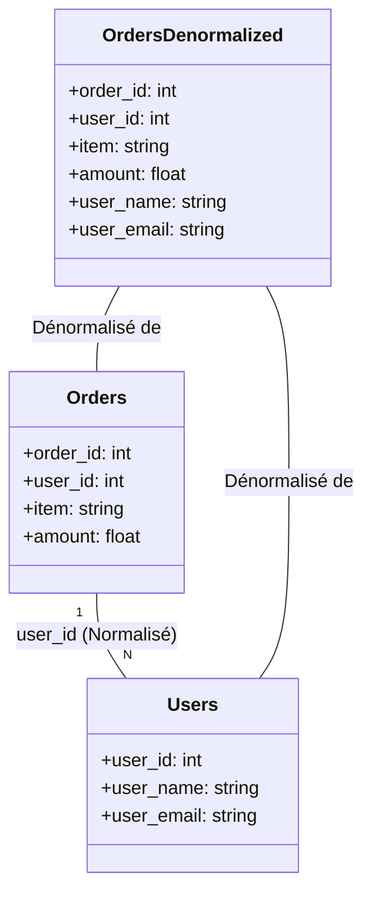
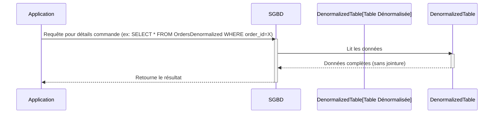

# Dénormalisation (Denormalization)

**Présentation**
La dénormalisation est une technique d'optimisation de base de données qui consiste à ajouter de la redondance aux données en combinant des tables ou en dupliquant des données. L'objectif est d'améliorer les performances des requêtes de lecture en réduisant le besoin de jointures complexes, au détriment de l'augmentation de l'espace de stockage et de la complexité des opérations d'écriture.

**Principes Clés**
- Introduction intentionnelle de redondance des données.
- Réduit le nombre de jointures nécessaires pour les requêtes de lecture.
- Améliore les performances des lectures, en particulier pour les requêtes fréquentes.
- Augmente l'espace de stockage requis.
- Rend les opérations d'écriture (INSERT, UPDATE, DELETE) plus complexes car les données dupliquées doivent être maintenues cohérentes.

**Avantages et Inconvénients de la Dénormalisation**

**Avantages:**
- **Performances de Lecture Améliorées:** Réduit le nombre de jointures coûteuses, ce qui accélère considérablement les requêtes de lecture.
- **Requêtes Simplifiées:** Les requêtes sont plus simples à écrire et à comprendre car elles accèdent directement à toutes les données nécessaires.
- **Réduction de la Charge sur la Base de Données:** Moins de jointures signifie moins de travail pour le SGBD.
- **Optimisation pour des Cas d'Utilisation Spécifiques:** Très efficace pour les rapports, les analyses et les tableaux de bord où les lectures sont prédominantes.

**Inconvénients:**
- **Redondance des Données:** Les mêmes données sont stockées à plusieurs endroits, ce qui augmente l'espace de stockage.
- **Complexité des Écritures:** Les opérations d'écriture (INSERT, UPDATE, DELETE) deviennent plus complexes car toutes les copies des données doivent être mises à jour pour maintenir la cohérence.
- **Risque d'Incohérence des Données:** Si les données dupliquées ne sont pas maintenues synchronisées, des incohérences peuvent apparaître.
- **Moins de Flexibilité du Schéma:** Les changements de schéma sont plus difficiles à gérer car ils peuvent affecter plusieurs tables.

**Composants Principaux**
- **Tables Combinées:** Fusionner des données de plusieurs tables dans une seule.
- **Colonnes Dupliquées:** Ajouter des colonnes d'une table à une autre pour éviter une jointure.
- **Vues Matérialisées:** Des tables qui stockent le résultat d'une requête (souvent une jointure) et sont périodiquement rafraîchies.

**Guides d'utilisation**
La dénormalisation est généralement appliquée aux bases de données relationnelles lorsque les performances de lecture sont critiques et que les jointures deviennent un goulot d'étranglement. Elle est courante dans les entrepôts de données (data warehouses) et les systèmes OLAP (Online Analytical Processing) où les lectures sont prédominantes. Pour les systèmes OLTP (Online Transaction Processing) avec de nombreuses écritures, la dénormalisation doit être utilisée avec prudence en raison des défis de maintien de la cohérence.

**Cas d'Utilisation de la Dénormalisation**
- **Entrepôts de Données (Data Warehouses) et OLAP:** Où les requêtes analytiques complexes sont fréquentes et les performances de lecture sont primordiales.
- **Tableaux de Bord et Rapports:** Pour générer rapidement des agrégats et des résumés de données.
- **Applications à Forte Charge de Lecture:** Lorsque les jointures deviennent un goulot d'étranglement et que la cohérence en temps réel n'est pas toujours critique.
- **Données de Profil Utilisateur:** Pour stocker toutes les informations d'un utilisateur dans un seul document ou une seule ligne pour un accès rapide.

**Stratégies de Maintien de la Cohérence en Dénormalisation**
Maintenir la cohérence des données dénormalisées est le principal défi. Voici quelques stratégies :
- **Triggers de Base de Données:** Des procédures stockées qui s'exécutent automatiquement lors des opérations d'écriture sur les tables sources pour mettre à jour les tables dénormalisées.
- **Jobs ETL (Extract, Transform, Load):** Des processus batch qui extraient les données des tables normalisées, les transforment et les chargent dans les tables dénormalisées à intervalles réguliers.
- **Vues Matérialisées:** Des tables qui stockent le résultat d'une requête (souvent une jointure) et sont rafraîchies périodiquement ou sur événement.
- **Mises à Jour au Niveau de l'Application:** La logique de l'application est responsable de la mise à jour de toutes les copies des données lors des opérations d'écriture.
- **Files de Messages (Message Queues):** Utiliser des files de messages pour propager les changements de données de manière asynchrone aux tables dénormalisées.

**Exemples de Code (Hono avec Dénormalisation DB - Conceptuel)**
Dans une base de données dénormalisée, les requêtes exécutées par l'application Hono sont simplifiées car elles nécessitent moins de jointures.

Voici un exemple conceptuel montrant comment une application Hono pourrait récupérer des informations sur les commandes et les utilisateurs à partir d'une table `orders_denormalized` qui combine des données des tables `orders` et `users` :

```typescript
import { Hono } from 'hono';
import { json } from 'hono/json';
// Importation conceptuelle d'un client de base de données SQL
// import sqlDb from './sqlDb';

const app = new Hono();

// Route pour obtenir les détails d'une commande avec les informations utilisateur dénormalisées
app.get('/orders-denormalized/:orderId', async (c) => {
  const orderId = c.req.param('orderId');
  try {
    // Cette requête simple sur une table dénormalisée
    // const orderDetails = await sqlDb.query(
    //   'SELECT order_id, item, amount, user_name, user_email FROM orders_denormalized WHERE order_id = ?',
    //   [orderId]
    // );

    // Simulation de données de commande dénormalisées
    const orderDetails = {
      order_id: orderId,
      item: 'Widget',
      amount: 50.00,
      user_name: 'Nom Utilisateur',
      user_email: 'user@example.com',
    }; // Simulation

    if (orderDetails) {
      return c.json(orderDetails);
    }
    return c.json({ message: 'Commande non trouvée' }, 404);
  } catch (error) {
    console.error('Erreur DB dénormalisée:', error);
    return c.json({ message: 'Erreur serveur' }, 500);
  }
});

export default app;
```

*Note : La table `orders_denormalized` serait créée et maintenue (par exemple, via des triggers, des jobs ETL ou des vues matérialisées) indépendamment du code Hono.*

**Diagramme Mermaid**



**Diagramme Mermaid : Accès aux Données Dénormalisées (Sequence Diagram)**


