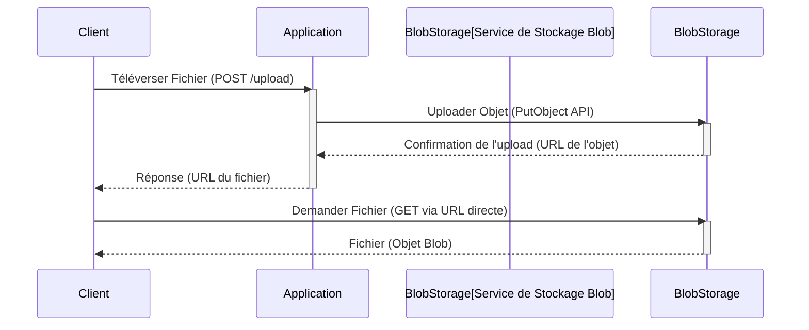

# Stockage Blob (Blob Storage)

**Présentation**
Le stockage Blob (Binary Large Object) est un service de stockage d'objets conçu pour stocker de grandes quantités de données non structurées, telles que des images, des vidéos, des documents, des fichiers de sauvegarde et des journaux. Contrairement au stockage basé sur des fichiers ou des blocs, le stockage d'objets gère les données sous forme d'objets discrets dans des conteneurs (buckets), accessibles via des APIs web.

**Principes Clés**
- Stockage de données non structurées sous forme d'objets.
- Haute scalabilité pour gérer des pétaoctets de données.
- Durabilité et disponibilité élevées grâce à la réplication des données.
- Accès aux données via des APIs HTTP (REST).
- Modèle de paiement à l'utilisation (pay-as-you-go).

**Cas d'Utilisation Détaillés**
Le stockage Blob est idéal pour une variété de scénarios :
- **Contenu Statique pour Applications Web et Mobiles:** Images, vidéos, fichiers CSS/JS, documents PDF. Les CDNs sont souvent utilisés en conjonction avec le stockage Blob pour une diffusion rapide.
- **Sauvegarde et Archivage:** Stockage à long terme de données de sauvegarde, de journaux d'audit, de données réglementaires. Souvent avec des classes de stockage à faible coût.
- **Big Data et Analytique:** Stockage de lacs de données (data lakes) pour l'analyse par des outils de Big Data (Spark, Hadoop).
- **Stockage de Fichiers Journaux (Logs):** Collecte et stockage centralisé des journaux d'application et de système pour l'analyse et le débogage.
- **Contenu Généré par l'Utilisateur:** Photos, vidéos, documents téléchargés par les utilisateurs sur des plateformes comme les réseaux sociaux ou les plateformes de partage de fichiers.
- **Distribution de Logiciels:** Stockage de fichiers d'installation, de mises à jour logicielles.

**Composants Principaux**
- **Objets (Blobs):** Les fichiers individuels stockés.
- **Conteneurs (Buckets):** Des regroupements logiques d'objets.
- **API:** L'interface pour interagir avec le service de stockage (télécharger, uploader, supprimer des objets).
- **Métadonnées:** Informations associées à un objet (type de contenu, date de création, etc.).

**Guides d'utilisation**
Le stockage Blob est idéal pour les cas d'utilisation nécessitant le stockage et la diffusion de contenu statique (images, vidéos pour sites web/applications mobiles), la sauvegarde et l'archivage de données, le stockage de données pour l'analyse de Big Data, et le stockage de fichiers journaux. Des services populaires incluent Amazon S3, Google Cloud Storage et Azure Blob Storage.

**Avantages et Inconvénients du Stockage Blob**

**Avantages:**
- **Scalabilité Massive:** Peut stocker des pétaoctets, voire des exaoctets de données.
- **Haute Durabilité et Disponibilité:** Les données sont répliquées sur plusieurs emplacements pour assurer la résilience aux pannes.
- **Coût Efficace:** Généralement moins cher que le stockage de blocs ou de fichiers, surtout pour le stockage à long terme.
- **Accès Global:** Les données peuvent être accessibles de n'importe où via HTTP/HTTPS.
- **Gestion Simplifiée:** Le fournisseur de services gère l'infrastructure sous-jacente.
- **Intégration Facile:** Des SDKs et APIs sont disponibles pour une intégration facile avec les applications.

**Inconvénients:**
- **Pas de Système de Fichiers Traditionnel:** Ne prend pas en charge les opérations de système de fichiers (comme les verrous de fichiers, les permissions au niveau du fichier).
- **Latence pour les Petits Fichiers:** Peut être moins efficace pour un grand nombre de très petits fichiers en raison de la surcharge des requêtes HTTP.
- **Complexité pour les Mises à Jour Partielles:** La modification d'une partie d'un objet nécessite généralement de télécharger l'objet entier, de le modifier, puis de le téléverser à nouveau.
- **Coût des Opérations:** Bien que le stockage soit bon marché, les coûts peuvent augmenter avec un grand nombre d'opérations (lectures/écritures).

**Exemples de Code (Hono avec Stockage Blob - Conceptuel)**
Une application Hono peut interagir avec un service de stockage Blob pour uploader, télécharger ou supprimer des fichiers. Cela se fait généralement en utilisant le SDK (Software Development Kit) fourni par le fournisseur de services cloud (par exemple, AWS SDK for JavaScript).

Voici un exemple conceptuel montrant comment une application Hono pourrait gérer l'upload d'un fichier vers un bucket S3 :

```typescript
import { Hono } from 'hono';
import { json } from 'hono/json';
// Importation conceptuelle du client S3
// import S3 from 'aws-sdk/clients/s3';
// const s3 = new S3({ region: 'your-region' });

const app = new Hono();

app.post('/upload', async (c) => {
  const body = await c.req.parseBody();
  const file = body['file']; // Supposons que le fichier est envoyé dans un champ 'file'

  if (!file || typeof file === 'string') {
      return c.json({ message: 'Aucun fichier trouvé dans la requête' }, 400);
  }

  // Dans une application réelle, vous liriez le contenu du fichier
  // et le téléverseriez vers S3 en utilisant le SDK.

  // const uploadParams = {
  //   Bucket: 'your-s3-bucket-name',
  //   Key: file.name, // Nom du fichier dans S3
  //   Body: file, // Contenu du fichier
  //   ContentType: file.type,
  // };

  try {
    // const uploadResult = await s3.upload(uploadParams).promise();
    console.log(`Simulation: Fichier ${file.name} téléversé vers S3`);
    const fileUrl = `https://your-s3-bucket-name.s3.amazonaws.com/${file.name}`; // URL simulée

    return c.json({ message: 'Fichier téléversé avec succès', url: fileUrl });
  } catch (error) {
    console.error('Erreur de téléversement S3:', error);
    return c.json({ message: 'Erreur lors du téléversement du fichier' }, 500);
  }
});

export default app;
```

*Note : L'exemple utilise des importations et des appels de fonction conceptuels pour le SDK AWS S3. L'implémentation réelle nécessiterait l'installation du SDK et la configuration des informations d'identification.*

**Diagramme Mermaid**


