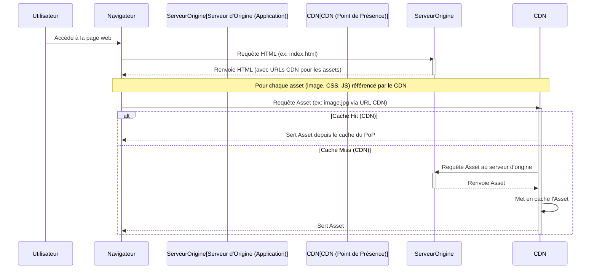

# CDN (Content Delivery Network)

**Présentation**
Un CDN, ou Content Delivery Network, est un réseau distribué géographiquement de serveurs qui travaillent ensemble pour fournir du contenu web (comme des images, des vidéos, des feuilles de style CSS et des fichiers JavaScript) aux utilisateurs de manière rapide et efficace. En mettant en cache le contenu sur des serveurs situés plus près de l'utilisateur final, un CDN réduit la latence et la charge sur le serveur d'origine.

**Principes Clés**
- Distribution du contenu statique sur un réseau mondial de serveurs (points de présence - PoP).
- Mise en cache du contenu aux PoP pour un accès rapide.
- Réduction de la latence en servant le contenu depuis le serveur le plus proche de l'utilisateur.
- Diminution de la charge sur le serveur d'origine.
- Amélioration de la résilience et de la disponibilité du contenu.

**Avantages Clés d'un CDN**
- **Performances Améliorées:** Réduit la latence et accélère le chargement des pages en servant le contenu depuis des serveurs proches de l'utilisateur.
- **Réduction de la Charge sur le Serveur d'Origine:** Le CDN gère une grande partie du trafic pour le contenu statique, libérant les ressources du serveur d'origine.
- **Haute Disponibilité et Résilience:** Le contenu est répliqué sur plusieurs PoP, assurant la disponibilité même en cas de panne d'un serveur ou d'un centre de données.
- **Sécurité Améliorée:** De nombreux CDNs offrent des fonctionnalités de sécurité intégrées comme la protection DDoS, le filtrage WAF (Web Application Firewall) et la terminaison SSL/TLS.
- **Meilleur Référencement (SEO):** La vitesse de chargement des pages est un facteur de classement pour les moteurs de recherche.
- **Évolutivité:** Les CDNs sont conçus pour gérer des pics de trafic massifs sans affecter les performances.

**Composants Principaux**
- **Serveurs d'Origine:** Le serveur où le contenu original est stocké (par exemple, votre serveur web ou votre stockage Blob).
- **Points de Présence (PoP):** Les centres de données distribués géographiquement où le contenu est mis en cache.
- **Serveurs de Cache:** Les serveurs au sein des PoP qui stockent et servent le contenu mis en cache.
- **Système de Routage:** Dirige les requêtes des utilisateurs vers le PoP le plus approprié.

**Guides d'utilisation**
L'utilisation d'un CDN est fortement recommandée pour les sites web et les applications qui servent du contenu statique à une audience mondiale. Pour utiliser un CDN avec une application Hono, vous configurez le CDN pour qu'il récupère le contenu statique de votre serveur d'origine (où votre application Hono pourrait servir ces fichiers, bien qu'il soit plus courant de les servir depuis un stockage Blob ou un serveur web optimisé pour le contenu statique). Le CDN mettra ensuite en cache ce contenu et le servira aux utilisateurs.

**Considérations pour l'Utilisation d'un CDN**
- **Type de Contenu:** Les CDNs sont principalement efficaces pour le contenu statique (images, vidéos, CSS, JS). Le contenu dynamique nécessite des stratégies de cache plus avancées ou peut ne pas être adapté au CDN.
- **Invalidation du Cache:** Comprendre comment invalider le cache du CDN lorsque le contenu d'origine change est crucial pour éviter de servir des données périmées.
- **Coût:** Les CDNs facturent généralement en fonction de la bande passante de sortie et du nombre de requêtes. Les coûts peuvent augmenter avec un trafic élevé.
- **Configuration DNS:** L'intégration d'un CDN implique souvent la modification des enregistrements DNS pour diriger le trafic vers le CDN.
- **Sécurité:** Bien que les CDNs offrent des fonctionnalités de sécurité, il est important de configurer correctement les règles de sécurité et de comprendre les implications.
- **Contenu Personnalisé:** Pour le contenu personnalisé par utilisateur, des stratégies de cache spécifiques (par exemple, Edge Logic, Serverless Functions au bord du réseau) peuvent être nécessaires.

**Exemples de Code (Hono et CDN - Conceptuel)**
Bien que le CDN serve le contenu statique, votre application Hono pourrait générer les pages HTML qui référencent ce contenu statique via les URLs du CDN.

Voici un exemple conceptuel montrant une route Hono qui génère une page HTML référençant une image servie par un CDN :

```typescript
import { Hono } from 'hono';
import { html } from 'hono/html';

const app = new Hono();

// Supposons que votre image est stockée sur un CDN à cette URL
const CDN_IMAGE_URL = 'https://your-cdn-domain.com/images/logo.png';

app.get('/page-with-image', (c) => {
  return c.html(
    html`
      <!DOCTYPE html>
      <html>
      <head>
        <title>Page avec Image CDN</title>
      </head>
      <body>
        <h1>Bienvenue !</h1>
        
        <p>Cette image est chargée via un réseau de diffusion de contenu (CDN).</p>
      </body>
      </html>
    `
  );
});

export default app;
```

*Note : L'URL du CDN (`CDN_IMAGE_URL`) pointerait vers le contenu mis en cache par le CDN, qui à son tour a été récupéré de votre serveur d'origine.*

**Diagramme Mermaid**


