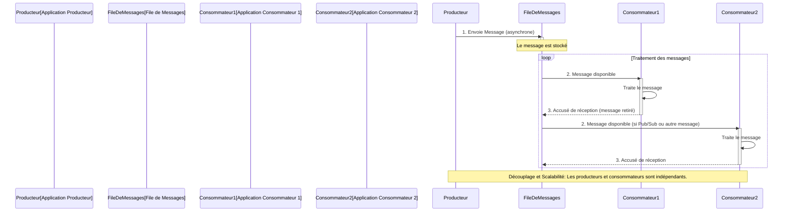

# Files De Messages (Message Queues)

**Présentation**
Une file de messages est un composant d'infrastructure qui permet la communication asynchrone entre différentes parties d'une application ou entre différents services (comme dans une architecture de microservices). Les applications peuvent envoyer des messages à une file (producteurs) sans attendre de réponse immédiate, et d'autres applications peuvent lire ces messages à partir de la file (consommateurs) lorsqu'elles sont prêtes.

**Principes Clés**
- **Communication Asynchrone:** Les producteurs n'ont pas besoin d'attendre que les consommateurs traitent les messages.
- **Découplage:** Les producteurs et les consommateurs n'ont pas besoin de se connaître directement. Ils interagissent uniquement avec la file de messages.
- **Mise en Tampon (Buffering):** La file peut stocker des messages lorsque les consommateurs sont occupés ou indisponibles, lissant ainsi les pics de trafic.
- **Résilience:** Si un consommateur tombe en panne, les messages restent dans la file et peuvent être traités plus tard par un autre consommateur.
- **Scalabilité:** Vous pouvez ajouter plus de consommateurs pour traiter un volume plus élevé de messages.

**Avantages et Inconvénients des Files de Messages**

**Avantages:**
- **Découplage:** Les producteurs et les consommateurs sont indépendants, ce qui facilite le développement, le déploiement et la maintenance.
- **Résilience:** Les messages sont stockés jusqu'à ce qu'ils soient traités, protégeant contre les pannes des consommateurs.
- **Scalabilité:** Permet de gérer des pics de charge en ajoutant ou retirant des consommateurs.
- **Communication Asynchrone:** Améliore la réactivité des applications en déchargeant les tâches longues.
- **Fiabilité:** Garantit la livraison des messages (selon la configuration).

**Inconvénients:**
- **Complexité Accrue:** Ajoute un composant d'infrastructure supplémentaire à gérer.
- **Latence:** Introduit une légère latence entre l'envoi et le traitement du message.
- **Gestion des Messages Dupliqués:** Les consommateurs doivent être idempotents pour gérer les messages qui pourraient être livrés plusieurs fois.
- **Ordonnancement des Messages:** Garantir l'ordre des messages peut être complexe dans certains systèmes distribués.
- **Surveillance:** Nécessite une surveillance attentive des files et des consommateurs.

**Composants Principaux**
- **Producteur:** L'application qui envoie des messages à la file.
- **Consommateur:** L'application qui reçoit et traite les messages de la file.
- **File de Messages (Queue):** Le composant intermédiaire qui stocke les messages.
- **Message:** Les données envoyées par le producteur et lues par le consommateur.

**Guides d'utilisation**
Les files de messages sont utilisées dans divers scénarios, notamment :
- **Traitement en arrière-plan:** Décharger les tâches longues ou non essentielles du chemin de requête principal.
- **Communication inter-services:** Permettre aux microservices de communiquer sans dépendance directe.
- **Gestion des pics de trafic:** Absorber les charges de travail importantes qui dépassent la capacité de traitement immédiate.
- **Traitement par lots:** Accumuler des messages pour un traitement ultérieur en groupe.
Des exemples populaires de systèmes de files de messages incluent RabbitMQ, Apache Kafka, Amazon SQS et Google Cloud Pub/Sub.

**Modèles de Messagerie Courants**
- **Point-à-Point (Point-to-Point / Queue):** Un message est envoyé à une file et est consommé par un seul consommateur. Une fois consommé, le message est retiré de la file. Idéal pour les tâches qui ne doivent être traitées qu'une seule fois.
- **Publication/Souscription (Publish/Subscribe / Topic):** Un message est publié sur un "sujet" (topic) et peut être reçu par plusieurs consommateurs qui se sont abonnés à ce sujet. Chaque consommateur reçoit une copie du message. Idéal pour la diffusion d'événements à plusieurs systèmes intéressés.

**Considérations de Conception pour les Files de Messages**
- **Ordonnancement des Messages:** Si l'ordre des messages est critique, assurez-vous que le système de file de messages et votre logique de consommation le garantissent.
- **Durabilité des Messages:** Configurez la file pour que les messages soient persistants (stockés sur disque) afin de ne pas les perdre en cas de panne du broker.
- **Gestion des Messages Morts (Dead-Letter Queues - DLQ):** Mettre en place une DLQ pour les messages qui ne peuvent pas être traités après plusieurs tentatives, afin de les inspecter et de les corriger.
- **Idempotence des Consommateurs:** Les consommateurs doivent être capables de traiter le même message plusieurs fois sans effets secondaires indésirables, car les messages peuvent être livrés en double.
- **Surveillance:** Surveiller la taille des files, le nombre de messages en attente, les erreurs de traitement pour détecter les goulots d'étranglement ou les problèmes.
- **Sécurité:** Sécuriser l'accès aux files de messages avec des mécanismes d'authentification et d'autorisation.

**Exemples de Code (Hono avec Files de Messages - Conceptuel)**
Une application Hono peut agir soit comme un producteur (envoyant des messages à une file) soit comme un consommateur (recevant des messages d'une file, bien que cela soit souvent géré par un processus d'arrière-plan distinct).

Voici un exemple conceptuel montrant une route Hono qui envoie un message à une file après avoir reçu une requête :

```typescript
import { Hono } from 'hono';
import { json } from 'hono/json';
// Importation conceptuelle d'un client de file de messages (par exemple, pour RabbitMQ ou SQS)
// import messageQueueClient from './messageQueueClient';

const app = new Hono();

// Route pour traiter une nouvelle commande
app.post('/process-order', async (c) => {
  const orderDetails = await c.req.json();

  try {
    console.log('Nouvelle commande reçue, envoi à la file de traitement...');
    // Envoyer un message à la file de messages pour traitement asynchrone
    // await messageQueueClient.send('order_processing_queue', orderDetails);

    // Simulation de l'envoi de message
    console.log('Message envoyé à la file:', orderDetails);

    return c.json({ status: 'Commande reçue, traitement en arrière-plan' });
  } catch (error) {
    console.error('Erreur lors de l\'envoi du message à la file:', error);
    return c.json({ message: 'Erreur serveur lors du traitement de la commande' }, 500);
  }
});

export default app;
```

*Note : L'implémentation réelle de l'envoi ou de la réception de messages dépend de la bibliothèque cliente spécifique à votre système de file de messages.*

**Diagramme Mermaid**


