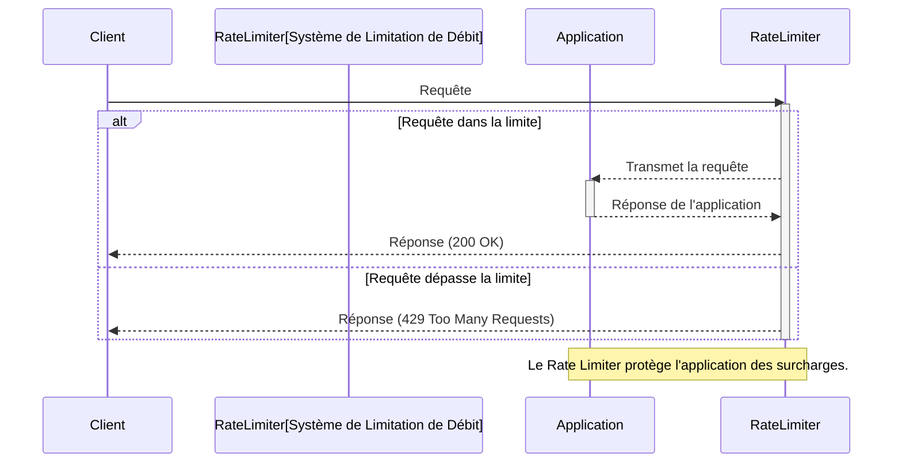

# Limitation De Débit (Rate Limiting)

**Présentation**
La limitation de débit est une technique utilisée pour contrôler le taux auquel un client ou un utilisateur peut envoyer des requêtes à un service ou une API dans un laps de temps donné. Elle est essentielle pour protéger les services contre les abus, les attaques par déni de service (DoS), la surcharge des ressources et pour garantir une utilisation équitable pour tous les utilisateurs.

**Principes Clés**
- Restriction du nombre de requêtes autorisées par unité de temps (par exemple, 100 requêtes par minute).
- Protection des services contre la surcharge et les abus.
- Assurer la disponibilité et la stabilité du service.
- Peut être appliquée par utilisateur, par adresse IP, par clé API, etc.
- Les requêtes qui dépassent la limite sont généralement rejetées avec un code d'état HTTP 429 (Too Many Requests).

**Algorithmes de Limitation de Débit Courants**
Plusieurs algorithmes peuvent être utilisés pour implémenter la limitation de débit :
- **Compteur à Fenêtre Fixe (Fixed Window Counter):**
    - **Fonctionnement:** Divise le temps en fenêtres fixes (ex: 1 minute). Chaque requête incrémente un compteur pour la fenêtre actuelle. Si le compteur dépasse la limite, les requêtes sont rejetées.
    - **Avantages:** Simple à implémenter.
    - **Inconvénients:** Peut permettre un "burst" de requêtes au début et à la fin de la fenêtre, doublant potentiellement le taux autorisé.
- **Compteur à Fenêtre Glissante (Sliding Window Counter):**
    - **Fonctionnement:** Combine le compteur à fenêtre fixe avec un suivi des requêtes de la fenêtre précédente pour lisser le taux.
    - **Avantages:** Plus précis que la fenêtre fixe, réduit les pics.
    - **Inconvénients:** Plus complexe à implémenter.
- **Seau à Jetons (Token Bucket):**
    - **Fonctionnement:** Un "seau" contient un nombre limité de jetons. Les jetons sont ajoutés au seau à un taux fixe. Chaque requête consomme un jeton. Si le seau est vide, la requête est rejetée ou mise en file d'attente.
    - **Avantages:** Permet des "bursts" de requêtes (jusqu'à la taille du seau) tout en limitant le taux moyen.
    - **Inconvénients:** Plus complexe à implémenter.
- **Leaky Bucket (Seau Perforé):**
    - **Fonctionnement:** Les requêtes sont ajoutées à un "seau". Les requêtes sont traitées à un taux constant (le seau "fuit" à un taux fixe). Si le seau déborde, les requêtes sont rejetées.
    - **Avantages:** Lisse le trafic sortant à un taux constant.
    - **Inconvénients:** Les requêtes peuvent être retardées si le seau est plein.

**Composants Principaux**
- **Compteur/Algorithme:** Le mécanisme qui suit le nombre de requêtes par client sur une période donnée (par exemple, fenêtre fixe, fenêtre glissante, seau à jetons).
- **Seuil de Débit:** La limite configurée (par exemple, 100/minute).
- **Identifiant Client:** La base sur laquelle la limite est appliquée (IP, ID utilisateur, clé API).
- **Action de Limitation:** Ce qui se passe lorsque la limite est atteinte (rejeter la requête, mettre en file d'attente, etc.).

**Guides d'utilisation**
La limitation de débit est souvent mise en œuvre au niveau d'une API Gateway, d'un équilibreur de charge ou d'un proxy inverse, avant que les requêtes n'atteignent les services backend. Cela permet de protéger l'ensemble de l'architecture. Bien que vous puissiez implémenter la limitation de débit dans votre application Hono, il est généralement plus efficace de la gérer à un niveau d'infrastructure supérieur.

**Cas d'Utilisation et Bénéfices de la Limitation de Débit**

**Cas d'Utilisation:**
- **Protection contre les Attaques DoS/DDoS:** Empêche les attaquants de submerger le service avec un grand nombre de requêtes.
- **Prévention des Abus:** Limite l'utilisation excessive par des utilisateurs ou des bots.
- **Contrôle des Coûts:** Pour les APIs payantes, la limitation de débit peut être utilisée pour appliquer les quotas d'utilisation.
- **Équilibrage de Charge:** Aide à distribuer la charge de manière plus équitable en rejetant les requêtes excessives.
- **Protection des Services Backend:** Empêche les services en aval d'être surchargés.
- **Qualité de Service (QoS):** Garantit une expérience utilisateur équitable pour tous en évitant qu'un seul utilisateur ne monopolise les ressources.

**Bénéfices:**
- **Stabilité du Service:** Maintient le service opérationnel et réactif.
- **Sécurité Améliorée:** Réduit la surface d'attaque.
- **Utilisation Équitable des Ressources:** Assure que tous les utilisateurs peuvent accéder au service.
- **Prévisibilité des Performances:** Aide à maintenir des performances constantes sous charge.

**Exemples de Code (Hono avec Limitation de Débit - Conceptuel)**
Implémenter une limitation de débit robuste dans une application Hono distribuée peut être complexe car cela nécessite un état partagé (pour suivre les compteurs de requêtes sur toutes les instances). Cependant, pour des cas d'utilisation simples ou des applications à instance unique, vous pourriez utiliser un middleware.

Voici un exemple conceptuel de middleware de limitation de débit simple en mémoire pour Hono (ne convient pas aux applications distribuées) :

```typescript
import { Hono } from 'hono';

const app = new Hono();

// Limitation de débit simple en mémoire (NE PAS UTILISER EN PRODUCTION DISTRIBUÉE)
const rateLimit = (limit: number, windowMs: number) => {
  const requests = new Map(); // Map<string, number[]> où la clé est l'IP et la valeur est un tableau de timestamps

  return async (c, next) => {
    const ip = c.req.header('X-Forwarded-For') || c.req.remoteAddress || 'unknown';
    const now = Date.now();
    const windowStart = now - windowMs;

    // Nettoyer les anciennes requêtes
    requests.set(ip, (requests.get(ip) || []).filter(timestamp => timestamp > windowStart));

    if (requests.get(ip).length >= limit) {
      console.warn(`Limitation de débit appliquée pour l'IP: ${ip}`);
      return c.text('Too Many Requests', 429);
    }

    requests.get(ip).push(now);
    await next();
  };
};

// Appliquer la limitation de débit à toutes les routes (par exemple, 5 requêtes par minute)
app.use('*', rateLimit(5, 60 * 1000));

app.get('/limited-resource', (c) => {
  return c.text('Cette ressource est limitée en débit.');
});

export default app;
```

*Note : Pour une limitation de débit en production dans une architecture distribuée, utilisez un service dédié (API Gateway, Load Balancer) ou une bibliothèque qui utilise un stockage partagé (comme Redis) pour les compteurs.*

**Diagramme Mermaid**


