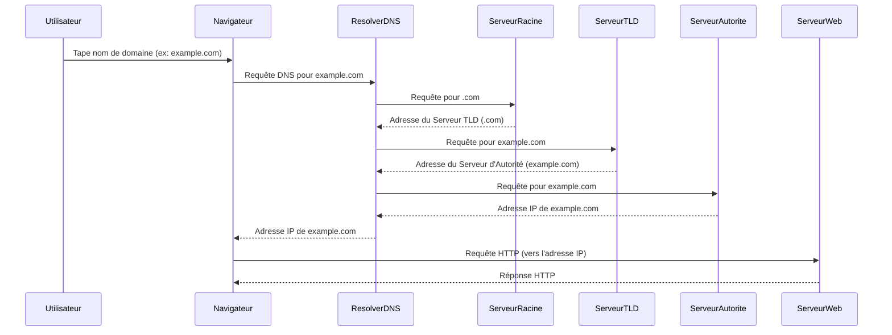

# DNS (Domain Name System)

**Présentation**
Le DNS, ou Domain Name System, est un système hiérarchique et décentralisé qui traduit les noms de domaine lisibles par l'homme (comme `google.com`) en adresses IP numériques (comme `172.217.160.142`) que les ordinateurs utilisent pour s'identifier sur Internet. C'est l'annuaire téléphonique d'Internet.

**Principes Clés**
- Le DNS élimine la nécessité pour les utilisateurs de mémoriser des adresses IP complexes.
- Il s'agit d'un système distribué, ce qui signifie qu'aucune entité unique ne gère toutes les traductions.
- Les informations DNS sont mises en cache à différents niveaux pour améliorer la vitesse et réduire la charge sur les serveurs DNS.

**Processus de Résolution DNS**
Lorsqu'un utilisateur tape un nom de domaine dans son navigateur, le processus de résolution DNS se déroule en plusieurs étapes :
1. **Requête au Resolver DNS:** Le navigateur envoie une requête au resolver DNS (souvent fourni par le FAI ou configuré manuellement).
2. **Requête au Serveur Racine (Root Server):** Si le resolver n'a pas l'information en cache, il interroge un serveur racine pour obtenir l'adresse du serveur TLD (Top-Level Domain) approprié (ex: `.com`, `.org`).
3. **Requête au Serveur TLD:** Le resolver interroge le serveur TLD pour obtenir l'adresse du serveur de noms faisant autorité (Authoritative Nameserver) pour le domaine spécifique (ex: `google.com`).
4. **Requête au Serveur de Noms Faisant Autorité:** Le resolver interroge le serveur de noms faisant autorité, qui contient l'enregistrement DNS exact pour le nom de domaine et renvoie l'adresse IP.
5. **Réponse au Navigateur:** Le resolver renvoie l'adresse IP au navigateur, qui peut alors établir une connexion avec le serveur web.

**Composants Principaux**
- **Noms de Domaine:** Les adresses web conviviales que les utilisateurs tapent dans les navigateurs.
- **Serveurs DNS:** Des serveurs spécialisés qui stockent les mappages entre les noms de domaine et les adresses IP. Il existe différents types de serveurs DNS (resolvers, root servers, TLD servers, authoritative nameservers).
- **Enregistrements DNS:** Les informations stockées sur les serveurs DNS qui lient un nom de domaine à une adresse IP ou à d'autres données (comme les enregistrements MX pour le courrier électronique).

**Exemples Concrets des Composants DNS**

Pour mieux comprendre les rôles des différents serveurs DNS et enregistrements, prenons l'exemple de l'accès à `www.google.com` :

*   **Resolver DNS (Résolveur DNS)**: C'est le premier point de contact. Lorsque vous tapez `www.google.com` dans votre navigateur, votre ordinateur envoie cette requête à votre Resolver DNS. Il s'agit souvent d'un serveur fourni par votre Fournisseur d'Accès Internet (FAI), comme `8.8.8.8` (Google Public DNS) ou `1.1.1.1` (Cloudflare DNS). Son rôle est de trouver l'adresse IP et de la mettre en cache pour les requêtes futures.

*   **Serveur Racine (Root Server)**: Il existe 13 ensembles de serveurs racines dans le monde, gérés par des organisations comme l'ICANN. Si votre Resolver DNS ne connaît pas l'adresse IP de `www.google.com`, il demandera au Serveur Racine : "Où puis-je trouver des informations sur le domaine `.com` ?". Le Serveur Racine ne connaît pas l'adresse IP de `google.com`, mais il sait où trouver les serveurs qui gèrent tous les domaines se terminant par `.com`.

*   **Serveur TLD (Top-Level Domain Server)**: Après avoir reçu la réponse du Serveur Racine, votre Resolver DNS contactera un Serveur TLD pour le domaine `.com`. Ce serveur est responsable de tous les noms de domaine qui se terminent par `.com`. Le Resolver DNS lui demandera : "Où puis-je trouver des informations sur `google.com` ?". Le Serveur TLD `.com` répondra avec l'adresse du Serveur de Noms Faisant Autorité pour `google.com`.

*   **Serveur de Noms Faisant Autorité (Authoritative Nameserver)**: C'est le serveur qui détient les enregistrements DNS officiels pour un domaine spécifique. Pour `google.com`, ce serait un serveur géré par Google ou son fournisseur DNS. Le Resolver DNS interrogera ce serveur : "Quelle est l'adresse IP de `www.google.com` ?". Le Serveur d'Autorité répondra avec l'adresse IP exacte, par exemple `142.250.186.164`.

*   **Enregistrements DNS**:
    *   **Enregistrement A**: L'enregistrement clé ici est un enregistrement A qui mappe `www.google.com` à l'adresse IP `142.250.186.164`.
    *   **Enregistrement CNAME**: Il est courant que `www.google.com` soit un enregistrement CNAME pointant vers `google.com`. Cela signifie que si quelqu'un tape `www.google.com`, le DNS le redirige d'abord vers `google.com`, puis résout l'adresse IP de `google.com`.
    *   **Enregistrement MX**: Si vous envoyez un e-mail à `utilisateur@google.com`, le système de messagerie interrogera un enregistrement MX pour `google.com` pour trouver les serveurs de messagerie de Google (par exemple, `aspmx.l.google.com`).

**Types d'Enregistrements DNS Courants**
- **A (Address Record):** Mappe un nom de domaine à une adresse IPv4. C'est le type d'enregistrement le plus fondamental.
- **AAAA (IPv6 Address Record):** Mappe un nom de domaine à une adresse IPv6.
- **CNAME (Canonical Name Record):** Crée un alias pour un nom de domaine. Par exemple, `www.example.com` pourrait être un CNAME pour `example.com`.
- **MX (Mail Exchange Record):** Spécifie les serveurs de messagerie responsables de la réception des e-mails pour un domaine.
- **NS (Name Server Record):** Indique les serveurs de noms faisant autorité pour un domaine.
- **TXT (Text Record):** Permet d'inclure du texte arbitraire, souvent utilisé pour des vérifications de domaine ou des politiques de sécurité (ex: SPF, DKIM).
- **PTR (Pointer Record):** Utilisé pour la résolution DNS inverse, mappant une adresse IP à un nom de domaine.

**Guides d'utilisation**
Lorsqu'un utilisateur tape un nom de domaine dans son navigateur, une requête est envoyée à un serveur DNS pour obtenir l'adresse IP correspondante. Le navigateur utilise ensuite cette adresse IP pour se connecter au serveur web hébergeant le site. Ce processus est généralement très rapide et transparent pour l'utilisateur final.

**Exemples de Code (Hono)**
Hono, étant un framework côté serveur, n'interagit pas directement avec le processus de résolution DNS. La résolution des noms de domaine en adresses IP est gérée par le système d'exploitation sous-jacent ou l'environnement d'exécution. Cependant, votre application Hono peut faire des requêtes vers d'autres services en utilisant leurs noms de domaine.

Voici un exemple conceptuel montrant comment vous pourriez faire une requête HTTP depuis votre application Hono vers un autre service en utilisant son nom de domaine (la résolution DNS est gérée par le système).

```typescript
import { Hono } from 'hono';

const app = new Hono();

app.get('/fetch-example', async (c) => {
  try {
    // Le système résoudra 'example.com' en adresse IP
    const response = await fetch('https://example.com');
    const data = await response.text();
    return c.text(`Contenu de example.com (extrait) : ${data.substring(0, 100)}...`);
  } catch (error) {
    console.error('Erreur lors de la récupération:', error);
    return c.text('Erreur lors de la récupération du contenu.', 500);
  }
});

export default app;
```

**Diagramme Mermaid**



**Explication du Diagramme de Séquence DNS**

Ce diagramme illustre le processus détaillé de résolution DNS lorsqu'un utilisateur tente d'accéder à un site web en tapant un nom de domaine dans son navigateur :

1.  **Utilisateur -> Navigateur**: L'utilisateur initie le processus en tapant un nom de domaine (par exemple, `example.com`) dans la barre d'adresse de son navigateur.
2.  **Navigateur -> Resolver DNS**: Le navigateur envoie une requête DNS au Resolver DNS configuré (souvent celui du FAI ou un serveur DNS public comme Google DNS).
3.  **Resolver DNS -> Serveur Racine**: Si le Resolver DNS n'a pas l'adresse IP en cache, il interroge un Serveur Racine pour savoir quel Serveur TLD est responsable du domaine de premier niveau (ici, `.com`).
4.  **Serveur Racine --> Resolver DNS**: Le Serveur Racine répond avec l'adresse du Serveur TLD (`.com`).
5.  **Resolver DNS -> Serveur TLD**: Le Resolver DNS interroge ensuite le Serveur TLD (`.com`) pour obtenir l'adresse du Serveur d'Autorité qui gère spécifiquement `example.com`.
6.  **Serveur TLD --> Resolver DNS**: Le Serveur TLD répond avec l'adresse du Serveur d'Autorité pour `example.com`.
7.  **Resolver DNS -> Serveur d'Autorité**: Le Resolver DNS envoie une requête au Serveur d'Autorité pour `example.com` afin d'obtenir l'adresse IP exacte associée à ce nom de domaine.
8.  **Serveur d'Autorité --> Resolver DNS**: Le Serveur d'Autorité renvoie l'adresse IP (par exemple, `192.0.2.1`) au Resolver DNS.
9.  **Resolver DNS --> Navigateur**: Le Resolver DNS transmet l'adresse IP au navigateur.
10. **Navigateur -> Serveur Web**: Le navigateur utilise cette adresse IP pour établir une connexion HTTP avec le Serveur Web hébergeant `example.com`.
11. **Serveur Web --> Navigateur**: Le Serveur Web envoie la réponse HTTP (le contenu du site web) au navigateur, qui l'affiche à l'utilisateur.

Ce processus garantit que les utilisateurs peuvent accéder aux sites web en utilisant des noms de domaine faciles à retenir, tandis que les ordinateurs communiquent via des adresses IP numériques.

---

### **Exemple Complet et Concret du Processus DNS**

Imaginons que vous souhaitez visiter le site web de votre librairie en ligne préférée, `www.librairie-fantastique.com`. Voici comment le DNS fonctionne en coulisses pour vous y amener :

1.  **Vous tapez l'adresse**: Vous ouvrez votre navigateur et tapez `www.librairie-fantastique.com` dans la barre d'adresse, puis appuyez sur Entrée.

2.  **Votre ordinateur interroge le Resolver DNS**: Votre ordinateur ne connaît pas l'adresse IP de `www.librairie-fantastique.com`. Il envoie donc une requête à votre Resolver DNS configuré (par exemple, le serveur DNS de votre FAI ou un serveur public comme `8.8.8.8`).

3.  **Le Resolver DNS interroge un Serveur Racine**: Le Resolver DNS vérifie son cache. S'il ne trouve pas l'information, il envoie une requête à l'un des 13 Serveurs Racines mondiaux : "Quel serveur gère le domaine de premier niveau `.com` ?"

4.  **Le Serveur Racine répond avec le Serveur TLD**: Le Serveur Racine répond au Resolver DNS avec l'adresse IP du Serveur TLD responsable de tous les domaines `.com`.

5.  **Le Resolver DNS interroge le Serveur TLD**: Le Resolver DNS contacte le Serveur TLD `.com` et lui demande : "Quel serveur est l'autorité pour `librairie-fantastique.com` ?"

6.  **Le Serveur TLD répond avec le Serveur d'Autorité**: Le Serveur TLD `.com` répond au Resolver DNS avec l'adresse IP du Serveur de Noms Faisant Autorité pour `librairie-fantastique.com`. Ce serveur est géré par l'hébergeur de la librairie ou son fournisseur DNS.

7.  **Le Resolver DNS interroge le Serveur d'Autorité**: Le Resolver DNS envoie une requête au Serveur d'Autorité de `librairie-fantastique.com` : "Quelle est l'adresse IP de `www.librairie-fantastique.com` ?"

8.  **Le Serveur d'Autorité répond avec l'adresse IP**: Le Serveur d'Autorité trouve l'enregistrement DNS pour `www.librairie-fantastique.com` (qui est probablement un enregistrement CNAME pointant vers `librairie-fantastique.com`, et un enregistrement A pour `librairie-fantastique.com` vers son adresse IP, par exemple `203.0.113.42`). Il renvoie cette adresse IP au Resolver DNS.

9.  **Le Resolver DNS transmet l'adresse IP au navigateur**: Le Resolver DNS envoie l'adresse IP (`203.0.113.42`) à votre navigateur. Il met également cette information en cache pour accélérer les futures requêtes vers `librairie-fantastique.com`.

10. **Votre navigateur se connecte au serveur web**: Votre navigateur utilise maintenant l'adresse IP `203.0.113.42` pour établir une connexion HTTP (ou HTTPS) directe avec le serveur web de `librairie-fantastique.com`.

11. **Le serveur web envoie la page**: Le serveur web de la librairie reçoit la requête et envoie le contenu de la page d'accueil à votre navigateur, qui l'affiche à l'écran.

Tout ce processus se déroule en quelques millisecondes, rendant l'accès aux sites web rapide et transparent pour l'utilisateur.
