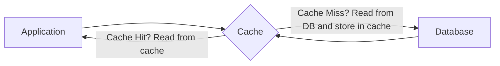
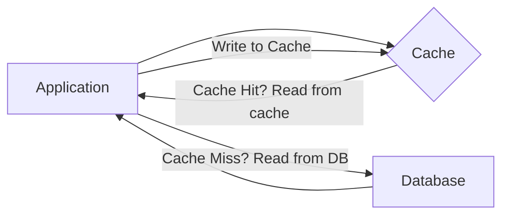
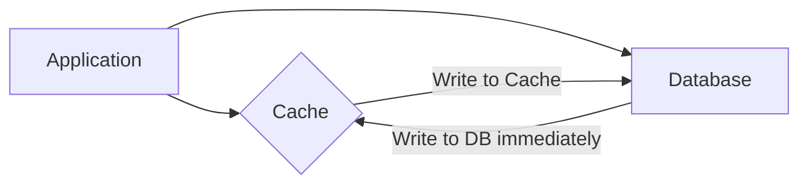
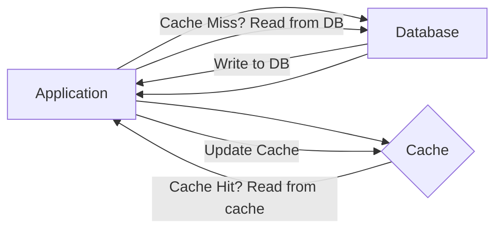

# Stratégies de Mise en Cache

Ce document explique les 5 stratégies de mise en cache courantes.

## 1. Read Through

Dans la stratégie Read Through, le cache agit comme un intermédiaire entre l'application et la base de données. Lorsque l'application demande des données, elle cherche d'abord dans le cache. Si les données sont disponibles (cache hit), elles sont retournées à l'application. Si les données ne sont pas trouvées dans le cache (cache miss), le cache est lui-même responsable de la récupération des données de la base de données, de leur stockage dans le cache et de leur retour à l'application.

Cette approche simplifie la logique de l'application car l'application n'a pas besoin de gérer la logique de récupération et de mise à jour du cache. Le cache gère lui-même la lecture de la base de données et le stockage des données demandées automatiquement. Cela minimise les données inutiles dans le cache et garantit que les données fréquemment consultées sont facilement disponibles.

Pour les cache hits, Read Through offre un accès aux données à faible latence. Cependant, pour les cache misses, il peut y avoir un délai potentiel pendant que le cache interroge la base de données et stocke les données. Cela peut entraîner une latence plus élevée lors des lectures initiales. Pour éviter que le cache ne serve des données périmées, un time-to-live (TTL) peut être ajouté aux entrées mises en cache. Le TTL expire automatiquement les données après une durée spécifiée, permettant de les recharger à partir de la base de données si nécessaire.

Read Through caching est mieux adapté aux applications à forte lecture où les données sont consultées fréquemment mais mises à jour moins souvent, comme les systèmes de diffusion de contenu (CDN), les flux de médias sociaux ou les profils d'utilisateurs.



## 2. Cache Aside

Cache Aside, également connu sous le nom de "Lazy Loading", est une stratégie où le code de l'application gère l'interaction entre le cache et la base de données. Les données ne sont chargées dans le cache qu'en cas de besoin. L'application vérifie d'abord le cache pour les données. Si les données existent dans le cache (cache hit), elles sont retournées à l'application. Si les données ne sont pas trouvées dans le cache (cache miss), l'application les récupère de la base de données, puis les charge dans le cache pour les requêtes ultérieures.

Cette approche donne à l'application un contrôle total sur la logique de mise en cache, ce qui la rend flexible et adaptable à divers cas d'utilisation. Cependant, elle ajoute de la complexité au code de l'application car elle doit gérer à la fois les lectures et les écritures dans le cache.

Pour les cache misses, il y a une latence plus élevée car l'application doit d'abord récupérer les données de la base de données avant de les servir. Pour éviter les données périmées, un TTL peut être utilisé pour les entrées de cache.

Cache Aside est parfait pour les systèmes où le rapport lecture-écriture est élevé et où les mises à jour de données sont peu fréquentes. Par exemple, dans un site Web de commerce électronique, les données de produits (comme les prix, les descriptions ou l'état des stocks) sont souvent lues beaucoup plus fréquemment qu'elles ne sont mises à jour.



## 3. Write Through

Dans la stratégie Write Through, chaque opération d'écriture est exécutée sur le cache et la base de données en même temps. Il s'agit d'un processus synchrone, ce qui signifie que le cache et la base de données sont mis à jour dans le cadre de la même opération, garantissant ainsi l'absence de délai dans la propagation des données.

Cette approche garantit que le cache et la base de données restent synchronisés et que les requêtes de lecture du cache renverront toujours les données les plus récentes, évitant ainsi le risque de servir des données périmées.

Le plus grand avantage de Write Through est qu'il assure une forte cohérence des données entre le cache et la base de données. Étant donné que le cache contient toujours les données les plus récentes, les opérations de lecture bénéficient d'une faible latence car les données peuvent être directement récupérées du cache. Cependant, la latence d'écriture peut être plus élevée en raison de la surcharge liée à l'écriture dans le cache et la base de données.

Dans une stratégie de mise en cache Write Through, les politiques d'expiration du cache (telles que TTL) ne sont généralement pas nécessaires. Cependant, si vous êtes préoccupé par l'utilisation de la mémoire cache, vous pouvez implémenter une politique TTL pour supprimer les données peu fréquemment consultées après un certain temps.

Write Through est idéal pour les systèmes critiques en matière de cohérence, tels que les applications financières ou les systèmes de traitement des transactions en ligne, où le cache et la base de données doivent toujours avoir les données les plus récentes.



## 4. Write Around

Write Around est une stratégie de mise en cache où les données sont écrites directement dans la base de données, en contournant le cache. Le cache n'est mis à jour que lorsque les données sont demandées ultérieurement lors d'une opération de lecture, moment auquel la stratégie Cache Aside est utilisée pour charger les données dans le cache.

Cette approche empêche le cache d'être pollué par des données qui pourraient ne pas être consultées à nouveau rapidement. Elle maintient le cache propre en évitant les données inutiles qui pourraient ne pas être demandées après avoir été écrites.

Les écritures sont relativement plus rapides car elles ne ciblent que la base de données et n'entraînent pas la surcharge de l'écriture dans le cache. Un TTL peut être utilisé pour garantir que les données ne restent pas indéfiniment dans le cache. Une fois le TTL expiré, les données sont supprimées du cache, forçant le système à les récupérer à nouveau de la base de données si nécessaire.

Write Around caching est mieux utilisé dans les systèmes à forte écriture où les données sont fréquemment écrites ou mises à jour, mais pas immédiatement ou fréquemment lues, comme les systèmes de journalisation.



## 5. Write Back

Dans la stratégie Write Back, les données sont d'abord écrites dans le cache, puis écrites de manière asynchrone dans la base de données ultérieurement. Cette écriture différée signifie que le cache agit comme le stockage principal pendant les opérations d'écriture, tandis que la base de données est mise à jour périodiquement en arrière-plan.

Cette stratégie se concentre sur la minimisation de la latence d'écriture en différant les écritures dans la base de données. Cette écriture différée signifie que le cache agit comme le stockage principal pendant les opérations d'écriture, tandis que la base de données est mise à jour périodiquement en arrière-plan.

Le principal avantage de Write Back est qu'il réduit considérablement la latence d'écriture, car les écritures sont effectuées rapidement dans le cache et les mises à jour de la base de données sont différées ou regroupées. Cependant, avec cette approche, il existe un risque de perte de données si le cache tombe en panne avant que les données ne soient écrites dans la base de données.

Write Back est idéal pour les systèmes où la latence d'écriture est critique et où une certaine perte de données est acceptable, comme les systèmes de mise en mémoire tampon ou les applications de streaming de données.

```mermaid
graph LR
    A[Application] --> C{Cache}
    C -->|Write to Cache constantly| A
    C -->|Write to DB asynchronously| D[Database]
