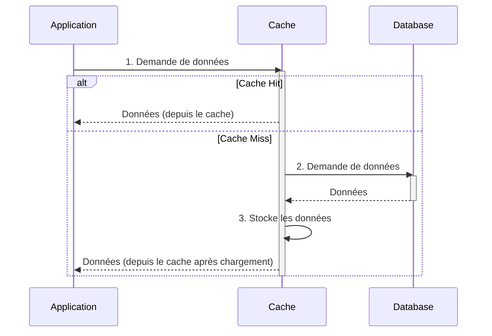
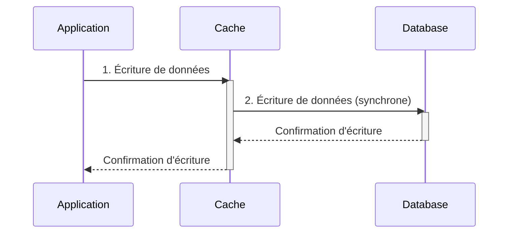

La mise en cache est une technique essentielle dans la conception de systèmes distribués performants et évolutifs. Elle permet de réduire la latence, d'améliorer le débit et de diminuer la charge sur les bases de données en stockant temporairement les données fréquemment consultées dans un emplacement plus rapide d'accès.

Ce document explore les cinq stratégies de mise en cache les plus courantes : Read Through, Cache Aside, Write Through, Write Around et Write Back. Pour chaque stratégie, nous examinerons son fonctionnement, ses avantages, ses inconvénients et ses cas d'utilisation appropriés. Nous discuterons également des considérations relatives à la cohérence des données et des compromis à prendre en compte lors du choix d'une stratégie de mise en cache particulière.

# Stratégies de Mise en Cache

Ce document explique les 5 stratégies de mise en cache courantes.

## 1. Read Through

Dans la stratégie Read Through, le cache se situe devant la base de données et est interrogé en premier lors d'une requête de données. L'application interagit directement avec le cache.

**Fonctionnement :**

1.  **Cache Hit :** Si les données sont présentes dans le cache (cache hit), le cache les renvoie directement à l'application.
2.  **Cache Miss :** Si les données ne sont pas présentes dans le cache (cache miss), le cache, de manière autonome :
    *   Récupère les données de la base de données.
    *   Stocke une copie des données dans le cache.
    *   Renvoie les données à l'application.

**Avantages :**

*   **Simplicité :** L'application n'a pas à se soucier de la logique de récupération des données à partir de la base de données ou de la mise à jour du cache.
*   **Cohérence :** Le cache est toujours à jour avec les données de la base de données.
*   **Performance :** Les lectures sont rapides en cas de cache hit.

**Inconvénients :**

*   **Latence initiale :** La première requête pour une donnée donnée entraînera toujours un cache miss, ce qui peut entraîner une latence plus élevée.
*   **Charge sur le cache :** Le cache peut être soumis à une charge importante si de nombreuses données sont demandées pour la première fois en même temps.

**Cas d'utilisation :**

La stratégie Read Through est bien adaptée aux applications à forte lecture où les données sont consultées fréquemment mais mises à jour moins souvent. Exemples :

*   Systèmes de diffusion de contenu (CDN)
*   Flux de médias sociaux
*   Profils d'utilisateurs



## 2. Cache Aside

Cache Aside, également connu sous le nom de "Lazy Loading", est une stratégie où l'application est responsable de la gestion du cache.

**Fonctionnement :**

1.  **Cache Hit :** L'application vérifie si les données sont présentes dans le cache. Si c'est le cas (cache hit), elle les récupère et les utilise.
2.  **Cache Miss :** Si les données ne sont pas présentes dans le cache (cache miss), l'application :
    *   Récupère les données de la base de données.
    *   Stocke les données dans le cache.
    *   Utilise les données.

**Avantages :**

*   **Contrôle :** L'application a un contrôle total sur la logique de mise en cache.
*   **Flexibilité :** La stratégie peut être adaptée à différents cas d'utilisation.
*   **Évite la pollution du cache :** Seules les données réellement utilisées sont stockées dans le cache.

**Inconvénients :**

*   **Complexité :** L'application doit gérer la logique de mise en cache.
*   **Latence :** La première requête pour une donnée donnée entraînera toujours un cache miss, ce qui peut entraîner une latence plus élevée.
*   **Cohérence :** L'application doit s'assurer que les données dans le cache sont cohérentes avec les données dans la base de données (par exemple, en utilisant des TTL).

**Cas d'utilisation :**

Cache Aside est bien adapté aux applications où :

*   Le rapport lecture/écriture est élevé.
*   Les données sont mises à jour peu fréquemment.
*   L'application a besoin d'un contrôle précis sur la logique de mise en cache.

Exemple :

*   Un site web de commerce électronique où les données des produits (prix, descriptions, stock) sont lues fréquemment mais mises à jour rarement.

```mermaid
sequenceDiagram
    participant Application
    participant Cache
    participant Database

    Application->>Cache: 1. Demande de données
    activate Cache

    alt Cache Hit
        Cache-->>Application: Données (depuis le cache)
    else Cache Miss
        Cache-->>Application: Données non trouvées
        deactivate Cache
        Application->>Database: 2. Récupère les données
        activate Database
        Database-->>Application: Données
        deactivate Database
        Application->>Cache: 3. Stocke les données dans le cache
        activate Cache
        Cache-->>Application: Confirmation de stockage
        deactivate Cache
    end
    deactivate Cache
```

## 3. Write Through

Dans la stratégie Write Through, chaque écriture est effectuée simultanément dans le cache et dans la base de données.

**Fonctionnement :**

1.  L'application effectue une écriture.
2.  Les données sont écrites simultanément dans le cache et dans la base de données.
3.  L'application reçoit une confirmation une fois que l'écriture a été effectuée avec succès dans les deux emplacements.

**Avantages :**

*   **Cohérence des données :** Le cache et la base de données sont toujours synchronisés.
*   **Fiabilité :** Les données sont stockées dans deux emplacements, ce qui réduit le risque de perte de données.

**Inconvénients :**

*   **Latence d'écriture :** Les écritures sont plus lentes car elles doivent être effectuées dans le cache et dans la base de données.
*   **Charge sur la base de données :** Chaque écriture entraîne une opération d'écriture dans la base de données.

**Cas d'utilisation :**

Write Through est bien adapté aux applications où :

*   La cohérence des données est primordiale.
*   La latence d'écriture n'est pas un problème majeur.

Exemples :

*   Applications financières
*   Systèmes de traitement des transactions en ligne



## 4. Write Around

Dans la stratégie Write Around, les écritures sont effectuées directement dans la base de données, sans passer par le cache. Le cache est mis à jour uniquement lors des lectures, en utilisant généralement une stratégie Cache Aside.

**Fonctionnement :**

1.  L'application effectue une écriture.
2.  Les données sont écrites directement dans la base de données.
3.  Lors d'une lecture, si les données ne sont pas présentes dans le cache (cache miss), elles sont récupérées de la base de données et stockées dans le cache.

**Avantages :**

*   **Évite la pollution du cache :** Seules les données qui sont réellement lues sont stockées dans le cache.
*   **Latence d'écriture réduite :** Les écritures sont plus rapides car elles ne passent pas par le cache.

**Inconvénients :**

*   **Latence de lecture initiale :** La première lecture d'une donnée donnée entraînera toujours un cache miss.
*   **Cohérence :** Le cache peut ne pas être toujours à jour avec les données les plus récentes de la base de données.

**Cas d'utilisation :**

Write Around est bien adapté aux applications où :

*   Les écritures sont fréquentes.
*   Les lectures sont moins fréquentes ou concernent des données différentes de celles qui sont écrites.
*   Il est important d'éviter la pollution du cache.

Exemple :

*   Systèmes de journalisation

```mermaid
sequenceDiagram
    participant Application
    participant Cache
    participant Database

    Application->>Database: 1. Écriture de données (directement à la DB)
    activate Database
    Database-->>Application: Confirmation d'écriture
    deactivate Database

    Application->>Cache: 2. Demande de lecture (peut être un cache miss)
    activate Cache

    alt Cache Hit
        Cache-->>Application: Données (depuis le cache)
    else Cache Miss
        Cache-->>Application: Données non trouvées
        deactivate Cache
        Application->>Database: 3. Récupère les données (pour la lecture)
        activate Database
        Database-->>Application: Données
        deactivate Database
        Application->>Cache: 4. Stocke les données dans le cache
        activate Cache
        Cache-->>Application: Confirmation de stockage
        deactivate Cache
    end
    deactivate Cache
```

## 5. Write Back

Dans la stratégie Write Back (ou Write Behind), les écritures sont d'abord effectuées dans le cache, puis propagées à la base de données de manière asynchrone.

**Fonctionnement :**

1.  L'application effectue une écriture.
2.  Les données sont écrites uniquement dans le cache.
3.  Le cache accuse réception de l'écriture à l'application.
4.  Plus tard, les données sont écrites de manière asynchrone dans la base de données.

**Avantages :**

*   **Latence d'écriture très faible :** Les écritures sont très rapides car elles ne concernent que le cache.
*   **Débit d'écriture élevé :** Le système peut gérer un grand nombre d'écritures car elles sont mises en mémoire tampon dans le cache.

**Inconvénients :**

*   **Risque de perte de données :** Si le cache tombe en panne avant que les données ne soient écrites dans la base de données, les données sont perdues.
*   **Cohérence :** Le cache et la base de données peuvent être incohérents pendant un certain temps.
*   **Complexité :** La mise en œuvre de cette stratégie est plus complexe que les autres.

**Cas d'utilisation :**

Write Back est bien adapté aux applications où :

*   La latence d'écriture est critique.
*   Une certaine perte de données est acceptable.
*   Le débit d'écriture est élevé.

Exemples :

*   Systèmes de mise en mémoire tampon
*   Applications de streaming de données

```mermaid
sequenceDiagram
    participant Application
    participant Cache
    participant Database

    Application->>Cache: 1. Écriture de données
    activate Cache
    Cache-->>Application: Confirmation d'écriture (rapide)
    deactivate Cache

    Note over Cache,Database: 2. Le cache écrit les données à la base de données de manière asynchrone
    Cache->>Database: Écriture de données (asynchrone)
    activate Database
    Database-->>Cache: Confirmation d'écriture
    deactivate Database
