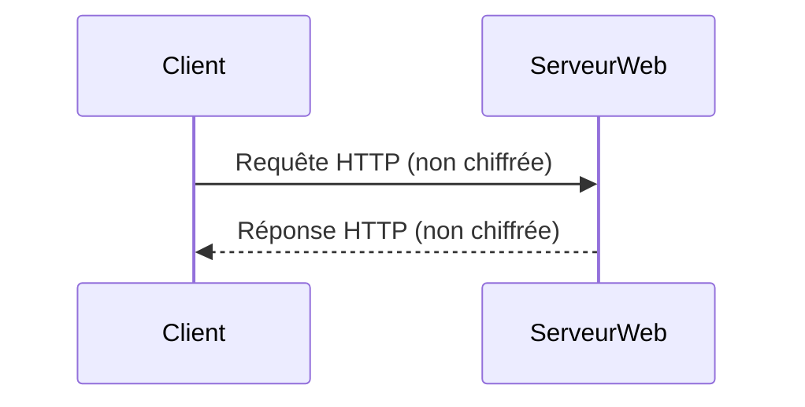
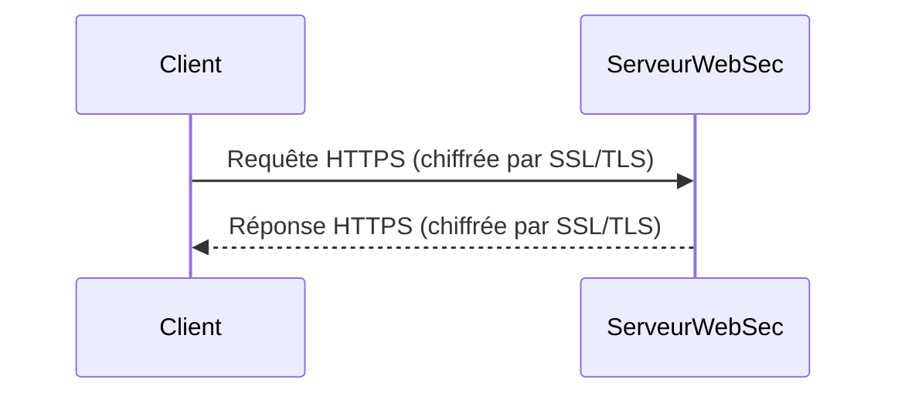

# HTTP / HTTPS

**Présentation**
HTTP (Hypertext Transfer Protocol) et HTTPS (Hypertext Transfer Protocol Secure) sont les protocoles fondamentaux utilisés pour transférer des données sur le World Wide Web. Ils définissent comment les clients (comme les navigateurs web) et les serveurs communiquent pour échanger des informations.

**Principes Clés**
- **HTTP:** Protocole sans état basé sur des requêtes-réponses. Le client envoie une requête au serveur, et le serveur renvoie une réponse. Les données sont transférées en texte clair.
- **HTTPS:** La version sécurisée de HTTP. Il utilise SSL/TLS pour chiffrer la communication entre le client et le serveur, garantissant la confidentialité et l'intégrité des données.

**Méthodes HTTP Courantes**
Les méthodes HTTP (ou verbes HTTP) indiquent l'action souhaitée à effectuer sur la ressource identifiée.
- **GET:** Demande une représentation de la ressource spécifiée. Les requêtes GET ne doivent que récupérer des données.
- **POST:** Soumet des données à la ressource spécifiée, souvent pour créer une nouvelle ressource ou envoyer des données de formulaire.
- **PUT:** Remplace toutes les représentations actuelles de la ressource cible par le contenu de la requête.
- **DELETE:** Supprime la ressource spécifiée.
- **PATCH:** Applique des modifications partielles à une ressource.
- **HEAD:** Demande les en-têtes de la ressource spécifiée, sans le corps de la réponse. Utile pour vérifier l'existence d'une ressource ou sa taille.
- **OPTIONS:** Décrit les options de communication pour la ressource cible.

**Composants Principaux**
- **Client:** Généralement un navigateur web.
- **Serveur:** Le serveur web hébergeant les ressources demandées.
- **Requête HTTP/HTTPS:** Envoyée par le client, contient la méthode (GET, POST, etc.), l'URL, les en-têtes et éventuellement un corps.
- **Réponse HTTP/HTTPS:** Envoyée par le serveur, contient un code de statut, des en-têtes et le corps de la réponse (par exemple, une page web).
- **SSL/TLS:** Protocoles de chiffrement utilisés par HTTPS pour sécuriser la connexion.

**Codes de Statut HTTP Courants**
Les codes de statut HTTP sont des réponses numériques du serveur qui indiquent le résultat de la requête HTTP.
- **1xx (Informational):** La requête a été reçue et le processus se poursuit.
- **2xx (Success):** La requête a été reçue, comprise et acceptée avec succès.
    - `200 OK`: La requête a réussi.
    - `201 Created`: La requête a abouti et une nouvelle ressource a été créée.
    - `204 No Content`: La requête a réussi mais il n'y a pas de contenu à renvoyer.
- **3xx (Redirection):** Une action supplémentaire doit être effectuée pour compléter la requête.
    - `301 Moved Permanently`: La ressource a été déplacée de façon permanente.
    - `302 Found`: La ressource a été temporairement déplacée.
- **4xx (Client Error):** La requête contient une erreur de syntaxe ou ne peut pas être satisfaite.
    - `400 Bad Request`: La requête est mal formée.
    - `401 Unauthorized`: L'authentification est requise.
    - `403 Forbidden`: Le serveur refuse d'autoriser la requête.
    - `404 Not Found`: La ressource demandée n'a pas été trouvée.
- **5xx (Server Error):** Le serveur n'a pas réussi à satisfaire une requête apparemment valide.
    - `500 Internal Server Error`: Une erreur inattendue s'est produite sur le serveur.
    - `502 Bad Gateway`: Le serveur agissant comme passerelle ou proxy a reçu une réponse invalide d'un serveur en amont.
    - `503 Service Unavailable`: Le serveur n'est pas prêt à gérer la requête.

**Avantages de HTTPS**
- **Sécurité des Données:** Chiffre les données en transit, protégeant les informations sensibles contre l'interception et la falsification.
- **Intégrité des Données:** Assure que les données n'ont pas été modifiées pendant le transfert.
- **Authentification:** Vérifie l'identité du serveur, protégeant contre les attaques de type "man-in-the-middle".
- **Confiance et Crédibilité:** Les navigateurs affichent un cadenas, indiquant aux utilisateurs que la connexion est sécurisée.
- **SEO (Search Engine Optimization):** Google favorise les sites HTTPS dans ses classements de recherche.
- **Fonctionnalités Modernes:** De nombreuses fonctionnalités web modernes (comme les Service Workers, Geolocation) nécessitent un contexte sécurisé (HTTPS).

**Guides d'utilisation**
HTTP est utilisé pour accéder à la plupart des ressources web. HTTPS est essentiel pour les sites web qui traitent des informations sensibles (comme les identifiants de connexion, les informations de paiement) afin de protéger les données contre l'interception. L'utilisation de HTTPS est désormais une pratique standard pour tous les sites web afin d'assurer la sécurité et d'améliorer le référencement.

**Exemples de Code (Hono)**
Hono est un framework web qui fonctionne nativement avec HTTP et HTTPS. Lorsque vous déployez une application Hono, vous la configurez pour écouter les requêtes sur un port spécifique, généralement via HTTP ou HTTPS (souvent géré par un proxy inverse en production).

Voici un exemple simple d'une application Hono gérant différentes méthodes HTTP :

```typescript
import { Hono } from 'hono';

const app = new Hono();

// Gérer les requêtes GET
app.get('/data', (c) => {
  return c.json({ message: 'Ceci est une requête GET' });
});

// Gérer les requêtes POST
app.post('/submit', async (c) => {
  const body = await c.req.json();
  return c.json({ received: body, status: 'success' });
});

// Gérer les requêtes PUT
app.put('/items/:id', async (c) => {
  const id = c.req.param('id');
  const body = await c.req.json();
  return c.json({ id: id, updated: body, status: 'updated' });
});

export default app;
```

*Note : La gestion de HTTPS en production implique généralement la configuration d'un serveur web (comme Nginx) ou d'un service cloud (comme un Load Balancer) devant votre application Hono pour gérer le certificat SSL/TLS.*

**Diagramme Mermaid**



**Diagramme Mermaid : Communication HTTPS**


