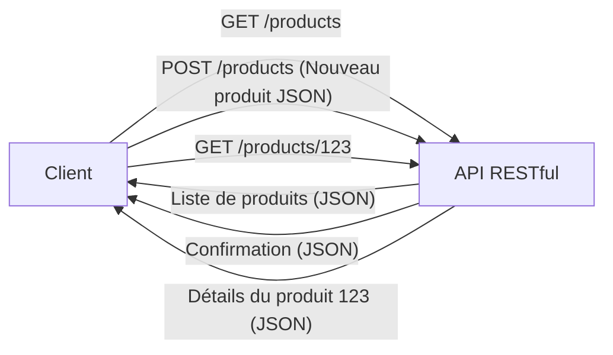

# API REST

**Présentation**
REST (Representational State Transfer) est un style d'architecture logicielle qui définit un ensemble de contraintes à utiliser pour créer des services web. Les APIs qui respectent les principes de REST sont appelées APIs RESTful. Elles sont largement utilisées pour construire des services web évoluables et maintenables.

**Principes Clés (Contraintes de REST)**
- **Client-Serveur:** Séparation des préoccupations entre l'interface utilisateur (client) et le stockage des données (serveur).
- **Sans État (Stateless):** Chaque requête du client au serveur doit contenir toutes les informations nécessaires pour comprendre et traiter la requête. Le serveur ne stocke pas d'informations sur l'état de la session du client entre les requêtes.
- **Cacheable:** Les réponses du serveur peuvent être mises en cache par les clients pour améliorer les performances.
- **Système en Couches (Layered System):** L'architecture peut être composée de plusieurs couches (serveurs, proxys, passerelles) sans affecter la communication entre le client et le serveur final.
- **Interface Uniforme (Uniform Interface):** Un ensemble standardisé de contraintes pour l'interaction entre le client et le serveur. Cela inclut l'identification des ressources, la manipulation des ressources via des représentations, les messages auto-descriptifs et HATEOAS (Hypermedia as the Engine of Application State).
    - **HATEOAS (Hypermedia as the Engine of Application State):** C'est une contrainte clé de REST qui signifie que les réponses de l'API doivent inclure des liens hypermédia pertinents qui guident le client sur les actions possibles et les ressources connexes. Le client n'a pas besoin de connaître à l'avance toutes les URL, il les découvre dynamiquement via les liens fournis par le serveur. Cela rend l'API plus découplée et évolutive.

**Composants Principaux**
- **Ressources:** Les données ou les concepts clés exposés par l'API (par exemple, un utilisateur, un produit, une commande).
- **URIs (Uniform Resource Identifiers):** Utilisés pour identifier de manière unique les ressources (par exemple, `/users`, `/products/123`).
- **Méthodes HTTP:** Utilisées pour effectuer des opérations sur les ressources (GET pour lire, POST pour créer, PUT/PATCH pour mettre à jour, DELETE pour supprimer).
- **Représentations:** La manière dont les données des ressources sont formatées (par exemple, JSON, XML).

**Guides d'utilisation**
Pour concevoir une API RESTful avec Hono, vous définissez des routes qui correspondent à vos ressources et utilisez les méthodes HTTP appropriées pour les opérations CRUD (Create, Read, Update, Delete). Vous renvoyez des représentations des ressources (généralement JSON) dans les réponses.

**Exemples de Code (Hono)**
Hono est bien adapté à la création d'APIs RESTful grâce à sa gestion des routes et sa capacité à renvoyer facilement des réponses JSON.

```typescript
import { Hono } from 'hono';
import { json } from 'hono/json';

const app = new Hono();

// Données en mémoire simulant une ressource 'produits'
let products = [
  { id: 1, name: 'Ordinateur portable', price: 1200 },
  { id: 2, name: 'Souris sans fil', price: 25 },
];

// GET /products - Obtenir tous les produits
app.get('/products', (c) => {
  return c.json(products);
});

// GET /products/:id - Obtenir un produit par ID
app.get('/products/:id', (c) => {
  const id = parseInt(c.req.param('id'));
  const product = products.find(p => p.id === id);
  if (product) {
    return c.json(product);
  }
  return c.json({ message: 'Produit non trouvé' }, 404);
});

// POST /products - Créer un nouveau produit
app.post('/products', async (c) => {
  const body = await c.req.json();
  const newProduct = {
    id: products.length + 1,
    name: body.name,
    price: body.price,
  };
  products.push(newProduct);
  return c.json(newProduct, 201);
});

// PUT /products/:id - Mettre à jour un produit existant
app.put('/products/:id', async (c) => {
  const id = parseInt(c.req.param('id'));
  const body = await c.req.json();
  const index = products.findIndex(p => p.id === id);
  if (index !== -1) {
    products[index] = { ...products[index], ...body };
    return c.json(products[index]);
  }
  return c.json({ message: 'Produit non trouvé' }, 404);
});

// DELETE /products/:id - Supprimer un produit
app.delete('/products/:id', (c) => {
  const id = parseInt(c.req.param('id'));
  const initialLength = products.length;
  products = products.filter(p => p.id !== id);
  if (products.length < initialLength) {
    return c.json({ message: `Produit avec ID ${id} supprimé` });
  }
  return c.json({ message: 'Produit non trouvé' }, 404);
});

export default app;
```

**Diagramme Mermaid**

