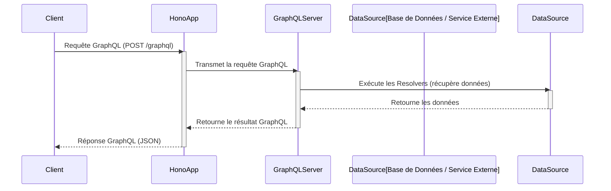

# GraphQL

**Présentation**
GraphQL est un langage de requête pour les API et un runtime pour exécuter ces requêtes côté serveur. Contrairement aux APIs REST où le serveur définit la structure des données renvoyées, GraphQL permet au client de spécifier exactement les données dont il a besoin, évitant ainsi la sur-acquisition ou la sous-acquisition de données.

**Principes Clés**
- **Requêtes Déclaratives:** Les clients demandent exactement les champs dont ils ont besoin.
- **Schéma Fortement Typé:** L'API GraphQL est définie par un schéma qui spécifie les types de données et les relations.
- **Une Seule Endpoint:** Typiquement, une API GraphQL est exposée via une seule endpoint HTTP (souvent POST).
- **Récupération Efficace des Données:** Réduit le nombre de requêtes et la quantité de données transférées.

**Avantages et Inconvénients de GraphQL**

**Avantages:**
- **Récupération de données précise:** Les clients demandent exactement ce dont ils ont besoin, évitant la sur-acquisition ou la sous-acquisition de données.
- **Moins de requêtes:** Souvent, une seule requête GraphQL peut remplacer plusieurs requêtes REST, réduisant les allers-retour réseau.
- **Évolution facile de l'API:** L'ajout de nouveaux champs ou types n'affecte pas les clients existants.
- **Schéma fortement typé:** Fournit une validation des données et une auto-complétion pour les clients.
- **Agrégation de données:** Facilite la récupération de données provenant de multiples sources en une seule requête.

**Inconvénients:**
- **Complexité côté serveur:** Nécessite une logique de résolution plus complexe pour gérer les requêtes flexibles.
- **Mise en cache:** La mise en cache côté client est plus complexe qu'avec REST en raison de la nature des requêtes.
- **Gestion des erreurs:** Les erreurs sont souvent renvoyées dans le corps de la réponse avec un statut HTTP 200, ce qui peut compliquer la gestion des erreurs.
- **Apprentissage:** Courbe d'apprentissage plus raide pour les développeurs habitués à REST.
- **Upload de fichiers:** Moins direct qu'avec REST, souvent géré via des extensions ou des approches spécifiques.

**Composants Principaux**
- **Schéma:** Définit la structure des données disponibles et les opérations possibles (Queries, Mutations, Subscriptions).
- **Queries:** Utilisées pour lire des données.
- **Mutations:** Utilisées pour modifier des données (créer, mettre à jour, supprimer).
- **Resolvers:** Fonctions côté serveur qui récupèrent les données demandées par une requête.
- **Types:** Définissent la structure des objets dans le schéma.

**Subscriptions GraphQL**
Les Subscriptions sont une fonctionnalité de GraphQL qui permet aux clients de recevoir des mises à jour en temps réel du serveur lorsqu'un événement spécifique se produit. Elles sont généralement implémentées via WebSockets.
- **Cas d'utilisation:** Notifications en temps réel, mises à jour de flux de données (ex: chat, cotations boursières), suivi de progression.
- **Fonctionnement:** Le client envoie une requête de subscription au serveur. Le serveur maintient une connexion persistante (via WebSocket) et envoie des données au client chaque fois que l'événement souscrit se produit.

**Guides d'utilisation**
Pour implémenter une API GraphQL avec Hono, vous auriez besoin d'intégrer une bibliothèque GraphQL (comme `graphql-js` ou `graphql-yoga`) et de définir votre schéma et vos resolvers. Hono peut servir de couche de transport HTTP pour recevoir les requêtes GraphQL et les passer au moteur GraphQL.

**Exemples de Code (Hono avec GraphQL)**
L'intégration complète de GraphQL dans Hono nécessite une bibliothèque GraphQL. Voici un exemple simplifié montrant comment Hono pourrait recevoir une requête POST GraphQL et la passer à un gestionnaire GraphQL (conceptuel).

```typescript
import { Hono } from 'hono';
import { json } from 'hono/json';
// Importation conceptuelle d'un gestionnaire GraphQL
// import { graphqlHandler } from './graphqlHandler';

const app = new Hono();

// Supposons que vous ayez un gestionnaire GraphQL configuré
// const handler = graphqlHandler({ schema: yourGraphQLSchema, rootValue: yourResolvers });

app.post('/graphql', async (c) => {
  // En production, vous passeriez la requête au gestionnaire GraphQL
  // return handler(c.req, c.res);

  // Pour cet exemple simple, nous allons juste renvoyer la requête reçue
  const body = await c.req.json();
  console.log('Requête GraphQL reçue:', body);

  // Structure de réponse GraphQL simple (simulée)
  const simulatedResponse = {
    data: {
      message: "Requête GraphQL reçue avec succès (traitement simulé)"
    }
  };

  return c.json(simulatedResponse);
});

export default app;
```
*Note : Cet exemple ne met pas en œuvre un moteur GraphQL complet. Il montre comment Hono peut recevoir une requête GraphQL. L'intégration réelle nécessiterait une bibliothèque GraphQL et la définition d'un schéma et de resolvers.*

**Diagramme Mermaid**
